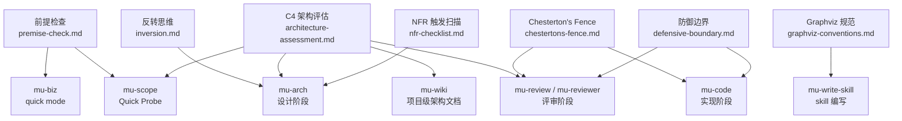

Referenced source files (7 files)

- `knowledge/principles/inversion.md`
- `knowledge/principles/premise-check.md`
- `knowledge/principles/chestertons-fence.md`
- `knowledge/principles/architecture-assessment.md`
- `knowledge/principles/nfr-checklist.md`
- `knowledge/principles/graphviz-conventions.md`
- `knowledge/principles/defensive-boundary.md`

# 设计原则与思维框架

DevMuse 把可复用的思维原则放在 `knowledge/principles/` 目录，而不是内联进各个 SKILL.md。这是一笔 token 经济账：如果每条原则都写进每个消费它的 skill 正文，每次 skill 加载都要为用不上的内容付费；抽成独立文件后，只有当执行流真正走到对应决策点时才被加载，上下文成本从"每次会话"降为"每次决策"。同一原则被多个 skill 引用时（如 Architecture Assessment 有四个消费方），也只需维护一份权威文本。

每个原则文件的开头都有一行 **"When to use"** 声明，明确绑定消费它的 skill 与触发时机——这行声明就是按需加载的路由依据。本页逐一介绍七条原则：核心思想是什么、被哪个 skill 在哪一步消费。

---

## 验证与设计阶段的原则

### 前提检查（Premise Check）

**核心思想：** 在投入 scoping / 设计之前，先验证前提本身是否成立。Sources: [knowledge/principles/premise-check.md:5]()

原则提供四个强制提问（forcing questions），每问附带危险信号：

1. **问题具体性** —— "到底谁有这个问题？他们今天用什么变通办法？"危险信号是含糊回答（"用户想要……"），说不出具体的人或变通做法。Sources: [knowledge/principles/premise-check.md:9-11]()
2. **时间耐久性** —— "如果三年后世界变了，这件事变得更必要还是更不必要？"危险信号是依赖一个可能反转的趋势。Sources: [knowledge/principles/premise-check.md:13-15]()
3. **最窄楔子** —— "能构建的最小的东西是什么，用来测试这件事是否重要？"危险信号是"我们得先有完整平台"。Sources: [knowledge/principles/premise-check.md:17-19]()
4. **观察测试**（仅完整版）—— "你有没有在不帮忙的情况下看别人使用类似方案？"Sources: [knowledge/principles/premise-check.md:21-23]()

**消费方与时机：** 该原则有两种模式——mu-biz quick mode 加载完整版（全部 4 问），mu-scope 的 Quick Probe 内联轻量版（3 问，跳过 Q4）。mu-biz quick mode 的产出落在 `docs/biz/YYYY-MM-DD-<name>-quick.md`，记录问题所有者、现状、时间测试、最窄楔子与验证状态。Sources: [knowledge/principles/premise-check.md:3](), [knowledge/principles/premise-check.md:25-32]()

### 反转思维（Inversion Reflex）

**核心思想：** 对每个提议的方案问反向问题——"怎样才能成功？"翻转为"什么会让我们失败？"；"这个功能做什么？"翻转为"这个功能会被怎样滥用？"；"这个时间线可行吗？"翻转为"什么事件会打乱这个时间线？"。Sources: [knowledge/principles/inversion.md:5-10]()

**消费方与时机：** 在 mu-arch 第 6 步（提出 2-3 个候选方案）时使用，在呈现给用户之前对每个方案逐一施加反转。具体落法是在方案对比表中把失败模式（failure modes）与权衡并列呈现，让用户看到每个方案会在哪里断掉，而不只是它的亮点。Sources: [knowledge/principles/inversion.md:3](), [knowledge/principles/inversion.md:12-21]()

### C4 架构评估（Architecture Assessment)

**核心思想：** 按项目类型选择正确的图型，且只画能增加清晰度的层级——大多数项目只需要 C4 的 1-2 层，不需要全部 4 层。Sources: [knowledge/principles/architecture-assessment.md:21]()

图型选择表按项目类型给出建议：CLI 工具/库只需 C3 组件图；Web 应用需要 C1 上下文 + C2 容器；微服务加上数据流图；插件/扩展的关键问题是"我在宿主系统的哪个位置"，用 C1（宿主关系）+ C3；数据管道以数据流图为主。Sources: [knowledge/principles/architecture-assessment.md:9-17]()

除 C1/C2/C3 外还覆盖两类场景图：

- **时序图**：适用于多方交互、外部回调、请求链路中"每一跳数据是否可得"很关键的设计。规则是**每个场景一张图**，不画合并大图——按场景拆分才能暴露数据可得性缺口（例如浏览器重定向会丢自定义 header）。Sources: [knowledge/principles/architecture-assessment.md:105]()
- **状态机图**：适用于有生命周期状态的实体（订单、订阅、审批流），强制枚举所有合法迁移并发现遗漏。Sources: [knowledge/principles/architecture-assessment.md:122]()

配套规范：在既有架构图上标注变更用 ➕/✏️/➖ 覆盖记号；格式首选 Mermaid，图必须活在设计文档里而不是独立文件。同时明确了跳过条件——bug 修复不改组件边界、纯配置/文档/测试变更、或 Quick Probe 显示只影响 1 个组件且不跨边界时，文字描述即可。Sources: [knowledge/principles/architecture-assessment.md:125-135](), [knowledge/principles/architecture-assessment.md:137-142]()

**消费方与时机：** 四个消费方——mu-scope（Quick Probe）、mu-arch（C4 定位 + 设计图）、mu-wiki（项目级架构文档）、mu-reviewer（review-design 模式）。Sources: [knowledge/principles/architecture-assessment.md:3]()

### NFR 触发扫描（Non-Functional Requirements Checklist）

**核心思想：** 基于 ISO/IEC 25010 质量模型，把非功能需求整理成 11 个类别（性能、可扩展性、可用性、可靠性、安全、可观测性、可维护性、兼容性、可移植性、合规、迁移），每类附带触发条件——只在至少一个触发条件命中时才展开该类别。Sources: [knowledge/principles/nfr-checklist.md:5](), [knowledge/principles/nfr-checklist.md:9-21]()

**消费方与时机：** mu-arch 在功能设计初稿完成后使用，三步走：

1. **扫描**：逐行走触发条件列，标记命中的类别；
2. **展开**：每个命中类别写 2-5 句，覆盖具体关切、设计如何应对、有何权衡；
3. **显式跳过**：无触发的类别直接省略，不需要罗列 "N/A"。

Sources: [knowledge/principles/nfr-checklist.md:3](), [knowledge/principles/nfr-checklist.md:25-27]()

---

## 实现与评审阶段的原则

### Chesterton's Fence

**核心思想：** 在改动或删除代码之前，先弄清它为什么存在。看起来多余、过度复杂或错误的代码，往往有不可见的存在理由：bug 变通、性能优化、兼容性约束、生产环境发现的边界情况。Sources: [knowledge/principles/chestertons-fence.md:7-11]()

简化前的五个必答问题：这段代码的职责是什么（没有它会坏什么）；谁在调用它（追所有调用方）；它写于何时、当时周边发生了什么（`git log` / `git blame`）；有没有注释、提交信息或 PR 解释"为什么"；删掉它哪个测试会挂——如果没有测试挂，那是"行为未被测试"的信号，不是"它不必要"的证据。Sources: [knowledge/principles/chestertons-fence.md:15-21]()

危险信号清单直接针对四种常见错觉："看着像死代码"（要更用力地 grep、查动态引用）、"对它做的事来说太复杂了"（复杂性可能在处理你没见过的边界情况）、"没人知道为什么在这"（这是调查的理由，不是删除的理由）、"删了测试也过"（测试可能覆盖不到它防御的场景）。Sources: [knowledge/principles/chestertons-fence.md:23-28]()

**消费方与时机：** mu-code 在重构任务中、mu-review 在代码质量评审中引用；触发点是任何简化、重构或删除代码之前。Sources: [knowledge/principles/chestertons-fence.md:3]()

### 防御边界（Defensive Boundary）

**核心思想：** 永远不信任外部数据。在边界处穷尽式校验、违规即快速失败，并确保每种可能的输入形态都被处理（MECE）。适用范围是一切与外部系统交换数据的代码：跨服务 API 调用、webhook 回调、第三方 SDK 响应、消息队列载荷、文件导入。Sources: [knowledge/principles/defensive-boundary.md:3-6]()

四条规则：

1. **假设每个字段都可能缺失、显式 null、空串或类型错误**——反序列化必须处理全部四种形态；典型反模式是以为 `required=False` 覆盖了空串，而多数框架（DRF、Pydantic v1、Jackson）把"缺失"和"空"当作两套独立校验。Sources: [knowledge/principles/defensive-boundary.md:9-20]()
2. **在边界快速失败**——收到即校验，不让坏数据渗入业务逻辑；错误信息要指明哪个字段、为什么失败；WARN 级别记录原始载荷（脱敏）。Sources: [knowledge/principles/defensive-boundary.md:22-26]()
3. **MECE：每条代码路径必须显式**——每个外部字段的每种状态都有显式分支，不依赖隐式穿透；外部系统开始发送预期之外的新状态时，应命中显式的 else/default 分支而非静默通过。Sources: [knowledge/principles/defensive-boundary.md:28-41]()
4. **出站方向不假设接收方行为**——null、缺失、空串在下游语义不同，要文档化你发的是什么；除非契约要求，宁可不发字段也不发 null/空。Sources: [knowledge/principles/defensive-boundary.md:43-47]()

原则还附带框架陷阱速查表（DRF `allow_blank`、Pydantic v1 `Optional`、Jackson/Gson 的 null 序列化差异）和一份五项检查清单。Sources: [knowledge/principles/defensive-boundary.md:49-57](), [knowledge/principles/defensive-boundary.md:59-65]()

**消费方与时机：** mu-code（写边界代码时）与 mu-review（评审时按清单核对）。Sources: [knowledge/principles/defensive-boundary.md:3]()

---

## Skill 工程原则

### Graphviz 规范（Graphviz Conventions）

**核心思想：** 流程图是稀缺资源，只用在"可能走错的决策点"上。仅当满足"需要展示信息"且"存在可能出错的决策"时才画小型内联流程图，否则用 markdown。明确允许的场景：非显而易见的决策点、可能过早停止的过程循环、"何时用 A 何时用 B"的选择；明确禁止的场景：参考资料（用表格/列表）、代码示例（用代码块）、线性步骤（用编号列表）、无语义的标签（step1、helper2）。Sources: [knowledge/principles/graphviz-conventions.md:7-17](), [knowledge/principles/graphviz-conventions.md:20-29]()

配套约定：节点形状语义化（`box` 动作、`diamond` 决策、`doublecircle` 终态、黄色填充为警告/停线点、绿色填充为成功路径）；节点标签描述动作/决策本身，边标签写条件或结果，标签要短——"需要一段话才能说清"说明图画错了。可用 mu-write-skill 目录下的 `render-graphs.cjs` 把 skill 里的流程图渲染成 SVG 给人类协作者看。Sources: [knowledge/principles/graphviz-conventions.md:31-39](), [knowledge/principles/graphviz-conventions.md:42-45](), [knowledge/principles/graphviz-conventions.md:47-54]()

**消费方与时机：** mu-write-skill（以及任何 skill 编写工作）在决定是否使用 digraph 流程图、以及如何组织它时引用。Sources: [knowledge/principles/graphviz-conventions.md:3]()

---

## 汇总：原则 × 消费方 × 触发点

| 原则 | 消费 skill | 触发点 |
|---|---|---|
| 前提检查 | mu-biz（quick mode，4 问全量）；mu-scope（Quick Probe 内联，3 问跳过 Q4） | 投入 scoping / 设计之前 |
| 反转思维 | mu-arch | Step 6 提出 2-3 个方案时，呈现给用户之前逐方案施加 |
| C4 架构评估 | mu-scope（Quick Probe）；mu-arch（C4 定位 + 设计图）；mu-wiki（项目级架构文档）；mu-reviewer（review-design 模式） | 需要判断画什么图、画到哪一层时 |
| NFR 触发扫描 | mu-arch | 功能设计初稿完成后，扫描触发条件列 |
| Chesterton's Fence | mu-code（重构任务）；mu-review（代码质量评审） | 任何简化、重构、删除代码之前 |
| 防御边界 | mu-code；mu-review | 代码与外部系统交换数据时（API、webhook、SDK、队列、文件导入） |
| Graphviz 规范 | mu-write-skill（及任何 skill 编写） | 决定是否使用 digraph 流程图及其结构时 |

Sources: [knowledge/principles/premise-check.md:3](), [knowledge/principles/inversion.md:3](), [knowledge/principles/architecture-assessment.md:3](), [knowledge/principles/nfr-checklist.md:3](), [knowledge/principles/chestertons-fence.md:3](), [knowledge/principles/defensive-boundary.md:3](), [knowledge/principles/graphviz-conventions.md:3]()

---

See also: [核心流水线](core-pipeline.md) · [领域语言与质量](domain-language-and-quality.md)
