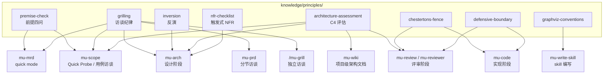

Referenced source files (8 files)

- `knowledge/principles/inversion.md`
- `knowledge/principles/premise-check.md`
- `knowledge/principles/chestertons-fence.md`
- `knowledge/principles/architecture-assessment.md`
- `knowledge/principles/nfr-checklist.md`
- `knowledge/principles/grilling.md`
- `knowledge/principles/graphviz-conventions.md`
- `knowledge/principles/defensive-boundary.md`

# 设计原则与思维框架库

DevMuse 把跨技能复用的思维模板集中放在 `knowledge/principles/` 目录，而不是内联进各个 SKILL.md。每个原则文件开头都有一行 **"When to use"** 声明，明确写出消费它的 skill 与注入时机——这行声明就是按需加载的路由依据：只有当执行流真正走到对应决策点时，skill 才通过 `@../../knowledge/principles/*.md` 引用加载它。同一原则被多个 skill 消费时（如 architecture-assessment 有四个消费方、grilling 有五个注入点），也只需维护一份权威文本。

本页逐一介绍八个思维模板：核心思想是什么、被哪些 skill 在哪一步注入。

```mermaid
graph TD
    subgraph 原则库["knowledge/principles/"]
        PC["premise-check<br/>前提四问"]
        GR["grilling<br/>访谈纪律"]
        INV["inversion<br/>反演"]
        AA["architecture-assessment<br/>C4 评估"]
        NFR["nfr-checklist<br/>触发式 NFR"]
        CF["chestertons-fence"]
        DB["defensive-boundary"]
        GC["graphviz-conventions"]
    end

    MRD["mu-mrd<br/>quick mode"]
    SCOPE["mu-scope<br/>Quick Probe / 用例访谈"]
    PRD["mu-prd<br/>分节访谈"]
    GRILL["/mu-grill<br/>独立访谈"]
    ARCH["mu-arch<br/>设计阶段"]
    CODE["mu-code<br/>实现阶段"]
    REVIEW["mu-review / mu-reviewer<br/>评审阶段"]
    WIKI["mu-wiki<br/>项目级架构文档"]
    WS["mu-write-skill<br/>skill 编写"]

    PC --> MRD
    PC --> SCOPE
    GR --> SCOPE
    GR --> ARCH
    GR --> PRD
    GR --> MRD
    GR --> GRILL
    INV --> ARCH
    AA --> SCOPE
    AA --> ARCH
    AA --> WIKI
    AA --> REVIEW
    NFR --> ARCH
    CF --> CODE
    CF --> REVIEW
    DB --> CODE
    DB --> REVIEW
    GC --> WS
```

---

## 验证与访谈原则

### 前提四问（Premise Check）

**核心思想：** 在投入 scoping / 设计之前，先验证前提本身是否成立。Sources: [knowledge/principles/premise-check.md:5]()

四个强制提问（forcing questions），每问附带危险信号（red flag）：

| # | 提问 | 危险信号 |
|---|---|---|
| Q1 问题具体性 | "到底谁有这个问题？他们今天用什么变通办法？" | 含糊回答（"用户想要……"），说不出具体的人或 workaround |
| Q2 时间耐久性 | "如果三年后世界变了，这件事更必要还是更不必要？" | 依赖一个可能反转的趋势 |
| Q3 最窄楔子 | "能构建的最小的东西是什么，用来测试这件事是否重要？" | "我们得先有完整平台" |
| Q4 观察测试（仅完整版） | "你有没有在不帮忙的情况下看别人使用类似方案？" | "demo 都是表演" / "没有任何意外发生" |

Sources: [knowledge/principles/premise-check.md:7-23]()

**消费技能与注入点：** 两种模式——mu-mrd quick mode 加载完整版（全部 4 问），mu-scope 的 Quick Probe 内联轻量版（3 问，跳过 Q4）。mu-mrd quick mode 的产出落在 `docs/mrd/YYYY-MM-DD-<name>-quick.md`，记录问题所有者、现状、时间测试、最窄楔子与验证状态。Sources: [knowledge/principles/premise-check.md:3](), [knowledge/principles/premise-check.md:25-32]()

### 访谈纪律（Grilling）

**核心思想：** 所有向用户提问的 skill 共享同一套访谈纪律——无论哪个 skill 在问，过程都一致。改编自 mattpocock/skills 的 grilling。Sources: [knowledge/principles/grilling.md:3-7]()

纪律四条：

1. **按依赖顺序走决策树**——答案打开子分支时先钻到底，再回到同级问题。
2. **一条消息只问一个问题**——有具体选项就给 A/B/C，附一句话理由的推荐项，推荐项放最前。
3. **事实归你，决策归用户**——凡是能从代码库、文档或命令中查到的，先自己查（问一个 greppable 的问题是浪费用户回合）；凡是偏好、优先级、权衡，交给用户。用户说"你定"时，做出决定并在 artifact 中记为显式假设。
4. **收敛每一个 fork**——fork 指猜错就要返工的决策点；每个 fork 以用户回答或用户可见的假设收尾。没有问题数量预算：fork 收敛才停，不是"问够了"就停。

Sources: [knowledge/principles/grilling.md:9-12]()

**退出判据：** 剩余未知要么可以靠读代码/文档回答，要么已记录为用户见过的显式假设——且每个 fork 都带着用户回答或用户认可的假设。用户确认达成共同理解之前不得动手、不得越过设计、不得定稿；在流水线 skill 中，artifact 审批就是这个确认。Sources: [knowledge/principles/grilling.md:14-16]()

**消费技能与注入点：** 五个注入点——mu-scope（用例引出）、mu-arch（澄清提问）、mu-prd（分节访谈）、mu-mrd（full-mode 各节）在各自的提问步骤引用；独立入口是 `/mu-grill`。Sources: [knowledge/principles/grilling.md:3]()

---

## 设计阶段原则

### 反演（Inversion Reflex）

**核心思想：** 对每个提议的方案问反向问题——"怎样成功？"翻转为"什么会让我们失败？"；"这个功能做什么？"翻转为"这个功能会被怎样滥用？"；"时间线可行吗？"翻转为"什么事件会打乱它？"；"方案是否可靠？"翻转为"什么条件下它会断掉？"。Sources: [knowledge/principles/inversion.md:5-10]()

**消费技能与注入点：** mu-arch Step 6（提出 2-3 个候选方案）——呈现给用户之前对每个方案逐一施加反演，在方案对比表中把 failure modes 与 strengths 并列成列，让用户看到每个方案会在哪里断掉，而不只是它的亮点。Sources: [knowledge/principles/inversion.md:3](), [knowledge/principles/inversion.md:12-21]()

### C4 架构评估（Architecture Assessment）

**核心思想：** 按项目类型选择正确的图型，且只画能增加清晰度的层级——大多数项目只需要 C4 的 1-2 层，不是全部 4 层。Sources: [knowledge/principles/architecture-assessment.md:21]()

图型选择表按项目类型给出建议：

| 项目类型 | 建议图型 | 原因 |
|---|---|---|
| CLI 工具 / 库 | C3 Component | 没有多容器复杂度，组件关系足够 |
| Web 应用 | C1 Context + C2 Container | 需要系统边界 + 技术栈容器 |
| 微服务 | C1 + C2 + Data Flow | 服务间交互是核心复杂度 |
| 插件 / 扩展 | C1（宿主关系）+ C3 | 关键问题是"我在宿主系统的哪个位置" |
| 数据管道 | Data Flow（为主） | 数据如何流动与变换是核心关切 |
| API 服务 | C2 + API boundary | 需要内外边界 + 技术容器 |
| 移动应用 | C1 + C2 | 设备 ↔ 云 ↔ 第三方关系 |

Sources: [knowledge/principles/architecture-assessment.md:9-17]()

除 C1/C2/C3 外还覆盖两类场景图，各带纳入条件：

- **Sequence Diagram**：适用于多方交互、外部回调、请求链中"每一跳数据是否可得"很关键的设计。规则是**每个场景一张图**，不画合并大图——按场景拆分才能暴露数据可得性缺口（例如浏览器 redirect 会丢自定义 header）。Sources: [knowledge/principles/architecture-assessment.md:88-105]()
- **State Machine Diagram**：适用于有生命周期状态的实体（订单、订阅、审批流、账户状态），强制枚举所有合法迁移并发现遗漏（如 Published 能否回到 Draft）。Sources: [knowledge/principles/architecture-assessment.md:107-122]()

配套规范：在既有架构图上标注变更用 ➕/✏️/➖ 覆盖记号；格式首选 Mermaid（ASCII art 为后备），图必须活在设计文档里而不是独立文件。同时定义了跳过条件——bug 修复不改组件边界、纯配置/文档/测试变更、或 Quick Probe 显示只影响 1 个组件且不跨边界、无新组件时，文字描述即可。Sources: [knowledge/principles/architecture-assessment.md:125-135](), [knowledge/principles/architecture-assessment.md:137-142]()

**消费技能与注入点：** 四个消费方——mu-scope（Quick Probe 的粗粒度架构上下文）、mu-arch（C4 定位 + 设计图）、mu-wiki（项目级架构文档）、mu-reviewer（review-design 模式）。Sources: [knowledge/principles/architecture-assessment.md:3]()

### 触发式 NFR 清单（NFR Checklist）

**核心思想：** 基于 ISO/IEC 25010 质量模型，把非功能需求整理成 11 个类别（Performance、Scalability、Availability、Reliability、Security、Observability、Maintainability、Compatibility、Portability、Compliance、Migration），每类附带触发条件（trigger conditions）——只在至少一个触发条件命中时才展开该类别。Sources: [knowledge/principles/nfr-checklist.md:5](), [knowledge/principles/nfr-checklist.md:9-21]()

**消费技能与注入点：** mu-arch 在功能设计初稿完成后使用，三步走：

1. **Scan**：逐行走触发条件列，标记命中的类别；
2. **Elaborate**：每个命中类别写 2-5 句，覆盖具体关切、设计如何应对、有何权衡；
3. **Skip explicitly**：无触发的类别直接省略，不需要罗列 "N/A"。

Sources: [knowledge/principles/nfr-checklist.md:3](), [knowledge/principles/nfr-checklist.md:23-27]()

---

## 实现与评审阶段原则

### Chesterton's Fence

**核心思想：** 在改动或删除代码之前，先弄清它为什么存在。看起来多余、过度复杂或错误的代码，往往有不可见的存在理由：bug workaround、性能优化、兼容性约束、生产环境发现的边界情况。Sources: [knowledge/principles/chestertons-fence.md:7-11]()

简化前的五个必答问题：这段代码的职责是什么（没有它会坏什么，而非它做什么）；谁在调用它（追所有调用方，不只是显眼的）；写于何时、当时周边发生了什么（`git log` / `git blame`）；有没有注释、commit message 或 PR 解释"为什么"；删掉它哪个测试会挂——没有测试挂是"行为未被测试"的信号，不是"它不必要"的证据。Sources: [knowledge/principles/chestertons-fence.md:15-21]()

危险信号清单针对四种常见错觉："看着像死代码"（更用力地 grep、查动态引用）、"对它做的事来说太复杂"（复杂性可能在处理你没见过的边界情况）、"没人知道为什么在这"（这是调查的理由，不是删除的理由）、"删了测试也过"（测试可能覆盖不到它防御的场景）。Sources: [knowledge/principles/chestertons-fence.md:23-28]()

**消费技能与注入点：** mu-code 在重构任务中、mu-review 在代码质量评审中引用；触发点是任何简化、重构或删除代码之前。Sources: [knowledge/principles/chestertons-fence.md:3]()

### 防御边界（Defensive Boundary）

**核心思想：** 永远不信任外部数据。在边界处穷尽式校验、违规即 fail fast，并确保每种可能的输入形态都被处理（MECE）。适用于一切与外部系统交换数据的代码：跨服务 API 调用、webhook 回调、第三方 SDK 响应、消息队列 payload、文件导入。Sources: [knowledge/principles/defensive-boundary.md:3-5]()

四条规则：

1. **假设每个字段都可能缺失、显式 null、空串或类型错误**——反序列化必须处理全部四种形态；典型反模式是以为 `required=False` 覆盖了空串，而多数框架（DRF、Pydantic v1、Jackson）把"缺失"和"空"当作两套独立校验。Sources: [knowledge/principles/defensive-boundary.md:9-20]()
2. **在边界 fail fast**——收到即校验，不让坏数据渗入业务逻辑；错误信息要指明哪个字段、为什么失败；WARN 级别记录原始 payload（脱敏）。Sources: [knowledge/principles/defensive-boundary.md:22-26]()
3. **MECE：每条代码路径显式化**——每个外部字段的每种状态都有显式分支，不依赖隐式 fallthrough；外部系统开始发送预期之外的新状态时，应命中显式的 else/default 分支而非静默通过。Sources: [knowledge/principles/defensive-boundary.md:28-41]()
4. **出站方向不假设接收方行为**——null、缺失、空串在下游语义不同，要文档化你发的是什么；除非契约要求，宁可不发字段也不发 null/空；API 契约要版本化——加字段安全，改语义不安全。Sources: [knowledge/principles/defensive-boundary.md:43-47]()

原则还附带框架陷阱速查表（DRF `allow_blank`、Pydantic v1 `Optional`、Jackson/Gson 的 null 序列化差异）和一份五项 checklist 供评审对照。Sources: [knowledge/principles/defensive-boundary.md:49-57](), [knowledge/principles/defensive-boundary.md:59-65]()

**消费技能与注入点：** mu-code（写边界代码时）与 mu-review（评审时按 checklist 核对）。Sources: [knowledge/principles/defensive-boundary.md:3]()

---

## Skill 工程原则

### Graphviz 规范（Graphviz Conventions）

**核心思想：** 流程图是稀缺资源，只用在"可能走错的决策点"上。仅当"需要展示信息"且"存在可能出错的决策"时才画小型内联流程图，否则用 markdown。允许的场景：非显而易见的决策点、可能过早停止的过程循环、"何时用 A 何时用 B"的选择；禁止的场景：参考资料（用表格/列表）、代码示例（用代码块）、线性步骤（用编号列表）、无语义的标签（step1、helper2）。Sources: [knowledge/principles/graphviz-conventions.md:7-17](), [knowledge/principles/graphviz-conventions.md:20-29]()

配套约定：节点形状语义化——`box` 动作、`diamond` 决策、`doublecircle` 终态、黄色填充为警告/停线点、绿色填充为成功路径；节点标签描述动作/决策本身，边标签写条件或结果（`"yes"`、`"bug found"`、`"approved"`），标签要短——需要一段话才能说清，说明图画错了。可用 mu-write-skill 目录下的 `render-graphs.cjs` 把 skill 的流程图渲染成 SVG 给人类协作者看（`--combine` 合并为一张）。Sources: [knowledge/principles/graphviz-conventions.md:31-39](), [knowledge/principles/graphviz-conventions.md:42-45](), [knowledge/principles/graphviz-conventions.md:47-54]()

**消费技能与注入点：** mu-write-skill（以及任何 skill 编写工作）在决定是否使用 digraph 流程图、以及如何组织它时引用。Sources: [knowledge/principles/graphviz-conventions.md:3]()

---

## 汇总：原则 × 消费技能 × 注入点

| 原则 | 消费 skill | 注入点 |
|---|---|---|
| premise-check（前提四问） | mu-mrd（quick mode，4 问全量）；mu-scope（Quick Probe 内联，3 问跳过 Q4） | 投入 scoping / 设计之前 |
| grilling（访谈纪律） | mu-scope、mu-arch、mu-prd、mu-mrd；独立入口 `/mu-grill` | 各 skill 的提问步骤 |
| inversion（反演） | mu-arch | Step 6 提出 2-3 个方案时，呈现给用户之前逐方案施加 |
| architecture-assessment（C4） | mu-scope（Quick Probe）；mu-arch（C4 定位 + 设计图）；mu-wiki（项目级架构文档）；mu-reviewer（review-design 模式） | 需要判断画什么图、画到哪一层时 |
| nfr-checklist（触发式） | mu-arch | 功能设计初稿完成后，扫描触发条件列 |
| chestertons-fence | mu-code（重构任务）；mu-review（代码质量评审） | 任何简化、重构、删除代码之前 |
| defensive-boundary | mu-code；mu-review | 代码与外部系统交换数据时（API、webhook、SDK、队列、文件导入） |
| graphviz-conventions | mu-write-skill（及任何 skill 编写） | 决定是否使用 digraph 流程图及其结构时 |

Sources: [knowledge/principles/premise-check.md:3](), [knowledge/principles/grilling.md:3](), [knowledge/principles/inversion.md:3](), [knowledge/principles/architecture-assessment.md:3](), [knowledge/principles/nfr-checklist.md:3](), [knowledge/principles/chestertons-fence.md:3](), [knowledge/principles/defensive-boundary.md:3](), [knowledge/principles/graphviz-conventions.md:3]()

---

See also: [域语言](domain-language.md) · [核心管线](core-pipeline.md)
