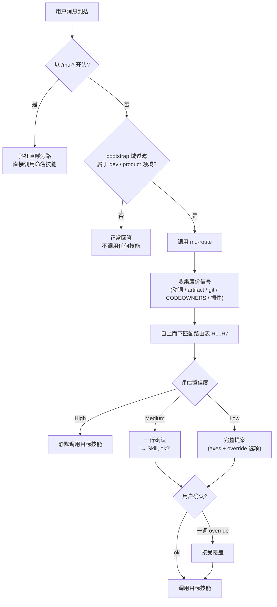

# 工作流与 mu-route 路由系统

Referenced source files (6 files)

- `skills/mu-route/SKILL.md`
- `rules/bootstrap.md`
- `docs/specs/2026-04-17-mu-route-system-design.md`
- `docs/plans/2026-04-17-mu-route-system.md`
- `README.md`
- `CONTEXT.md`

DevMuse 对未加前缀的用户消息采用三层处理链：`rules/bootstrap.md` 先做域过滤（只放行软件工程与产品分析类任务），随后调用 `mu-route` 这个**智能路由器**（smart router）——它用消息动词加廉价仓库信号匹配路由表，选出任务的 **Opening move**（Explore / Design-tech / Reproduce / Implement 之一），并按置信度决定交互摩擦：高置信度静默调用，中置信度一行确认，低置信度给出带 override 选项的完整提案。Sources: [rules/bootstrap.md:42-54](), [skills/mu-route/SKILL.md:8](), [CONTEXT.md:7-9]()

mu-route 不是 HARD-GATE，而是路由器：目标技能仍执行自己的门禁。用户随时可以用 `/mu-<skill>` 斜杠直呼绕过整套路由——这是面向熟练用户的逃生舱口。Sources: [skills/mu-route/SKILL.md:8](), [skills/mu-route/SKILL.md:143-151](), [docs/specs/2026-04-17-mu-route-system-design.md:108-110]()

## 分层架构：bootstrap → mu-route → 目标技能

设计文档将系统定义为三个组件，全部为 markdown：bootstrap 负责"对未加前缀的用户输入调用 mu-route"，mu-route 读取用户消息与廉价仓库信号、按路由表计算最佳 Opening move、提案并交接给目标技能；sign-off gate 则是正交的原则文件，仅在创作型技能出口处被消费。Sources: [docs/specs/2026-04-17-mu-route-system-design.md:15-31]()

Sources: [skills/mu-route/SKILL.md:39-68](), [rules/bootstrap.md:42-54]()

历史背景：这套架构由 2026-04-17 的 mu-route 系统实施计划落地——bootstrap 原有的"4 条 pipeline 路径"表被迁移为 mu-route 的内部路由表，bootstrap 只保留"未加前缀消息调用 mu-route + 斜杠旁路"这一条主规则。Sources: [docs/plans/2026-04-17-mu-route-system.md:71-84](), [docs/specs/2026-04-17-mu-route-system-design.md:161-182]()

### 域过滤（bootstrap 层）

DevMuse 只处理两类工作：**软件工程**（编码、架构、调试、重构、测试、代码评审、部署）和**产品/商业分析**（前提验证、产品需求、竞品分析、商业建模）。一般性问题、无具体目标的开放讨论、非软件话题不在范围内——直接正常回答，不调用任何技能，因此这些消息永远不会到达 mu-route。Sources: [rules/bootstrap.md:42-48](), [skills/mu-route/SKILL.md:16]()

bootstrap 同时定义了指令优先级：用户显式指令（CLAUDE.md / AGENTS.md / 直接请求）> DevMuse 技能 > 默认系统提示。若用户的 CLAUDE.md 为某仓库固定了特定技能，路由会尊重该指令。Sources: [rules/bootstrap.md:18-26](), [skills/mu-route/SKILL.md:23]()

### 技能的四个类别

| 类别 | 技能 | 路由方式 |
|------|------|----------|
| Core pipeline | mu-scope → mu-arch → mu-plan → mu-code → mu-review | 自动路由 |
| Orthogonal | mu-explore, mu-debug | 自动路由 |
| On-demand | mu-biz, mu-prd, mu-wiki, mu-retro, mu-grill | 仅斜杠调用；mu-route 对匹配意图回复指针而非调用 |
| Meta | mu-route（路由器）, mu-write-skill（技能编写） | — |

Sources: [rules/bootstrap.md:56-61](), [README.md:37-70]()

## mu-route 的路由决策

### 廉价信号（五个 Axis，全部 <5s 完成）

| Axis | 探测方式 |
|------|----------|
| Axis-Intent | 用消息动词匹配词表（见下） |
| Axis-Familiarity | `git log --author="$USER" --since="30 days ago" -- <area>`（若能推断目标区域） |
| Axis-Missing-artifact | 对 `docs/biz/`、`docs/prd/`、`docs/specs/` 做 file-exists 检查；**对话中的内联内容（payload 示例、伪代码、口头描述）永远不算"specs 存在"**——只有磁盘上的 artifact 文件才算 |
| Axis-Stakeholder | CODEOWNERS 存在性 + git log 多作者检查（供后续 sign-off gate 使用，此处仅向用户提示） |
| Axis-Plugin | 扫描可用技能列表中的非 DevMuse 技能，检查用户消息是否匹配其描述 |

Sources: [skills/mu-route/SKILL.md:75-80](), [docs/specs/2026-04-17-mu-route-system-design.md:48-56]()

### Trigger Signal 词表

| 用户消息中的动词/短语 | Axis-Intent | 默认 Opening move |
|------------------------|-------------|-------------------|
| "understand", "figure out", "read", "take over", "evaluate", "what does this do" | understand | **Explore** |
| "add feature", "build feature" | create-feature | **Design-tech**（不熟悉则先 Explore） |
| "refactor", "clean up", "rename", "restructure" | reshape | **Design-tech**（不熟悉则先 Explore） |
| "fix", "broken", "error", "bug", "test failing", "crash" | fix | **Reproduce** |
| "implement", "write this", "build this", "code it up" | implement | **Implement**（design 存在时；否则 Design-tech） |

多个动词同时命中时，Axis-Intent 取**主要动作**，优先级为 fix > reshape > create-feature > implement > understand（最具体者胜出）。Sources: [skills/mu-route/SKILL.md:89-100]()

### 路由决策表（自上而下，首个匹配生效）

| # | 斜杠前缀 | Axis-Intent | Axis-Missing-artifact | Axis-Familiarity | → Opening move |
|---|----------|-------------|----------------------|------------------|----------------|
| R1 | `/mu-<skill>` | — | — | — | **bypass**（直接调用，用户拥有意图） |
| R2 | 无 | understand | — | — | **Explore** |
| R3 | 无 | fix | — | — | **Reproduce**（经 mu-scope 1-UC repro） |
| R4 | 无 | reshape | — | unfamiliar | **Explore**（pre-change 变体）→ 再 Design-tech |
| R5 | 无 | reshape / create-feature | 无 specs | familiar | **Design-tech**（hint: stance=auto） |
| R5.5 | 无 | implement | 无 specs | — | **Design-tech**（hint: stance=auto） |
| R6 | 无 | implement | specs 存在 | — | **Implement** |
| R6.5 | 无 | Axis-Plugin 命中 | — | — | **委派给插件技能** |
| R7 | 无（无动词命中） | — | — | — | **Explore**（安全默认：先理解再行动） |

Sources: [skills/mu-route/SKILL.md:102-120]()

Opening move 到技能的映射由域语言固定：Explore → mu-explore，Design-tech → mu-arch，Reproduce → mu-scope（1-UC repro）+ mu-debug，Implement → mu-code。Sources: [CONTEXT.md:7-9](), [CONTEXT.md:85]()

当目标是 mu-arch 时，mu-route 可传递 `stance=auto` hint，表示其 Phase 0 应自行做 stance 检测、无需再次预确认。mu-route 自身**不**运行 stance 检测——那是目标创作型技能 Phase 0 的职责。Sources: [skills/mu-route/SKILL.md:10](), [skills/mu-route/SKILL.md:120]()

> 演进注记：2026-04-17 设计稿的路由表原为 R1..R9，含 Validate（mu-biz）与 Design-product（mu-prd）两个自动路由目标；现行版本收窄为 R1..R7（含 R5.5 / R6.5 插行），商业/产品类意图改为 on-demand 指针式响应，不再自动调用。Sources: [docs/specs/2026-04-17-mu-route-system-design.md:85-99](), [skills/mu-route/SKILL.md:98](), [skills/mu-route/SKILL.md:118]()

### 置信度分级

| 置信度 | 判据 | 行为 |
|--------|------|------|
| **High** | 单一动词命中、意图无歧义、上下文充分 | **静默调用**——无提案，用户直接看到目标技能的输出 |
| **Medium** | 两个可能 move，其一明显占优 | **一行确认**——"→ **<Skill>**, ok?" |
| **Low** | 三个及以上可能 move，或两个同等可信 | **完整提案**——列出 axes + override 选项 |

不确定时默认取 Medium。低置信度提案的措辞为："Looks like **<Opening Move>**. Axes: Intent=`<verb>`, Familiarity=`<...>`, Missing=`<...>`. Confirm (`ok`) or override (one word: explore / design-tech / reproduce / implement)?" Sources: [skills/mu-route/SKILL.md:29-35](), [skills/mu-route/SKILL.md:124-134]()

提案后的用户回复处理：`ok` 或裸确认 → 继续；一个词的 override → 采用被覆盖的 move；其他内容 → 请用户澄清（非阻塞）。这是 Plan-as-Checkpoint 原则的体现：提案一句话、确认一个词、永不阻塞。Sources: [skills/mu-route/SKILL.md:86](), [docs/specs/2026-04-17-mu-route-system-design.md:101-106]()

## Continuation vs Task transition

mu-route 只在两个时机触发：**会话内的第一条领域内消息**，以及 **Task transition**——用户意图切换到不同的技能类别（debug→fix、explore→implement、anything→review、fix→redesign）。活动技能期间的同类型追问是 continuation，直接响应、不重新路由：例如 mu-debug 进行中的"查下另一个日志"、澄清性问题、补充所要求的信息。Sources: [skills/mu-route/SKILL.md:14-15](), [skills/mu-route/SKILL.md:25](), [rules/bootstrap.md:63-65](), [CONTEXT.md:67-69]()

判定测试：**去掉全部先前对话上下文后，这条消息会路由到与当前活动技能不同的技能吗？** 是 → transition → 重新调用 mu-route。bootstrap 的 Red Flags 表也把"这是当前任务的延续"列为需要警惕的合理化借口——意图已切换就必须重路由。Sources: [rules/bootstrap.md:66-67](), [rules/bootstrap.md:79]()

## 斜杠直呼旁路

任何 `/mu-<skill>` 前缀都完全绕过 mu-route：`/mu-explore` 直接调用 mu-explore、`/mu-arch` 直接调用 mu-arch，以此类推。这与业界惯例一致（Aider 的 `/ask`/`/code`/`/architect`，Roo Code 的 `/architect`/`/debug`/`/code`），保留用户的肌肉记忆；mu-route 只是未加前缀消息的默认路径，在分类有价值时才介入。向后兼容也由此保证：始终直呼技能的用户完全不受路由系统影响。Sources: [skills/mu-route/SKILL.md:143-151](), [docs/specs/2026-04-17-mu-route-system-design.md:178-182]()

## On-demand 技能：指针，不调用

mu-biz、mu-prd、mu-retro、mu-wiki、mu-grill 是 On-demand skill，**永不自动路由**。当消息命中其触发语言（"validate idea"、"business model"、"retro"、"wiki"、"grill me"、"挑战这个方案"等）时，mu-route 回复一个指向对应斜杠命令的指针，例如："This sounds like `<biz/product/retro>` work. Use `/mu-biz`, `/mu-prd`, or `/mu-retro` to start."——由用户显式发起。Sources: [skills/mu-route/SKILL.md:98](), [skills/mu-route/SKILL.md:118](), [skills/mu-route/SKILL.md:136-138](), [README.md:58-66](), [CONTEXT.md:19-21]()

## 歧义与失败处理

| 情形 | 处理 |
|------|------|
| 2+ moves 在规则上打平 | 提案 R1..R7 排序中先命中者，并在提案句中注明 "(tied with <other move>)"；用户一词 override |
| 无动词命中 Axis-Intent | R7 生效——默认 Explore（先理解再行动的安全默认） |
| 仓库状态异常（空仓库、shallow clone、submodule 根、非 git 目录） | 跳过路由表，直接问用户选哪个 Opening move |
| ER-R1：启发式计算出错（git 命令失败、文件读取失败、正则错误） | **不伪造信号**——简述错误并询问用户 |
| ER-R2：用户回复无法解析（多词/离题/拼写错误） | 请用户从接受列表中用一个词重述 |

所有路径均非阻塞——mu-route 总是产出一个提案或一个澄清性提问。这是 **Guidance over control** 哲学的直接体现：检测、路由与门禁产出的是用户可一词覆盖的建议。Sources: [skills/mu-route/SKILL.md:153-164](), [CONTEXT.md:71-73]()

## 与 sign-off gate 的边界

mu-route 自身不执行 sign-off gate 协议。它只把 Axis-Stakeholder 作为上下文提示给用户（如"检测到 CODEOWNERS；artifact 出口处将需要 sign-off"），gate 本身在目标创作型技能的出口步骤内、依据 `knowledge/principles/sign-off-gate.md` 触发。分层上 sign-off gate 与路由正交：仅当 stakeholder-scope 为 team-touching 时才在创作型技能出口消费。Sources: [skills/mu-route/SKILL.md:166-168](), [docs/specs/2026-04-17-mu-route-system-design.md:26-31]()

---

See also: [核心管道](core-pipeline.md) · [探索与调试](explore-and-debug.md) · [On-demand 技能](on-demand-skills.md)
