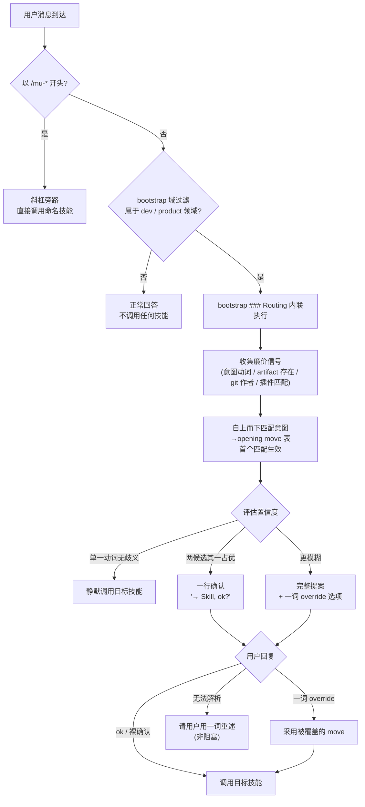

# 工作流与路由（bootstrap 内联路由器）

Referenced source files (5 files)

- `rules/bootstrap.md`
- `README.md`
- `CONTEXT.md`
- `docs/specs/2026-07-17-fold-routing-into-bootstrap-design.md`
- `docs/plans/2026-07-17-fold-routing-into-bootstrap.md`

DevMuse 对未加前缀的用户消息的路由，现在**内联在始终生效的 `rules/bootstrap.md` 中**——分类与调用直接从 bootstrap 的 `### Routing` 小节完成，不再经过任何独立的路由技能。此前承担该职责的独立路由技能已于 **2026-07-17 退役**：其路由表被折叠进 always-on 的 bootstrap 规则，技能目录被彻底删除、不留 tombstone stub。Sources: [rules/bootstrap.md:50-93](), [docs/specs/2026-07-17-fold-routing-into-bootstrap-design.md:1-8]()

之所以把路由搬进 rules 层，是因为路由必须在**任何技能或 knowledge 文件加载之前**就能运行——它是"选哪个技能"的决策，本质属于 rules 层定义的 always-on 决策指南。内联后达成三个效果：零跳转路由（无需先 Read 一个 186 行的技能文件）、单一权威来源（消除 bootstrap 与路由技能"必须保持一致"的一对约束）、Task transition 时零重载。代价是 bootstrap 净增约 20 行 always-on 内容。Sources: [docs/specs/2026-07-17-fold-routing-into-bootstrap-design.md:24-40](), [docs/specs/2026-07-17-fold-routing-into-bootstrap-design.md:88-92]()

对外的用户文档也把这一事实作为路由的权威描述：README 明确写明"路由存在于 always-on 的 bootstrap 规则中"——未加前缀的消息按意图与仓库状态分类，意图清晰则静默路由、模糊则给出提案，非 dev/product 消息不路由。这与 bootstrap 内部实现逐条对应，README 不再指向任何独立路由技能。Sources: [README.md:68-70](), [rules/bootstrap.md:50-54]()

## 整体流程：域过滤 → 内联路由 → 目标技能

未加前缀的消息先经 bootstrap 的**域过滤**放行（只放软件工程与产品分析类任务），再由同一份 bootstrap 中的 `### Routing` 小节按意图动词加廉价仓库信号匹配路由表，选出任务的 **Opening move**（Explore / Design-tech / Reproduce / Implement 之一），并按置信度决定交互摩擦。`/mu-*` 斜杠前缀完全绕过这套路由。Sources: [rules/bootstrap.md:42-54](), [rules/bootstrap.md:84-93]()

Sources: [rules/bootstrap.md:52-82](), [docs/plans/2026-07-17-fold-routing-into-bootstrap.md:26-59]()

## 域过滤（路由之前）

DevMuse 只处理两类工作：**软件工程**（编码、架构、调试、重构、测试、代码评审、部署）和**产品/商业分析**（前提验证、产品需求、竞品分析、商业建模）。一般性问题、无具体目标的开放讨论、非软件话题不在范围内——直接正常回答，不调用任何技能，因此这些消息永远不会进入路由表。Sources: [rules/bootstrap.md:42-48](), [rules/bootstrap.md:113]()

bootstrap 同时定义指令优先级：用户显式指令（CLAUDE.md / AGENTS.md / 直接请求）> DevMuse 技能 > 默认系统提示。若用户的 CLAUDE.md 为某仓库固定了行为，路由与技能都必须让位于该指令。Sources: [rules/bootstrap.md:18-26]()

## 信号：git/fs 事实，绝不伪造

路由的判定依据是廉价的 git/文件系统事实，而非推断。bootstrap 明确要求：命令失败时不伪造信号，而是向用户询问 Opening move。四类信号如下。Sources: [rules/bootstrap.md:56-61](), [docs/specs/2026-07-17-fold-routing-into-bootstrap-design.md:49]()

| 信号 | 探测方式 |
|------|----------|
| 意图动词 | 匹配下方的意图→opening move 表 |
| artifact 存在 | 磁盘上 `docs/scope\|specs\|prd\|biz/*.md` 的 file-exists 检查——**对话中的内联内容永远不算"specs 存在"** |
| recent-author familiarity | reshape 触发时执行 `git log --author --since="30 days ago" -- <area>` |
| 插件匹配 | 检查用户消息是否与已安装的非 DevMuse 技能描述吻合 |

Sources: [rules/bootstrap.md:56-61]()

## 意图 → Opening move 表

未加前缀的域内消息（任务起点或 Task transition 时）自上而下匹配下表，**首个匹配生效**。多动词同时命中时按优先级 **fix > review > reshape > create-feature > implement > understand** 取主要动作。Sources: [rules/bootstrap.md:63-77]()

| 信号 | Opening move |
|------|--------------|
| understand / figure out / take over / evaluate / what does this do | **Explore**（mu-explore） |
| fix / broken / error / bug / test failing / crash | **Reproduce**（mu-scope 1-UC repro） |
| review / 检查 / look at this diff or PR / 审一下 | **Review**（mu-review） |
| reshape（refactor / clean up / restructure）——不熟悉的区域 | **Explore**（pre-change）→ Design-tech |
| reshape 或 create-feature——熟悉、磁盘无 specs | **Design-tech**（mu-arch, stance=auto） |
| implement / build this——磁盘无 specs | **Design-tech**（mu-arch, stance=auto） |
| implement / build this——specs 已存在 | **Implement**（mu-code） |
| 疑似匹配某已安装的非 DevMuse 技能 | 提议委派给该技能 |
| 无动词命中 / 仓库状态异常（空仓、shallow） | **Explore** 安全默认 / 询问用户 |

Sources: [rules/bootstrap.md:66-77]()

Opening move 到技能的映射由域语言固定：Explore → mu-explore，Design-tech → mu-arch，Reproduce → mu-scope（1-UC repro）+ mu-debug，Implement → mu-code。当目标是 mu-arch 时，路由传递 `stance=auto` hint，表示其 Phase 0 自行做 stance 检测、无需再次预确认——路由本身不运行 stance 检测。Sources: [CONTEXT.md:7-9](), [CONTEXT.md:85](), [docs/specs/2026-07-17-fold-routing-into-bootstrap-design.md:53]()

## 置信度分级（置信度决定摩擦）

同一份路由逻辑用置信度决定要不要打扰用户：越确定越安静。Sources: [rules/bootstrap.md:78-82]()

| 置信度 | 判据 | 行为 |
|--------|------|------|
| 高 | 单一动词、意图无歧义 | **静默调用**——无提案，用户直接看到目标技能输出 |
| 中 | 两个候选 move、其一明显占优 | **一行确认**——"→ **<Skill>**, ok?" |
| 低 | 更模糊 | **完整提案**——附一词 override 选项（explore / design-tech / reproduce / review / implement） |

对提案的回复若无法解析（多词 / 离题 / 拼写错误），请用户从 override 列表中用一个词重述——非阻塞。这是 **Guidance over control** 哲学的直接体现：检测、路由与门禁产出的都是用户可一词覆盖的建议。Sources: [rules/bootstrap.md:78-82](), [CONTEXT.md:71-73]()

## Continuation vs Task transition

路由只在两个时机触发：**会话内第一条领域内消息**，以及 **Task transition**——用户意图切换到不同的技能类别（debug→fix、explore→implement、anything→review、fix→redesign）。活动技能期间的同类型追问是 continuation，直接响应、不重新路由：例如 mu-debug 进行中的"查下这个日志"、澄清性问题、补充所要求的信息。Sources: [rules/bootstrap.md:96-97](), [CONTEXT.md:67-69]()

判定测试：**去掉全部先前对话上下文后，这条消息会路由到与当前活动技能不同的技能吗？** 是 → transition → 用 Routing 小节重新路由。bootstrap 的 Red Flags 表也把"这是当前任务的延续"列为需要警惕的合理化借口——意图已切换就必须重路由。Sources: [rules/bootstrap.md:98-99](), [rules/bootstrap.md:110]()

## On-demand 技能：指针，不调用

mu-biz、mu-prd、mu-wiki、mu-retro、mu-grill 是 **On-demand skill**，永不自动路由。当消息命中其触发意图时，bootstrap 的路由回复一个指向对应斜杠命令的**指针**而非调用：validate idea / business model → `/mu-biz`；product requirements / user flows → `/mu-prd`；wiki / architecture docs → `/mu-wiki`；retro / look back → `/mu-retro`；grill me / stress-test this plan → `/mu-grill`。由用户显式发起。这段 on-demand 指针行为在折叠后作为 bootstrap 中的独立块保留、语义未变。Sources: [rules/bootstrap.md:84-93](), [CONTEXT.md:19-21](), [docs/specs/2026-07-17-fold-routing-into-bootstrap-design.md:53]()

四类技能划分如下（技能清单的唯一权威来源是 README 的 Skills 表，此处仅示路由方式）：

| 类别 | 路由方式 |
|------|----------|
| Core pipeline（mu-scope → mu-arch → mu-plan → mu-code → mu-review） | 自动路由 |
| Orthogonal（mu-explore, mu-debug） | 自动路由 |
| On-demand（mu-biz, mu-prd, mu-wiki, mu-retro, mu-grill） | 仅 slash 调用；匹配意图得到指针而非调用 |
| Meta（mu-write-skill） | — |

Sources: [rules/bootstrap.md:84-93](), [README.md:68-70]()

## 折叠理由：为什么路由搬进 rules 层

退役独立路由技能、把路由内联进 bootstrap，是在三个方案中选定的 **A1（单节内联折叠）**：

| 方案 | 结论 |
|------|------|
| A1 单节内联折叠 | **选定**——零往返、Task transition 零重载、消除 bootstrap↔路由技能"必须一致"一对约束、单一权威来源 |
| A2 折叠 + 保留一个 disclosed 引用文件 | 拒绝——路由在任何技能加载前运行，disclosed 文件需要一次 Read 往返，等于重新引入被消除的那一跳 |
| A3 保留技能、瘦身到 ~80 行 | 拒绝——同步一对约束与每次路由的加载仍在 |

Sources: [docs/specs/2026-07-17-fold-routing-into-bootstrap-design.md:14-20]()

两条关键决策记录（ADR）：**ADR-1** 决定内联完整路由器而非把细节 disclose 到 knowledge 文件——路由必须仅凭 always-on 上下文就完全可运行；**ADR-2** 决定干净删除路由技能、不留 tombstone stub——因为 stub 会经 `./skills/` glob 重新注册为技能、污染插件清单，git history 即记录。折叠后技能总数回到 13。Sources: [docs/specs/2026-07-17-fold-routing-into-bootstrap-design.md:88-98]()

折叠的验收 oracle 是**行为等价**：8+5 场景 battery 在折叠后的 bootstrap 上重跑，每个路由决策必须与折叠前逐一相同——这是一次"仅搬迁、不改任何路由决策"的重构。结构性门禁另有两道：`grep -r "mu-route"` 在 dated snapshots 之外须为空、`wc -l rules/bootstrap.md` ≤135。Sources: [docs/specs/2026-07-17-fold-routing-into-bootstrap-design.md:82-84](), [docs/plans/2026-07-17-fold-routing-into-bootstrap.md:73-92]()

实施计划把这条 oracle 落成一道**先失败后通过**的验收门：仅以折叠草稿为 guidance、向一个全新 subagent 提交 13 个场景（含 bug 修复、中文闲聊、mu-debug continuation、slash 直调、on-demand 指针、指令优先级旁路、多动词优先级 `fix > review` 等），逐一比对每个场景的期望决策，必须 13/13 全中方可安装草稿——任一不符即回退改草稿措辞、重跑 battery。这确保折叠没有静默改变任何一条路由判定。Sources: [docs/plans/2026-07-17-fold-routing-into-bootstrap.md:75-90]()

## 错误处理

| 情形 | 处理 |
|------|------|
| 信号计算失败（git 命令失败、文件读取失败、正则错误） | 不伪造信号——向用户询问 Opening move（UC-E1） |
| 仓库状态异常（空仓、shallow clone） | 跳过路由表，直接问用户（UC-E2） |
| 对提案的回复无法解析 | 请用户从 override 列表中用一个词重述（非阻塞） |

所有路径均非阻塞——路由总是产出一个提案或一个澄清性提问。Sources: [rules/bootstrap.md:56-61](), [rules/bootstrap.md:78-82](), [docs/specs/2026-07-17-fold-routing-into-bootstrap-design.md:100-103]()

---

See also: [四层架构](four-layer-architecture.md) · [核心管道](core-pipeline.md) · [探索与调试](explore-and-debug.md)
