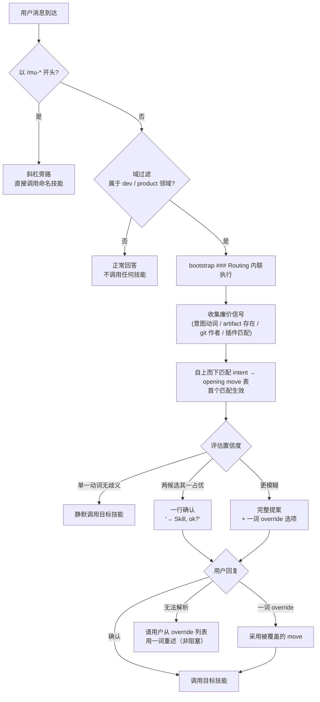
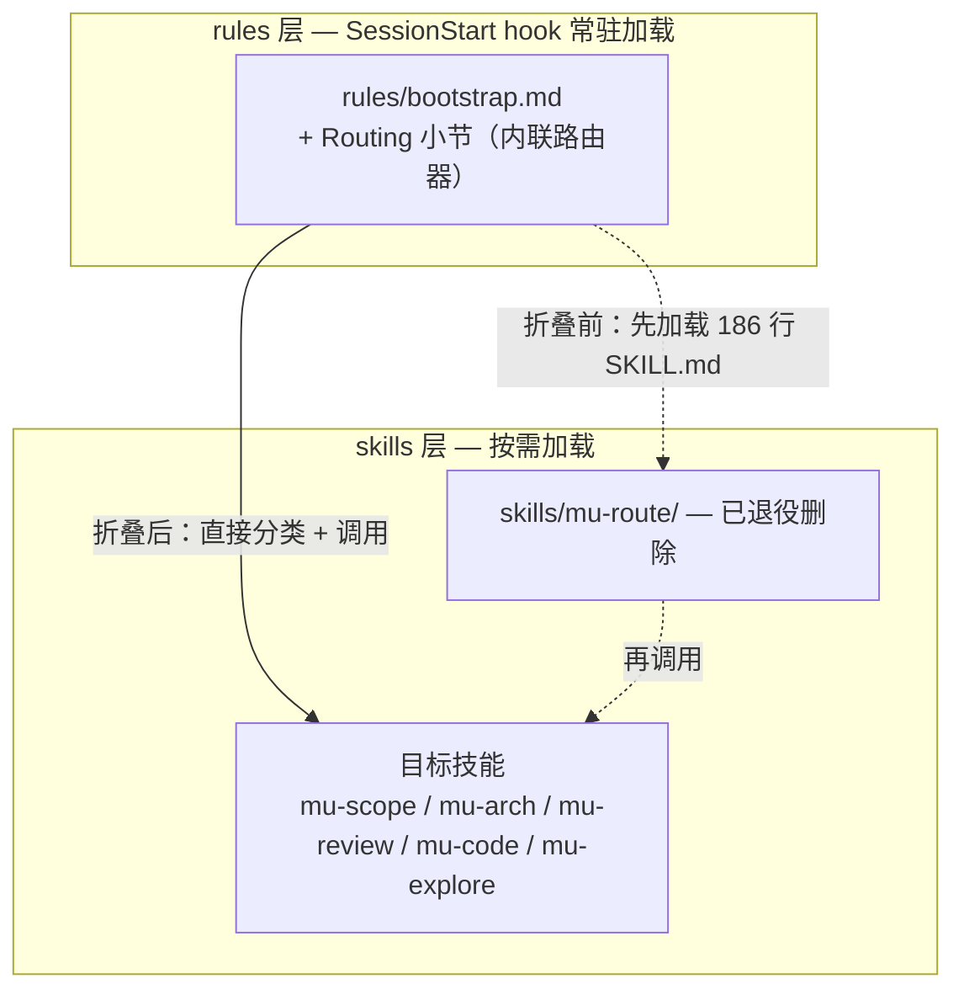

Referenced source files (5 files)

- `rules/bootstrap.md`
- `README.md`
- `CONTEXT.md`
- `docs/specs/2026-07-17-fold-routing-into-bootstrap-design.md`
- `docs/plans/2026-07-17-fold-routing-into-bootstrap.md`

# 工作流与路由（bootstrap 内联路由器）

DevMuse 对未加前缀的用户消息的路由，**内联在始终生效的 `rules/bootstrap.md` 中**——分类与调用直接从 bootstrap 的 `### Routing` 小节完成，不经过任何独立的路由技能。此前承担该职责的 mu-route 技能已于 **2026-07-17 退役**：其路由表被折叠进 always-on 的 bootstrap 规则，技能目录被彻底删除、不留 tombstone stub。本页 `docs/specs`、`docs/plans` 两个引用文件是那次折叠的 dated snapshot（历史设计记录），描述的是折叠当时的形态；bootstrap 的现行文本以文件本身为准。Sources: [rules/bootstrap.md:46-89](), [docs/specs/2026-07-17-fold-routing-into-bootstrap-design.md:1-8](), [docs/plans/2026-07-17-fold-routing-into-bootstrap.md:5-7]()

之所以把路由放在 rules 层，是因为路由必须在**任何技能或 knowledge 文件加载之前**就能运行——它是"选哪个技能"的决策，本质属于 rules 层的 always-on 决策指南。内联达成三个效果：零跳转路由（无需先加载一个 186 行的技能文件）、单一权威来源（消除 bootstrap 与路由技能"必须保持一致"的同步约束对）、task transition 时零重载。对外文档同样以此为权威描述：README 写明"路由存在于 always-on 的 bootstrap 规则中"——意图清晰则静默路由、模糊则给出提案，非 dev/product 消息不路由。Sources: [docs/specs/2026-07-17-fold-routing-into-bootstrap-design.md:88-92](), [README.md:68-70](), [rules/bootstrap.md:46-50]()

## SKILL-ROUTING 触发规则：成本不对称，而非胁迫

bootstrap 的开篇块现在是一条**中性的 `<SKILL-ROUTING>` 规则**，取代了早期版本的胁迫式命令措辞（"YOU DO NOT HAVE A CHOICE" 一类的强制口吻）。现行规则用**成本不对称**论证来说服而非命令：只要某个技能*可能*适用——哪怕不确定——就在任何回应（包括澄清性提问）之前先调用它；因为两类错误的代价不对等——多余的一次调用只浪费一个 tool call，而静默跳过则丢失该技能编码的整个工作流。结论一句话：**存疑就调用（When in doubt, invoke）**。Sources: [rules/bootstrap.md:10-12]()

开篇另有一条 `<SUBAGENT-STOP>` 例外：若当前是被派出的执行特定任务的 subagent，跳过整个 bootstrap 技能路由——路由只属于主对话。Sources: [rules/bootstrap.md:6-8]()

规则块之下是**指令优先级**：用户显式指令（CLAUDE.md / AGENTS.md / 直接请求）> DevMuse 技能 > 默认系统提示。若用户指令与技能冲突（如 CLAUDE.md 说"不用 TDD"而技能要求 TDD），听用户的——用户始终掌控。这也意味着"别走流程了直接改"这类消息合法地绕过路由。Sources: [rules/bootstrap.md:14-22](), [docs/plans/2026-07-17-fold-routing-into-bootstrap.md:82]()

## 整体流程：域过滤 → 内联路由 → 目标技能

未加前缀的消息先经 bootstrap 的**域过滤**放行（只放软件工程与产品分析类任务），再由同一份 bootstrap 的 `### Routing` 小节按意图动词加廉价仓库信号匹配路由表，选出任务的 **Opening move**（Explore / Design-tech / Reproduce / Implement 之一），并按置信度决定交互摩擦。`/mu-*` 斜杠前缀完全绕过路由。Sources: [rules/bootstrap.md:38-50](), [CONTEXT.md:7-9]()

```mermaid
graph TD
    A["用户消息到达"] --> B{"以 /mu-* 开头?"}
    B -->|"是"| C["斜杠旁路<br/>直接调用命名技能"]
    B -->|"否"| D{"域过滤<br/>属于 dev / product 领域?"}
    D -->|"否"| E["正常回答<br/>不调用任何技能"]
    D -->|"是"| F["bootstrap ### Routing 内联执行"]
    F --> G["收集廉价信号<br/>(意图动词 / artifact 存在 / git 作者 / 插件匹配)"]
    G --> H["自上而下匹配 intent → opening move 表<br/>首个匹配生效"]
    H --> I{"评估置信度"}
    I -->|"单一动词无歧义"| J["静默调用目标技能"]
    I -->|"两候选其一占优"| K["一行确认<br/>'→ Skill, ok?'"]
    I -->|"更模糊"| L["完整提案<br/>+ 一词 override 选项"]
    K --> M{"用户回复"}
    L --> M
    M -->|"确认"| N["调用目标技能"]
    M -->|"一词 override"| O["采用被覆盖的 move"] --> N
    M -->|"无法解析"| P["请用户从 override 列表<br/>用一词重述（非阻塞）"]
```

Sources: [rules/bootstrap.md:38-78](), [docs/plans/2026-07-17-fold-routing-into-bootstrap.md:26-59]()

## 域过滤（路由之前）

DevMuse 只处理两类工作：**软件工程**（编码、架构、调试、重构、测试、代码评审、部署）与**产品/商业分析**（前提验证、产品需求、竞品分析、商业建模）。一般性问题、无具体目标的开放讨论、非软件话题不在范围内——直接正常回答，不调用任何技能，这些消息永远不会进入路由表。Red Flags 表也明确"这不是 dev/product 任务"**不是**危险信号——开放讨论正常回应即可。Sources: [rules/bootstrap.md:38-44](), [rules/bootstrap.md:109]()

## 信号：git/fs 事实，绝不推断

路由的判定依据是廉价的 git/文件系统事实，而非推断。bootstrap 明确要求：命令失败时不伪造信号，而是向用户询问 opening move。四类信号如下。Sources: [rules/bootstrap.md:52-57](), [docs/specs/2026-07-17-fold-routing-into-bootstrap-design.md:49]()

| 信号 | 探测方式 |
|------|----------|
| 意图动词 | 匹配下方的 intent → opening move 表 |
| artifact 存在 | 磁盘上 `docs/scope\|specs\|prd\|biz/*.md` 是否存在——**对话中的内联文本永远不算"specs 存在"** |
| recent-author familiarity | reshape 触发时执行 `git log --author --since="30 days ago" -- <area>` |
| 插件匹配 | 用户消息是否 plausible 地吻合某个已安装的非 DevMuse 技能 |

Sources: [rules/bootstrap.md:52-57]()

## Intent → Opening move 表

未加前缀的域内消息（任务起点或 task transition 时）自上而下匹配下表，**首个匹配生效**。多动词同时命中时按优先级 **fix > review > reshape > create-feature > implement > understand** 取主导动作。Sources: [rules/bootstrap.md:59-72]()

| 信号 | Opening move |
|------|--------------|
| understand / figure out / take over / evaluate / what does this do | **Explore**（mu-explore） |
| fix / broken / error / bug / test failing / crash | **Reproduce**（mu-scope 1-UC repro） |
| review / 检查 / look at this diff or PR / 审一下 | **Review**（mu-review） |
| reshape（refactor / clean up / restructure）——不熟悉的区域 | **Explore**（pre-change）→ Design-tech |
| reshape 或 create-feature——熟悉、磁盘无 specs | **Design-tech**（mu-arch, stance=auto） |
| implement / build this——磁盘无 specs | **Design-tech**（mu-arch, stance=auto） |
| implement / build this——specs 已存在 | **Implement**（mu-code） |
| 疑似匹配某已安装的非 DevMuse 技能 | 提议委派给该技能 |
| 无动词命中 / 仓库状态异常（空仓、shallow） | **Explore** 安全默认 / 询问用户 |

Sources: [rules/bootstrap.md:62-72]()

Opening move 到技能的映射由域语言（CONTEXT.md）固定：Explore → mu-explore，Design-tech → mu-arch，Reproduce → mu-scope（1-UC repro）+ mu-debug，Implement → mu-code。目标为 mu-arch 时路由传递 `stance=auto` hint——由 mu-arch 的 Phase 0 自行做 stance 检测，路由本身不做。Sources: [CONTEXT.md:7-9](), [CONTEXT.md:85](), [docs/specs/2026-07-17-fold-routing-into-bootstrap-design.md:53]()

## 置信度决定摩擦

同一份路由逻辑用置信度决定要不要打扰用户：越确定越安静。Sources: [rules/bootstrap.md:74-78]()

| 置信度 | 判据 | 行为 |
|--------|------|------|
| 高 | 单一动词、意图无歧义 | **静默调用**——无提案，用户直接看到目标技能输出 |
| 中 | 两个候选 move、其一明显占优 | **一行确认**——"→ **\<Skill\>**, ok?" |
| 低 | 更模糊 | **完整提案**——附一词 override 选项（explore / design-tech / reproduce / review / implement） |

对提案的回复若无法解析，请用户从 override 列表中用一个词重述——非阻塞。这是 **Guidance over control** 哲学的直接体现：检测、路由与各类 gate 产出的都是用户可一词覆盖的建议。Sources: [rules/bootstrap.md:74-78](), [CONTEXT.md:71-73]()

## Continuation vs Task transition

路由只在两个时机触发：**任务起点**，以及 **task transition**——用户意图切换到不同的技能类别（debug→fix、explore→implement、anything→review、fix→redesign）。活动技能期间的同类型追问是 continuation，直接响应、不重新路由：例如 mu-debug 进行中的"查下这个日志"、澄清性问题、补充所要求的信息。Sources: [rules/bootstrap.md:91-93](), [CONTEXT.md:67-69]()

判定测试：**去掉全部先前对话上下文后，这条消息会路由到与当前活动技能不同的技能吗？** 是 → transition → 用 Routing 小节重新路由。Red Flags 表把"这是当前任务的延续"列为需警惕的合理化借口——意图已切换类别就必须重路由；表中其余条目（"先收集上下文"、"技能是杀鸡用牛刀"、"我记得这个技能"、"就是个快速修复"）同样都是跳过路由的自我合理化信号。Sources: [rules/bootstrap.md:95](), [rules/bootstrap.md:97-107]()

## 四类技能与 on-demand 指针

路由视角下技能分四类（技能清单的唯一权威来源是 README 的 Skills 表，此处仅示路由方式）。Sources: [rules/bootstrap.md:80-89](), [README.md:37-66]()

| 类别 | 成员 | 路由方式 |
|------|------|----------|
| Core pipeline | mu-scope → mu-arch → mu-plan → mu-code → mu-review | 自动路由 |
| Orthogonal | mu-explore, mu-debug | 自动路由 |
| On-demand | mu-biz, mu-prd, mu-wiki, mu-retro, mu-grill | 仅 slash 调用；匹配意图得到**指针而非调用** |
| Meta | mu-write-skill | 技能创作时使用 |

On-demand 技能永不自动路由。消息命中其触发意图时，路由回复一个指向对应斜杠命令的指针：validate idea / business model → `/mu-biz`；product requirements / user flows → `/mu-prd`；wiki / architecture docs → `/mu-wiki`；retro / look back → `/mu-retro`；grill me / stress-test this plan → `/mu-grill`。由用户显式发起。这段指针行为在折叠时作为独立块保留、语义未变。Sources: [rules/bootstrap.md:84-88](), [CONTEXT.md:19-21](), [docs/specs/2026-07-17-fold-routing-into-bootstrap-design.md:53]()

## 历史：折叠设计与验收（dated snapshot）

2026-07-17 的折叠在三个方案中选定 **A1（单节内联折叠）**：A2（折叠 + disclosed 引用文件）被拒——路由在任何技能加载前运行，disclosed 文件需要一次 Read 往返，等于重新引入被消除的那一跳；A3（保留技能、瘦身到 ~80 行）被用户决策否决——同步约束对与每次路由的加载仍在。Sources: [docs/specs/2026-07-17-fold-routing-into-bootstrap-design.md:16-20]()

```mermaid
graph TD
    subgraph RulesLayer["rules 层 — SessionStart hook 常驻加载"]
        B["rules/bootstrap.md<br/>+ Routing 小节（内联路由器）"]
    end
    subgraph SkillsLayer["skills 层 — 按需加载"]
        R["skills/mu-route/ — 已退役删除"]
        T["目标技能<br/>mu-scope / mu-arch / mu-review / mu-code / mu-explore"]
    end
    B -->|"折叠后：直接分类 + 调用"| T
    B -.->|"折叠前：先加载 186 行 SKILL.md"| R
    R -.->|"再调用"| T
```

Sources: [docs/specs/2026-07-17-fold-routing-into-bootstrap-design.md:26-40]()

两条 ADR：**ADR-1** 内联完整路由器而非 disclose 到 knowledge 文件——路由必须仅凭 always-on 上下文就完全可运行；代价是 bootstrap 净增约 20 行 always-on 内容、每次路由改动的 blast radius 变大（由场景 battery 作为回归网兜底）。**ADR-2** 干净删除技能目录、不留 tombstone stub——stub 会经 `./skills/` glob 重新注册为技能、污染插件清单，git history 即记录；技能总数回到 13。Sources: [docs/specs/2026-07-17-fold-routing-into-bootstrap-design.md:88-98](), [docs/specs/2026-07-17-fold-routing-into-bootstrap-design.md:76-80]()

验收 oracle 是**行为等价**：这是一次"仅搬迁、不改任何路由决策"的重构。实施计划把它落成先失败后通过的验收门——仅以折叠草稿为 guidance、向一个全新 subagent 提交 13 个场景（bug 修复静默路由、中文闲聊不路由、mu-debug continuation、debug→fix transition、slash 直调、on-demand 指针、指令优先级旁路、多动词优先级 `fix > review` 等），必须 13/13 与折叠前决策全中方可安装；另有结构性门禁 `grep -r "mu-route"` 在 dated snapshots 之外为空、`wc -l rules/bootstrap.md` ≤135。落地后的两个用户动作：`/reload-plugins`（插件缓存在会话内提供 stale bootstrap）与 `/mu-wiki update`（再生引用了旧路由的 wiki 页——本页即在其列）。Sources: [docs/plans/2026-07-17-fold-routing-into-bootstrap.md:73-92](), [docs/plans/2026-07-17-fold-routing-into-bootstrap.md:143-158](), [docs/plans/2026-07-17-fold-routing-into-bootstrap.md:160-164](), [docs/specs/2026-07-17-fold-routing-into-bootstrap-design.md:105-108]()

## 错误处理

| 情形 | 处理 |
|------|------|
| 信号计算失败（git 命令失败等） | 不伪造信号——向用户询问 opening move（UC-E1） |
| 仓库状态异常（空仓、shallow clone） | 跳过路由表，直接问用户（UC-E2） |
| 对提案的回复无法解析 | 请用户从 override 列表中用一个词重述（非阻塞） |

所有路径均非阻塞——路由总是产出一次调用、一个指针、一个提案或一个澄清性提问。Sources: [rules/bootstrap.md:52-57](), [rules/bootstrap.md:74-78](), [docs/specs/2026-07-17-fold-routing-into-bootstrap-design.md:100-103]()

---

See also: [DevMuse 四层架构](four-layer-architecture.md) · [核心管线：Scope → Arch → Plan → Code → Review](core-pipeline.md) · [按需技能：mu-biz / mu-prd / mu-wiki / mu-retro / mu-grill](on-demand-skills.md)
