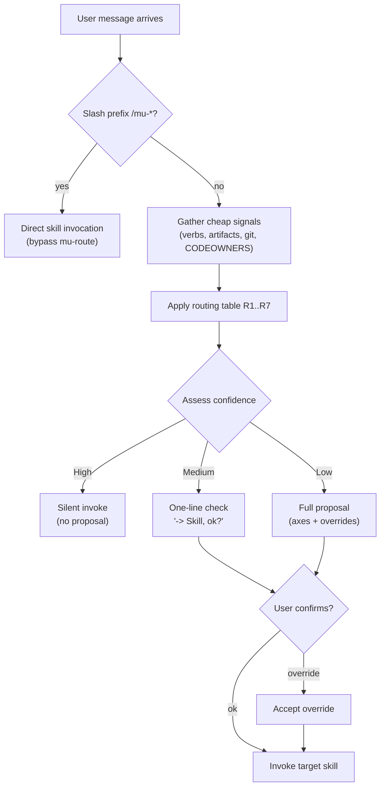
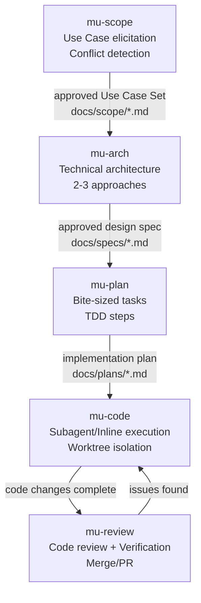
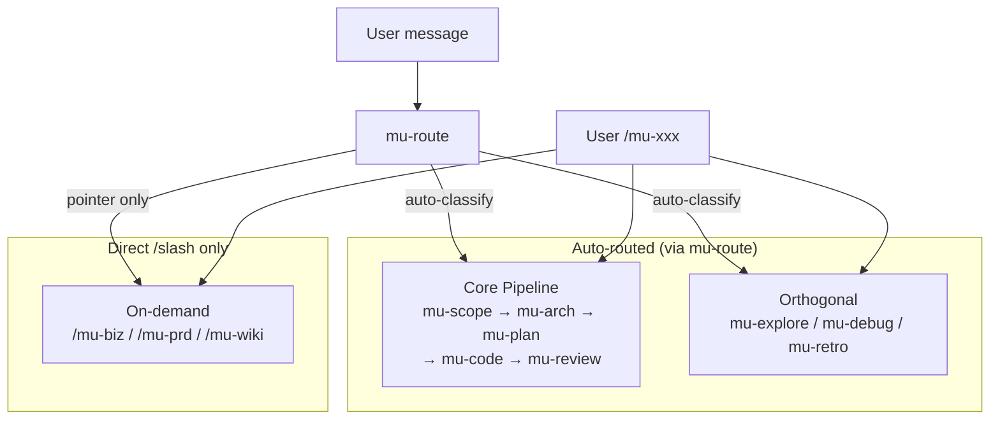

# 开发工作流与路由

引用的源文件

- `README.md`
- `rules/bootstrap.md`
- `skills/mu-route/SKILL.md`
- `skills/mu-scope/SKILL.md`
- `skills/mu-arch/SKILL.md`
- `skills/mu-plan/SKILL.md`
- `skills/mu-code/SKILL.md`
- `skills/mu-review/SKILL.md`
- `docs/architecture.md`

DevMuse 的核心开发工作流由 `mu-route` 驱动，将用户的自然语言消息自动路由到 `scope → arch → plan → code → review` 五阶段管道。路由基于 confidence 级别运作：明确意图静默路由，模糊意图向用户提案确认，从而在效率与可控性之间取得平衡。

整个管道的设计理念是"先理解、再设计、后实现"。每个阶段都产出结构化的 artifact（文档），作为下一阶段的输入，确保可追溯性。用户在每个阶段都有 sign-off 的机会，系统不会跳过任何阶段自行推进实现。

Sources: [README.md:36-51](), [rules/bootstrap.md:117-120]()

## 路由系统 (mu-route)

### 路由触发条件

mu-route 在以下场景被调用：

- **会话的第一条消息**，且属于 DevMuse 领域（软件工程或产品分析）
- **Task transition**：用户意图从一个 skill 类别切换到另一个（如 debug → fix）
- **不会触发**：用户使用 `/mu-<skill>` 直接调用时（slash 命令绕过路由）

Sources: [skills/mu-route/SKILL.md:13-17](), [rules/bootstrap.md:39-44]()

### 路由流程

Sources: [skills/mu-route/SKILL.md:39-68]()

### Confidence 级别

| Confidence | 判定条件 | 行为 |
|------------|----------|------|
| **High** | 单一动词匹配，意图明确，上下文充分 | 静默调用目标 skill，不提案 |
| **Medium** | 两个可能动作，一个明显优势 | 一行确认："→ Skill, ok?" |
| **Low** | 三个以上可能动作，或两个均等 | 完整提案：axes + override 选项 |

默认值：不确定时使用 Medium。

Sources: [skills/mu-route/SKILL.md:29-36]()

### Trigger Signal 词表

| 用户消息中的动词/短语 | Axis-Intent | 默认 Opening Move |
|------------------------|-------------|-------------------|
| "understand", "figure out", "read", "take over", "evaluate" | understand | **Explore** |
| "add feature", "build feature" | create-feature | **Design-tech** (或 Explore 若不熟悉) |
| "refactor", "clean up", "rename", "restructure" | reshape | **Design-tech** (或 Explore 若不熟悉) |
| "fix", "broken", "error", "bug", "test failing", "crash" | fix | **Reproduce** |
| "implement", "write this", "build this", "code it up" | implement | **Implement** (若 design 存在；否则 Design-tech) |

当多个动词同时出现时，Axis-Intent 优先级：fix > reshape > create-feature > implement > understand（最具体者优先）。

Sources: [skills/mu-route/SKILL.md:89-101]()

### 路由决策表

| # | Slash prefix | Axis-Intent | Axis-Missing-artifact | Axis-Familiarity | Opening Move |
|---|-------------|-------------|----------------------|-----------------|--------------|
| R1 | `/mu-<skill>` | -- | -- | -- | **bypass** direct invocation |
| R2 | none | understand | -- | -- | **Explore** |
| R3 | none | fix | -- | -- | **Reproduce** (via mu-scope 1 UC) |
| R4 | none | reshape | -- | unfamiliar | **Explore** -> Design-tech |
| R5 | none | reshape / create-feature | no specs | familiar | **Design-tech** |
| R6 | none | implement | specs exist | -- | **Implement** |
| R6.5 | none | Axis-Plugin matched | -- | -- | **Delegate to plugin** |
| R7 | none (no verb match) | -- | -- | -- | **Explore** (safe default) |

决策表从上到下评估，第一条匹配即执行。On-demand skills（mu-biz, mu-prd, mu-retro）不会被自动路由，mu-route 只会返回对应 `/slash` 命令的指引。

Sources: [skills/mu-route/SKILL.md:104-117]()

## 延续 vs 转场检测 (Continuation vs Transition)

并非每条消息都需要重新路由。当一个 skill 正在活跃运行时，同类型的后续消息视为"延续"，直接在当前 skill 内处理；只有用户意图发生类别切换时才触发"转场"，重新调用 mu-route。

### 判断标准

**延续（跳过 mu-route）：**
- 同类型后续：如在 mu-debug 期间 "查下这个日志"、"再看下 authId=xxx"
- 对当前工作的澄清性提问
- 向当前 skill 提供被请求的信息

**转场（重新调用 mu-route）：**

| From | Signal words | Likely target |
|------|-------------|---------------|
| debug/explore → fix | "修复", "fix", "改掉", "解决" | mu-code |
| debug/explore → implement | "实现", "implement", "加上", "做这个" | mu-arch or mu-code |
| any → review | "review", "检查", "提交" | mu-review |
| any → new feature | "接下来做", "新增", "加个功能" | mu-arch |
| fix → design | "重新设计", "重构", "这个架构不对" | mu-arch |

**判断测试：** 如果去掉之前所有的对话上下文，这条消息会被路由到与当前活跃 skill **不同**的 skill 吗？如果是 → 转场 → 重新路由。

Sources: [rules/bootstrap.md:73-91]()

## 核心管道 (Core Pipeline)

Sources: [README.md:39-51](), [docs/architecture.md:83-91]()

### 阶段 1: mu-scope

对工作范围进行界定：扫描代码库评估影响（Quick Probe），枚举 use cases（happy path → edge cases → error cases → reverse cases），检测冲突，产出 Use Case Set。

**关键规则：** 每个任务都必须经过 scoping，无论多简单。一个 bug fix 的 scope 可能只有 1 个 use case（30 秒完成），但必须产出并获得用户确认。

| 阶段 | 内容 |
|------|------|
| Quick Probe | 扫描代码库：定位代码、fan-out 分析、测试覆盖、历史信号、接口风险、guard 语义分析 |
| Depth Decision | 基于 probe 结果推荐深度（低风险快速 / 高风险全面枚举） |
| Use Case Elicitation | Happy paths → Edge cases → Error cases → Reverse cases |
| Conflict Detection | 交叉检查所有 use cases，解决矛盾 |
| Output | 写入 `docs/scope/YYYY-MM-DD-<name>.md` |

Sources: [skills/mu-scope/SKILL.md:1-10](), [skills/mu-scope/SKILL.md:27-29](), [skills/mu-scope/SKILL.md:75-98]()

### 阶段 2: mu-arch

将已批准的 scope 转化为技术架构设计：组件、接口、数据流、错误处理。

**核心流程：**
1. Phase 0 Stance Detection（`create` / `update` / `extract` / `skip`）
2. 读取 scope artifact，理解全部 use cases
3. 探索项目上下文和现有架构文档
4. 提出 2-3 种方案（含 inversion test：每种方案的失败场景）
5. 分节呈现设计，逐节获得用户批准
6. 写入 `docs/specs/YYYY-MM-DD-<topic>-design.md`
7. Spec review loop（dispatch mu-reviewer review-design）
8. 用户最终审核

**HARD-GATE：** 必须有 scope artifact（`docs/scope/*.md`）才能开始设计。无 scope 则先调用 mu-scope。

Sources: [skills/mu-arch/SKILL.md:1-16](), [skills/mu-arch/SKILL.md:56-72](), [skills/mu-arch/SKILL.md:256-263]()

### 阶段 3: mu-plan

将架构设计拆分为可执行的 bite-sized tasks（每个 2-5 分钟），面向"没有项目上下文的工程师"编写。

**Task 结构要求：**
- 精确文件路径
- 完整代码（非 "add validation" 之类的占位）
- TDD 流程：write failing test → run → implement → run → commit
- `Covers: UC-xxx` 标注（UC-ID traceability）
- 验证步骤含预期输出

**输出路径：** `docs/plans/YYYY-MM-DD-<feature-name>.md`

Sources: [skills/mu-plan/SKILL.md:1-10](), [skills/mu-plan/SKILL.md:66-76](), [skills/mu-plan/SKILL.md:92-135]()

### 阶段 4: mu-code

按计划逐 task 执行实现，支持两种模式：

| 模式 | 特点 |
|------|------|
| **Subagent-Driven**（推荐） | 每个 task dispatch 一个新 subagent，task 之间 review |
| **Inline** | 在当前 session 内执行，batch execution with checkpoints |

核心原则：Fresh subagent per task + two-stage review (spec then quality) = 高质量 + 快速迭代。使用 Git worktree 进行隔离开发。

Sources: [skills/mu-code/SKILL.md:1-14](), [skills/mu-code/SKILL.md:24-28]()

### 阶段 5: mu-review

代码审查、反馈处理、验证门控、集成。

| 步骤 | 内容 |
|------|------|
| Dispatch Review | dispatch mu-reviewer（含 security check 条件触发） |
| Handle Feedback | 处理审查反馈 |
| Coverage Check | 需求覆盖度检查 + gap 处理 |
| Verification | 验证门控 |
| Finish/Integrate | merge / PR / keep / discard |

Sources: [skills/mu-review/SKILL.md:1-12](), [skills/mu-review/SKILL.md:39-50]()

## Artifact 输出结构

管道中每个阶段产出的 artifact 遵循统一的目录规范：

| 阶段 | Artifact | 路径 |
|------|----------|------|
| mu-scope | Use Case Set | `docs/scope/YYYY-MM-DD-<name>.md` |
| mu-arch | Architecture Spec | `docs/specs/YYYY-MM-DD-<topic>-design.md` |
| mu-plan | Implementation Plan | `docs/plans/YYYY-MM-DD-<feature-name>.md` |
| mu-code | Code changes | Git worktree (branch isolation) |
| mu-review | Review feedback | Inline (conversation context) |

每个 artifact 文件在写入后都会被 commit 到 git。Artifact 之间通过文件引用建立 traceability 链：

- **Design doc** 包含 `Requirements Reference` 字段，链接回 scope 的 UC-ID
- **Plan** 中每个 task 包含 `Covers: UC-xxx` 标注
- **Review** 检查需求覆盖度，确保所有 UC 都被实现和测试

Sources: [skills/mu-scope/SKILL.md:195-196](), [skills/mu-arch/SKILL.md:188-198](), [skills/mu-plan/SKILL.md:17-19]()

## 典型路径

| 场景 | 路径 |
|------|------|
| 已有项目的新功能 | `mu-scope → mu-arch → mu-plan → mu-code → mu-review` |
| 全新产品 (Greenfield) | `/mu-biz` → `/mu-prd` → 上述功能循环 |
| Bug 修复 | `mu-scope (1 UC) → mu-debug → mu-code` |

Sources: [README.md:73-76]()

## Skill 分类与路由范围

| 类别 | Skills | 路由方式 |
|------|--------|----------|
| Pipeline (核心管道) | mu-scope, mu-arch, mu-plan, mu-code, mu-review | Auto-routed |
| Orthogonal (正交) | mu-explore, mu-debug, mu-retro | Auto-routed |
| On-demand (按需) | mu-biz, mu-prd, mu-wiki | Direct `/slash` only |
| Router | mu-route | 被 bootstrap 调用 |
| Meta | mu-write-skill | 内部工具 |

Sources: [README.md:89-105](), [rules/bootstrap.md:117-126](), [docs/architecture.md:79-119]()

## Domain Filter

mu-route 之前有一层 domain filter，由 bootstrap 规则执行。只有属于以下两类的消息才会进入路由：

1. **软件工程** -- coding, architecture, debugging, refactoring, testing, code review, deployment
2. **产品/业务分析** -- premise validation, product requirements, competitive analysis, business modeling

不在范围内的消息（一般性问题、开放讨论、非软件话题）直接正常回复，不调用任何 skill。

Sources: [rules/bootstrap.md:39-46]()
