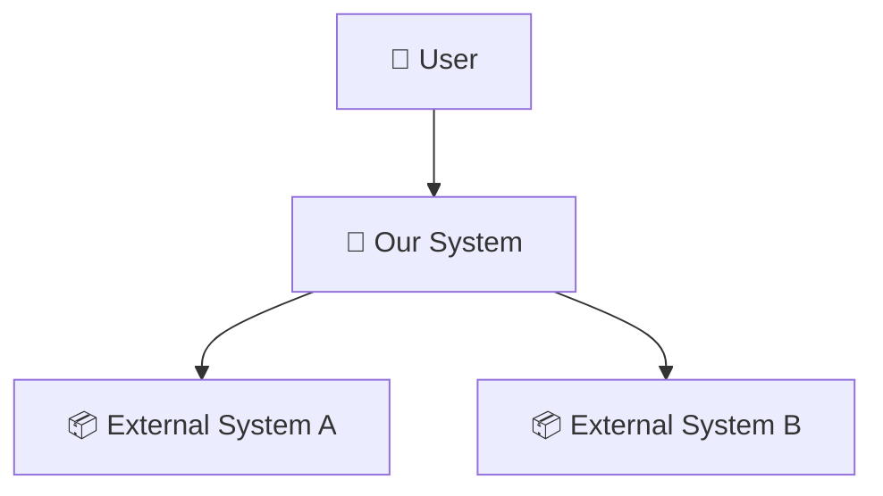
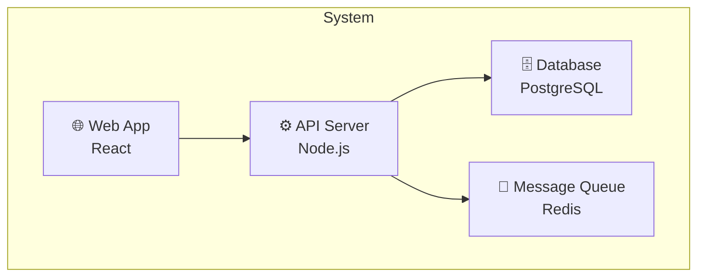
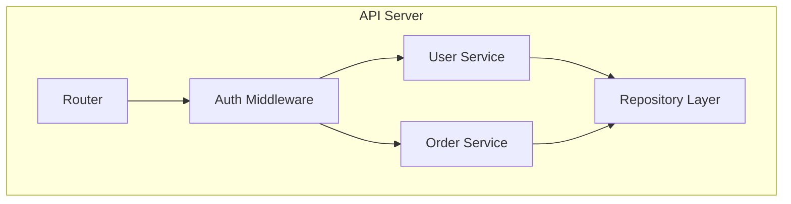
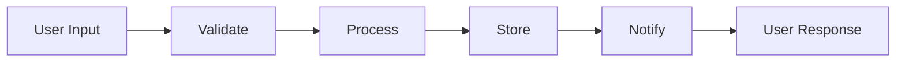
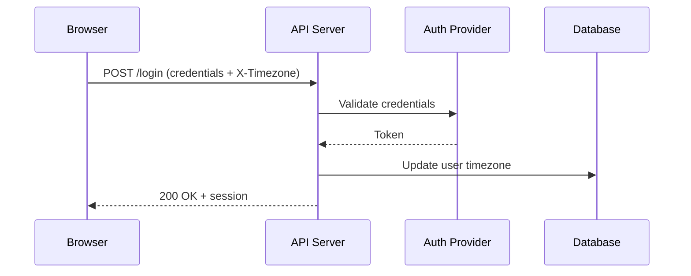
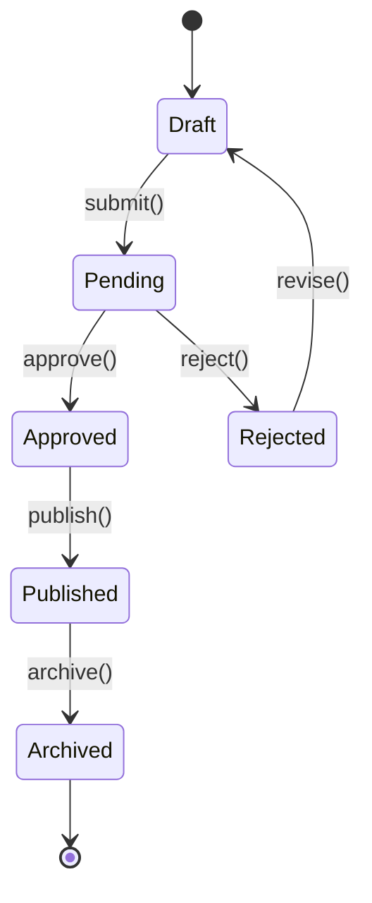

# Architecture Assessment

**When to use:** Referenced by mu-scope (Quick Probe), mu-arch (C4 positioning + design diagrams), mu-wiki (project-level architecture documentation), and mu-reviewer (review-design mode).

## Diagram Type by Project Type

Choose the right diagram type based on what the project is:

| Project type | Recommended diagrams | Why |
|---|---|---|
| CLI tool / Library | C3 Component | No multi-container complexity; component relationships suffice |
| Web app (frontend + backend + DB) | C1 Context + C2 Container | Need system boundary + tech stack containers |
| Microservices | C1 Context + C2 Container + Data Flow | Service interactions are the core complexity |
| Plugin / Extension | C1 Context (host relationship) + C3 Component | "Where do I fit in the host system?" is the key question |
| Data pipeline | Data Flow Diagram (primary) | How data flows and transforms is the core concern |
| API service | C2 Container + API boundary | Need inside/outside boundary + tech containers |
| Mobile app | C1 Context + C2 Container | Device ↔ cloud ↔ third-party relationships |

## C4 Model Quick Reference

Use only the levels that add clarity. Most projects need 1-2 levels, not all 4.

### C1: System Context
"What is this system and who/what interacts with it?"

**When to include:** Always for new systems. For changes to existing systems, include when the change affects external interactions.

### C2: Container
"What are the major technical building blocks?"

**When to include:** When the system has multiple deployable units (server, database, queue, etc.).

### C3: Component
"What are the major structural pieces inside a container?"

**When to include:** When the change adds/modifies components within a container.

### Data Flow Diagram
"How does data move through the system?"

**When to include:** When the change introduces or modifies a data processing path.

### Sequence Diagram
"How do participants interact in a specific scenario?"

**When to include:** When the design involves multi-party interactions, external system callbacks, or request chains where data availability at each hop matters. Draw one diagram **per scenario** — not a single combined diagram. Per-scenario diagrams expose data availability gaps (e.g., a browser redirect loses custom headers).

### State Machine Diagram
"What states can this entity be in, and how does it transition?"

**When to include:** When the design involves entities with lifecycle states (orders, subscriptions, approval workflows, account status). The diagram forces you to enumerate all valid transitions and spot missing ones (e.g., can a Published item go back to Draft?).

## Change Overlay Notation

When showing proposed changes on an existing architecture diagram:
- ➕ New component/connection
- ✏️ Modified component/connection
- ➖ Removed component/connection

## Diagram Format

- **Preferred:** Mermaid (renders natively on GitHub, in IDEs, and in design docs)
- **Fallback:** ASCII art (when working in contexts without Mermaid rendering)
- **Rule:** Diagrams live in the design spec, not in a separate file. They are part of the design, not standalone artifacts.

## When to Skip Detailed Diagrams

- Bug fixes that don't change component boundaries
- Config changes, documentation-only changes, test-only changes
- Quick Probe shows: 1 component affected, no boundaries crossed, no new components → brief text description suffices
