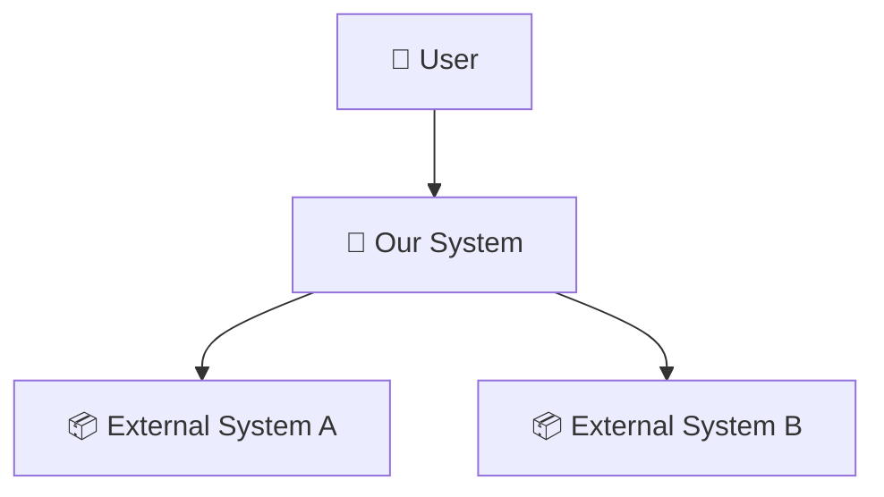
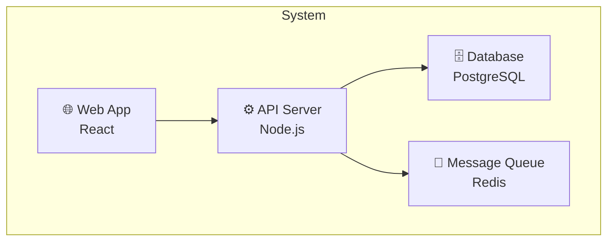
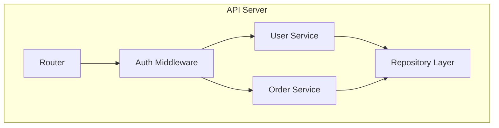
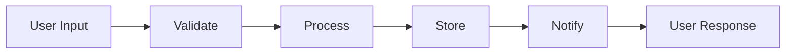

# Architecture Assessment

**When to use:** During mu-scope Quick Probe (coarse assessment) and mu-design approach proposal (detailed assessment). Also referenced by mu-reviewer review-design mode.

## Purpose

Understand the current architecture before proposing changes. Map the proposed work onto the architecture to surface cross-boundary impacts, new components, and interface changes early — before they become expensive surprises during implementation.

## Two-Phase Assessment

### Phase 1: Coarse (mu-scope Quick Probe)

Quick, 2-minute assessment. Answer three questions:

1. **What is the current architecture?** — Read architecture doc (README, ARCHITECTURE.md, docs/). If none exists, sketch from codebase structure.
2. **Which layers/components does this work touch?** — Map the proposed change onto the architecture. List affected components.
3. **Does this cross architectural boundaries?** — Does data need to flow between components that don't currently communicate? Does a new component need to be introduced?

Output as part of Quick Probe results:
```
Architecture impact:
- Components affected: [list]
- Boundaries crossed: [yes/no, which ones]
- New components needed: [yes/no, what]
- Architecture doc needs update: [yes/no]
```

### Phase 2: Detailed (mu-design)

After approach selection, before writing the design spec. Produce:

1. **Current architecture diagram** — showing the relevant portion of the system
2. **Proposed change overlay** — mark what's added (➕), modified (✏️), or removed (➖)
3. **Data flow for new/changed paths** — how data moves through the modified architecture

## Diagram Type by Project Type

Choose the right diagram type based on what the project is:

| Project type | Recommended diagrams | Why |
|---|---|---|
| CLI tool / Library | C3 Component | No multi-container complexity; component relationships suffice |
| Web app (frontend + backend + DB) | C1 Context + C2 Container | Need system boundary + tech stack containers |
| Microservices | C1 Context + C2 Container + Data Flow | Service interactions are the core complexity |
| Plugin / Extension | C1 Context (host relationship) + C3 Component | "Where do I fit in the host system?" is the key question |
| Data pipeline | Data Flow Diagram (primary) | How data flows and transforms is the core concern |
| API service | C2 Container + API boundary | Need inside/outside boundary + tech containers |
| Mobile app | C1 Context + C2 Container | Device ↔ cloud ↔ third-party relationships |

## C4 Model Quick Reference

Use only the levels that add clarity. Most projects need 1-2 levels, not all 4.

### C1: System Context
"What is this system and who/what interacts with it?"



**When to include:** Always for new systems. For changes to existing systems, include when the change affects external interactions.

### C2: Container
"What are the major technical building blocks?"



**When to include:** When the system has multiple deployable units (server, database, queue, etc.).

### C3: Component
"What are the major structural pieces inside a container?"



**When to include:** When the change adds/modifies components within a container.

### Data Flow Diagram
"How does data move through the system?"



**When to include:** When the change introduces or modifies a data processing path.

## Diagram Format

- **Preferred:** Mermaid (renders natively on GitHub, in IDEs, and in design docs)
- **Fallback:** ASCII art (when working in contexts without Mermaid rendering)
- **Rule:** Diagrams live in the design spec, not in a separate file. They are part of the design, not standalone artifacts.

## When to Skip

- Bug fixes that don't change component boundaries
- Config changes
- Documentation-only changes
- Test-only changes

**Signal:** If Quick Probe Phase 1 shows "Components affected: 1, Boundaries crossed: no, New components: no" → skip the detailed architecture diagram in mu-design. A brief text description suffices.
