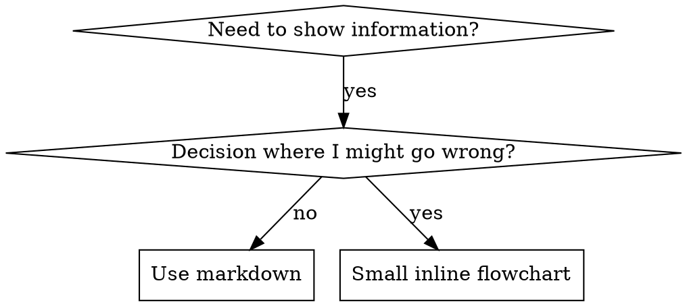

# Graphviz Conventions

**When to use:** Referenced by mu-write-skill (and any skill authoring) when deciding whether to use a digraph flowchart and how to structure it.

## When to Use a Flowchart



**Use flowcharts ONLY for:**
- Non-obvious decision points
- Process loops where you might stop too early
- "When to use A vs B" decisions

**Never use flowcharts for:**
- Reference material → Tables, lists
- Code examples → Markdown blocks
- Linear instructions → Numbered lists
- Labels without semantic meaning (step1, helper2)

## Node Shape Conventions

| Shape | Use for |
|---|---|
| `box` | Action or step |
| `diamond` | Decision point (yes/no or choice) |
| `doublecircle` | Terminal state (skill exits here) |
| `box, style=filled, fillcolor=lightyellow` | Important warning / stop-the-line point |
| `box, style=filled, fillcolor=lightgreen` | Success path |

## Label Conventions

- Node labels: semantically describe the action/decision (not "step1", "node2")
- Edge labels: condition or outcome (`"yes"`, `"no"`, `"bug found"`, `"approved"`)
- Keep labels short — if they need paragraphs, the diagram is wrong

## Visualizing for Your Human Partner

Use `render-graphs.js` in the mu-write-skill directory to render a skill's flowcharts to SVG:

```bash
./render-graphs.js ../some-skill           # Each diagram separately
./render-graphs.js ../some-skill --combine # All diagrams in one SVG
```
