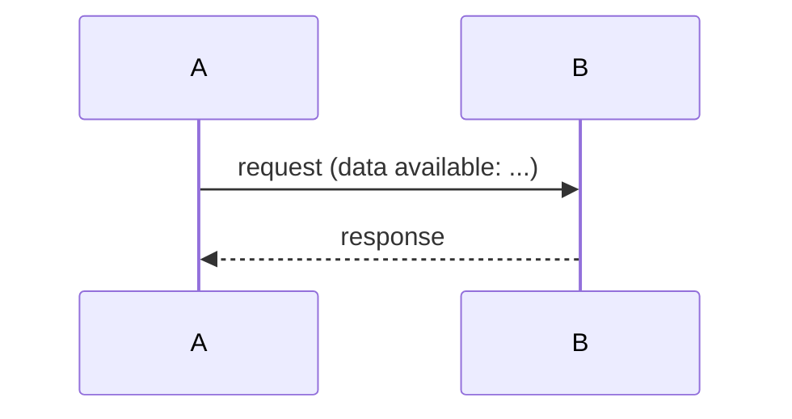
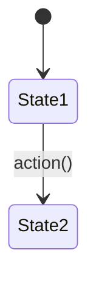

# Architecture: <feature-name>

> **Date:** YYYY-MM-DD
> **Scope reference:** docs/scope/YYYY-MM-DD-<name>.md
> **Stance:** <create | update | extract | skip>

## Requirements Reference
- Scope: [link to scope artifact]
- Use cases covered: UC-1, UC-2, ...

## Alternatives Considered

| Approach | Pros | Cons | Failure Modes | Verdict |
|----------|------|------|---------------|---------|
| A: <name> | ... | ... | Fails when ... | **Selected** / Rejected |
| B: <name> | ... | ... | Breaks if ... | Selected / **Rejected** — <reason> |

## C4 Positioning

### Container Level
- Which services, databases, message queues are involved?
- Architecture diagram (Mermaid) with change overlay (➕/✏️/➖)

### Component Level
- Within each affected container, which modules/classes are touched?

## Functional Design

### Interface Contracts
- API endpoints: method, path, request/response format, error codes
- Message formats (if async): queue/topic, payload schema

### Data Model
- Schema changes: new tables/columns, type definitions
- Index strategy (if performance-relevant)

### Sequence Diagrams (per scenario, if multi-party interaction)

#### Scenario: <scenario-name>

#### Data Availability Summary

| Scenario | Execution Point | Required Data | Available? |
|----------|----------------|---------------|------------|
| <name> | <where> | <what> | ✅ / ❌ |

### State Machine (if entity has lifecycle)

## Non-Functional Design
<!-- Scan nfr-checklist.md triggers. Only include categories where triggers fire. -->

### <NFR Category>
- Concern: ...
- How addressed: ...
- Trade-off: ...

## Architecture Decision Records

### ADR-1: <title>
- **Context:** what led to this decision
- **Decision:** what was decided
- **Alternatives:** what was rejected
- **Consequences:** what follows (positive and negative)

## Error Handling
- Failure modes and recovery strategies
- Error propagation path

## Testing Strategy
- Unit test approach
- Integration test approach
- UC coverage mapping

## Out of Scope
- <explicitly excluded item> — <reason>

## History

| Date | Commit | Change |
|------|--------|--------|
| YYYY-MM-DD | `<sha>` | Initial creation |
