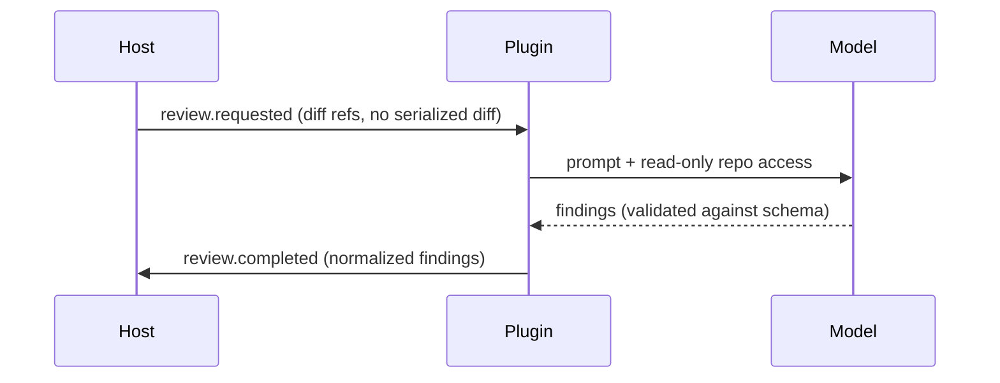

# Reference example — an AI code-review plugin

> **Illustrative example, not this repository's product truth (UC-DR3).** A
> fictional-but-plausible multi-axis worked case. Do not cite it as evidence for
> real work.

Shows how the **four axes compose** on one project without any single label
capturing it. A plugin that runs inside an IDE, reviews code with an LLM, and
reports findings back over the host's event bus is:

- **Product profile:** `developer-tool` — developers operate it.
- **Interaction surface:** `event` (host event bus) — no GUI of its own; it uses the host's.
- **Implementation profile:** `plugin-agent` — it lives inside a host and is bound by the host's capability model.
- **Concern triggers that fire:** AI/model-tool boundary, cost/latency envelope, and (because it reads the repo) local-file access.

The document takes the **union** of these axes' sections, deduplicated — and
emits nothing for the axes that do not apply (no information architecture, no
tiering, no transactions, no multitenancy).

## Which sections compose in — and which stay out

| Section | From | In? |
|---|---|---|
| Command/task surface | `developer-tool` product | ✅ how a developer triggers a review |
| Host-relationship boundary, capability/permission model | `plugin-agent` impl | ✅ what the host grants; what the plugin may read |
| Event catalog + delivery guarantees | `event` surface | ✅ `review.requested` → `review.completed` on the host bus |
| Model/tool boundary, evaluation, guardrails, cost/latency | `data-ai` concern | ✅ which model, prompt/tool contract, token budget, non-determinism handling |
| Information architecture / screens / tiering | `end-user-app` product | ❌ not this product — no invented UI |
| Domain state machine / transactions / multitenancy | `stateful-service` impl | ❌ stateless per-review; no lifecycle entity invented (stateless degradation) |

## Event surface (the `event` axis)

## AI/tool boundary (the `data-ai` concern)

- **Model boundary:** one model call per review; a bounded token budget; a
  timeout that degrades to "no findings" rather than blocking the host.
- **Tool boundary:** the plugin grants the model read-only repository access and
  never lets model output drive a host mutation without the developer's approval.
- **Guardrail:** findings are validated against a fixed schema; unparseable model
  output is a typed fallback, never trusted.

There is no central lifecycle entity here — each review is independent — so the
document organizes the plugin by its data flow, not by an invented state machine.
