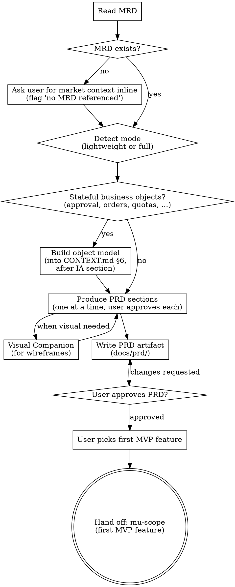

# Product Requirements

**Scope:** User-facing product requirements — personas, flows, wireframes, feature specs, tiering rules, NFRs, metrics. For market questions (worth building? competitors? revenue opportunity?) use **mu-mrd** first. For technical architecture use **mu-arch** after this.

Independent of the feature-level pipeline. Product-level skill that runs **once per product**, not per feature. Reads the MRD as input; outputs PRD that becomes input for per-feature mu-scope.

**Domain modeling (folded in, not a gate):** when a feature introduces
lifecycle-bearing objects or new domain vocabulary, run the domain-modeling
method inline (@../../knowledge/principles/domain-model.md) and write to the
architecture set's `domain_model` member — the PRD's surfaces are a projection of
that model's ownership table, and its state names come from it. `/mu-model`
remains the optional dedicated tool for a focused pass; it is **not** a required
step before this skill. When the project has no domain concepts worth modeling,
flag "no domain model" in the PRD header and coin names as you go.

<HARD-GATE>
Do NOT invoke mu-scope or any feature-level skill until the user has approved the PRD artifact. The PRD must cover all MVP features from the MRD when a full-mode MRD exists; otherwise, the features the user names.
</HARD-GATE>

## Phase 0: Stance Detection

Before Depth Mode Selection, detect the current state of any existing PRD artifact and pick an entry stance.

1. Read `@../../knowledge/principles/stance-detection.md`
2. Run the detection algorithm with:
   - **Artifact type**: `prd`
   - **Artifact dir**: `docs/prd/`
   - **Watched source dirs**: `src/pages/`, `src/screens/`, `src/views/`, `app/`. **Fallback**: if none of those exist (backend/CLI/library projects), fall back to top-level `src/` directly; if that also doesn't exist, H3 returns `insufficient-signal`.
   - **Legacy locations**: root `PRD.md`
   - Never watch `docs/prd/` itself (circular).
3. Apply the Shared Consumption Protocol in that file (confidence handling, slash pre-confirmation — including the `/mu-prd create` prompted by mu-mrd's terminal — stance metadata), then route below.

**Branch routing**:

| Stance | Action |
|--------|--------|
| `create` | Run Depth Mode Selection, then existing Process (Lightweight or Full) unchanged. |
| `update` | Load the existing PRD artifact and its state machines in `CONTEXT.md` §6, when any exist → classify each change and apply sub-type logic (`expand` fills stub sections; `gap-fill` appends a new feature spec section titled "Gap-fill: `<feature>`" — state changes it implies are edited in `CONTEXT.md`, with the PRD body citing state names; `sync` aligns feature descriptions and the `CONTEXT.md` machines — including their excluded-candidates and non-transition notes — to current code behavior) → merge via section approval, machines before the body sections that cite them. Each touched state machine is one approval unit: re-run the state-modeling self-check on it, and treat a terminal-state change as a fork to confirm with the user. New state names follow the same CONTEXT.md domain-model rule as creation. Multiple sub-types in one invocation: commit prefix takes the highest-priority sub-type (expand > gap-fill > sync). **Two History tables, split by what changed:** machine edits (states, transitions, invariants, excluded candidates) record in `CONTEXT.md` §7; PRD body edits record in the PRD's own History. An invocation that touches both writes one row in each. |
| `extract` | Read source dirs (pages/screens/views/app or fallback src/) section-by-section, synthesize a PRD covering observed features + flows + screens. Commit prefix: `extract:`. |
| `skip` | Append pass-through history entry; invoke `mu-scope` for the first MVP feature per existing Integration. No stance hint is passed to `mu-scope` since it isn't a creative skill. |

**Stance × Depth Mode interaction**:

mu-prd has two independent concepts: **Stance** (Phase 0) and **Depth Mode** (lightweight/full, below). Slash hints may specify either or both; tokens are split cleanly per spec §2.5:

| User / upstream input | Stance | Depth mode |
|-----------------------|--------|-----------|
| `/mu-prd` | auto-detect in Phase 0 | auto-detect in Depth Mode Selection |
| `/mu-prd create` | `create` (forced) | auto-detect |
| `/mu-prd lightweight` | auto-detect | `lightweight` (forced) |
| `/mu-prd create full` | `create` | `full` |
| `/mu-prd create` (prompted by mu-mrd's full-mode terminal) | `create` (pre-confirmed, no dialog) | auto-detect |

Phase 0 parses only the stance token; Depth Mode Selection parses only the depth token.


## Profile and Depth Selection

Two orthogonal axes compose the section set (see @../../knowledge/principles/project-profiles.md):

- **Profile** — *what kind of product this is* — selects **which** sections exist. The product axis values are `end-user-app` / `developer-tool` / `library-sdk` / `data-ai` (see the axis table in @../../knowledge/principles/project-profiles.md — use those names, not ad-hoc ones). An `end-user-app` has information architecture, core user flows, key screens, and tiering; a `library-sdk` or `developer-tool` has a public/command surface and no screens; a `data-ai` product has data-flow and model/tool-boundary sections. Compose profiles; take the union when more than one applies. Never emit a section a profile does not populate from the project's own evidence.
- **Depth** — *how much ceremony the stakes justify* — selects **how much** of each section to carry.

| Signal | Depth | Scope |
|---|---|---|
| Solo dev, small project, "lightweight PRD", `/mu-prd lightweight` | **Lightweight** | The profile's core sections only (for `end-user-app`: core flows + key specs + open questions) |
| Team project, investor-facing, formal product, `/mu-prd full` | **Full** | The profile's full section set |
| Unclear | One probe: "Stakes — hobby / internal tool / public launch?" hobby → lightweight; internal → lightweight; launch → full |

**Length scales with stakes:** hobby ≈ a page or two; internal ≈ a few pages; launch ≈ as long as its features require. Profile picks the section set; depth and stakes calibrate how much each section carries. The full section list below is the `end-user-app` profile — the default when a project is a user-facing application, not what every project emits.

## Process Flow



## Process

### 1. Read the MRD

Look for `docs/mrd/YYYY-MM-DD-*.md` (legacy: `docs/biz/*.md`). If found, extract:
- Target persona (baseline)
- MVP feature list
- Tiering rules (if any)
- Success metrics / North Star

If not found, ask the user to provide market context inline. Log "no MRD referenced" in the PRD header.

### 2. PRD Sections

The section set is **composed** from the project's profile axes
(@../../knowledge/principles/project-profiles.md), not a fixed list: common core
+ the sections each activated axis adds + concern-triggered sections. Depth
(lightweight/full) scales how much each carries. Produce sections one at a time,
approving each before moving on. Drive each section's open points per
@../../knowledge/principles/grilling.md — one question per message with a
recommendation, facts self-served, converge every fork before the section is
approved. **Emit a section only when the project's evidence populates it — never
add a screen/state/tiering slot a profile merely offers (UC-DR2).**

#### Common core (every profile)

1. **Purpose and users** — who it is for, the target persona(s), the problem.
2. **Per-feature specs** — for each MVP feature: what it does, why, user-facing rules (edge cases in user terms, not code). **Scope boundary:** these are product-level rules — mu-scope later enumerates all concrete paths (happy / edge / error use cases) per feature. Do not pre-enumerate UCs here. Guarantees that survive retries and races ("double-clicking never creates two orders") are rules, not use cases — they live in the object model, and a feature touching a modeled object cites its states by name.
3. **Open questions / assumptions** — things not yet decided that downstream work must resolve.

#### Profile-activated sections (add only the axes that apply)

- **`end-user-app` product / `gui` surface** — information architecture & feature map; core user flows (journey/sequence maps); key screen wireframes (text/mermaid; use Visual Companion for mockups); tiering rules (free vs paid quotas/triggers). *(These four are the classic "full mode" — they belong to the user-facing app profile, not to every project.)*
- **`cli` surface** — command/flag grammar, exit-code and output contract (no screens).
- **`library-sdk` / `api` surface** — public API/endpoint surface, request/response and error shapes, versioning/compat contract.
- **`data-ai` product** — data flow and lineage; model/tool boundary; evaluation and guardrails; cost/latency envelope.
- **`plugin-agent` implementation** — host-relationship boundary; invocation/routing and capability/permission model.

#### Concern-triggered sections

Scan @../../knowledge/principles/nfr-checklist.md; add a section only where a
trigger fires (performance, security/PII, transactions, multitenancy, public
API, AI/model-tool boundary, accessibility & localization, compliance…). Success
metrics → instrumentation is added whenever the product has a measurable funnel.

**Depth:** lightweight carries the core (purpose + key per-feature specs + open
questions) at minimal detail; full carries every activated section at launch
depth. Depth changes *how much*, profile changes *which*.

### 3. Product Object Model (conditional)

**Trigger:** any MVP feature involves approval, booking, ordering/payment, subscription, publishing, multi-role handoff, quotas, or time-bounded validity — i.e., a business object whose allowed actions depend on where it is in a lifecycle. No trigger → skip silently, zero ceremony.

When triggered, build the model per @../../knowledge/principles/state-modeling.md: classify candidate states (business state vs attribute / computed / page / sub-object), then per object produce the closed state list, transition table (state × event × actor → next state, with boundary semantics), invariants, terminal states, and retry/race guarantees, plus the model's negative space (excluded-candidate table, non-transition notes). Drive every unfilled blank with the lifecycle sentence; run the self-check before the model is approved.

- **Timing:** build it after the Information Architecture section (the feature map names the objects) and before Core User Flows — flows walk the machine, and feature specs cite its states by name.
- **Artifact:** the machine lands in repo-root `CONTEXT.md` §6 — one `### <Object>` entry per machine (state diagram, invariants, guarantees, excluded candidates, non-transitions), committed together with the PRD; create `CONTEXT.md` from @../../knowledge/templates/context-md.md if absent. **The PRD cites state names and never restates the machine** — see @../../knowledge/principles/state-modeling.md Layer Boundaries. Both depth modes write to the same home; lightweight differs in the model's size, not its location.
- **Vocabulary:** state names are domain language by construction — they arrive in `CONTEXT.md` with the machine, each carrying its `_Avoid_` synonyms. Downstream skills use them verbatim.

### 4. Visual Companion

For screen/layout questions, offer the Visual Companion (same pattern as mu-arch). Accept → browser-based wireframing. Decline → Mermaid/ASCII in the doc. Before writing Mermaid, read @../../knowledge/principles/mermaid-compat.md and use ASCII when that subset is insufficient.

### 5. Write artifact

Save to `docs/prd/YYYY-MM-DD-<product>.md` (plus the `CONTEXT.md` machines when the Product Object Model triggered). Commit together. Draft per @../../knowledge/principles/prose-discipline.md.

**On `update` / `extract`, write back to the file Phase 0 detected — the filename and its date do not change.** The date records when the PRD was created, not when it was last touched. A PRD is a living artifact: one per product, iterated in place. (Dated snapshots under `docs/scope|specs|plans` work differently — see @../../knowledge/principles/artifact-succession.md.)

**When the PRD outgrows one file:** keep `docs/prd/YYYY-MM-DD-<product>.md` as the **main file** — it carries the header, the stance metadata, the History, and an index of the parts. Parts live under `docs/prd/<product>/<part>.md` and carry content only. Phase 0 detects against the main file; a part is never detected on its own, and a part never carries its own stance or History. **Splitting without a main file is what breaks iteration** — nine sibling PRD files with no History and no stance between them cannot be entered by `update` at all, only re-created.

### 6. Hand off

Ask the user which MVP feature to start with. Then invoke mu-scope for that feature. Remaining features go through mu-scope iteratively, one at a time.

## Artifact Format

The template below is the **`end-user-app` profile** in full depth — its nine
sections (persona, information architecture, screens, tiering, …) belong to a
user-facing app, not to every project. Compose the actual section set from §2's
axes: keep the common core, add the sections the project's profile activates, and
drop the ones it does not populate (a `library-sdk`/`developer-tool` has a public
or command surface and no screens or IA; a `data-ai` product leads with data-flow
and the model/tool boundary). Do not emit an empty `end-user-app` section for a
project whose profile never fills it.

```markdown
# PRD: <product name>

> **Date:** YYYY-MM-DD
> **Depth mode:** lightweight | full
> **Stance:** <create | update | extract | skip>
> **Sub-type:** <expand | gap-fill | sync | —> (highest-priority when one update carries several; omitted on fresh create)
> **Detected at:** YYYY-MM-DD (commit `<short-sha>`) (omitted on fresh create — appears from first update/extract)
> **MRD reference:** docs/mrd/YYYY-MM-DD-<name>.md (legacy docs/biz/*.md; or "inline" if none)
> **Object model:** CONTEXT.md §6 — <objects with machines> (omit if the Product Object Model did not trigger)

## 1. Persona Deepening
...

## 2. Information Architecture
...

## 3. Core User Flows
[mermaid or text diagrams]

## 4. Key Screen Wireframes
[mermaid / ASCII / companion screenshots]

## 5. Per-Feature Specs
### Feature: <name>
- **What:** ...
- **Why:** ...
- **Rules:** ...

## 6. Tiering Rules
| Capability | Free | Paid |
|---|---|---|
...

## 7. NFRs
- Performance: ...
- Privacy: ...
- Accessibility: ...

## 8. Success Metrics
| Metric | Target | Instrumentation |
|---|---|---|
...

## 9. Open Questions
- ...

## History

| Date | Commit | Stance | Sub-type | Change |
|------|--------|--------|----------|--------|
| YYYY-MM-DD | `<sha>` | create | — | Initial creation: <the create round's key decisions — never leave this bare> |
```

### Commit Convention

- `docs(prd): create: ...` — from-zero PRD
- `docs(prd): update(expand): ...` — filled stub sections
- `docs(prd): update(gap-fill): ...` — added new feature section
- `docs(prd): update(sync): ...` — aligned to current code behavior
- `docs(prd): extract: ...` — reverse-engineered from source dirs
- `docs(prd): skip: passthrough for <task>` — history-only commit if needed

**Opt-out**: user can pass `--no-stance-meta` to suppress the Stance / Sub-type / Detected-at header fields. Default is on.

## Key Principles

- **One section at a time** — get approval before moving on
- **User-facing, not tech** — describe what users see/do, not how it's built
- **Concrete specs** — "rules" are user-observable behaviors, not API contracts
- **Reference the MRD** — personas and MVP scope come from there; don't re-derive
- **Defer technical choices** — tech stack, API schema, DB design belong in mu-arch, not here
- **Defer use case enumeration** — per-feature UCs (happy/edge/error paths) are mu-scope's job, not mu-prd's. PRD states product rules — including the object model's state guarantees — and mu-scope enumerates concrete scenarios through them.
- **Single-home every rule** — state each rule in exactly one section and reference it elsewhere; two copies of a rule will diverge.
- **Visual when helpful** — flows and wireframes benefit from diagrams; requirements/rules are text

**Sign-off gate (before terminal):**

Before invoking mu-scope, consult `@../../knowledge/principles/sign-off-gate.md`. If stakeholder-scope indicates team-touching, run the gate protocol. Sign-off gate is skipped when stance was `skip`.

## Integration

- **Invoked by:** user manually (`/mu-prd`); mu-mrd's full-mode terminal prompts `/mu-prd create` (slash hint pre-confirmed per spec §2.5)
- **Reads:** `docs/mrd/*.md` (MRD if present; legacy `docs/biz/*.md`); `@../../knowledge/principles/stance-detection.md` (Phase 0); `@../../knowledge/principles/state-modeling.md` (Product Object Model, when triggered); `@../../knowledge/principles/domain-model.md` (domain-model qualification); `@../../knowledge/principles/sign-off-gate.md` (terminal if team-touching)
- **Produces:** `docs/prd/YYYY-MM-DD-<product>.md`; state machines written into repo-root `CONTEXT.md` §6 (when the Product Object Model triggers)
- **Terminal state:** per the Pipeline Graph (bootstrap) — mu-scope for the first MVP feature; further features iterate through mu-scope one at a time.
