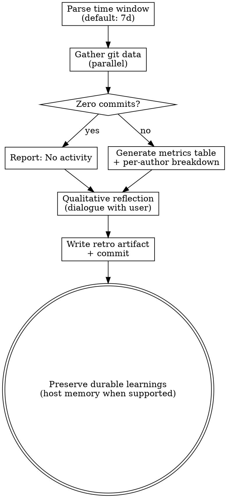

# Retrospective

Gather quantitative git metrics and qualitative reflections for a time period. Preserve non-obvious learnings in the host's durable project memory when that capability exists; otherwise keep them in the retrospective artifact.

Independent of the main pipeline. Invoke with `/mu-retro` or `/mu-retro 14d`.

## Process Flow



## Process

1. **Parse time window** from argument (default: 7d)
   - Convert to absolute start date at midnight
   - Example: `7d` on 2026-04-12 → start 2026-04-05T00:00:00
2. **Gather data** (run in parallel):

```bash
# Commits in window
git log --since="<date>" --format="%H|%an|%s|%aI"

# Author summary
git shortlog -sn --since="<date>"

# File change stats
git log --since="<date>" --name-only --format="" | sort | uniq -c | sort -rn | head -10

# Test file count
find . -name "*test*" -o -name "*spec*" | grep -v node_modules | wc -l

# Wiki freshness (only if docs/wiki/ exists): last update date + commits since
git log -1 --format=%as -- docs/wiki/ && git rev-list --count "$(git log -1 --format=%H -- docs/wiki/)"..HEAD
```

3. **Check for zero commits:**
   - If no commits in window → report "No activity in this period"
   - Skip metrics table, proceed directly to qualitative reflection
4. **Generate metrics table:**

| Metric | Value |
|---|---|
| Commits | N |
| Contributors | N |
| Lines changed | +N / -M |
| Test files | N |
| Hottest files | top 3 by change frequency |

5. **Per-author breakdown:**

| Author | Commits | Top area |
|---|---|---|
| ... | ... | ... |

6. **Wiki freshness check** — if `docs/wiki/_index.md` exists and commits have landed since its last update, report the lag ("wiki 落后 N 个提交，最后更新 YYYY-MM-DD") and recommend running `/mu-wiki update` after the retro. Suggestion only — mu-retro never invokes other skills. Skip silently when there is no wiki.
7. **Qualitative reflection** (dialogue with user, one at a time):
   - "What went best this period?"
   - "What was most surprising?"
   - "What would you change next period?"
8. **Write retro artifact** to `docs/retro/YYYY-MM-DD-retro.md`, drafted per @../../knowledge/principles/prose-discipline.md
9. **Commit artifact**
10. **Preserve durable learnings**:
   - Only non-obvious findings worth remembering across sessions; never copy raw metrics or verbose summaries
   - If the host exposes project memory, use it only within that host's normal permission and review rules
   - Do not invent a memory file or edit `AGENTS.md`, `CLAUDE.md`, `GEMINI.md`, or other host configuration merely to simulate memory
   - If host memory is unavailable, the retrospective artifact remains the source of truth; if nothing is worth remembering, skip

## Key Principles

- **Data first, then reflection** — show the numbers before asking opinion
- **One reflection question at a time** — don't overwhelm
- **Durable learning is selective** — preserve only non-obvious findings. Don't dump metrics or invent a host memory mechanism.
- **Handle edge cases gracefully** — zero commits, shallow clones, monorepos
- **Standalone, no chaining** — does NOT invoke other skills
