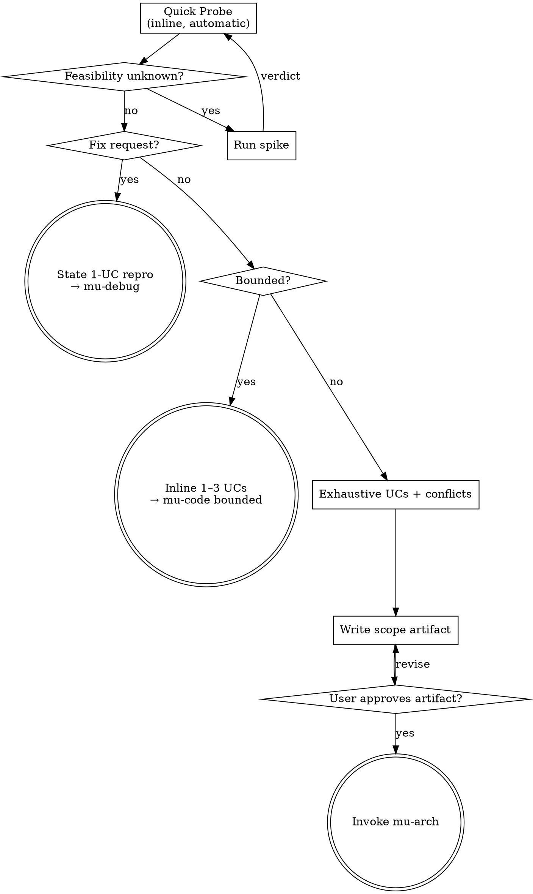

# Scope

Scope behavior-changing work by probing impact, then spend ceremony in proportion to risk and uncertainty.

**Core principle:** the probe chooses the process. A bounded change gets an inline acceptance contract and implementation; an architectural change gets exhaustive cases, an artifact, and explicit approval.

<HARD-GATE>
Do not implement behavior-changing work until its expected behavior is stated as use cases and the probe has ruled on bounded versus architectural. Architectural work requires an approved scope artifact. Bounded work may use the user's sufficiently exact request as approval of a faithful inline contract.
</HARD-GATE>

Sequence substitutions and handoffs are defined in the Pipeline Graph.

## Entry Boundary

Bootstrap has already excluded Direct work. Do not pull mechanical,
reversible, execution-only tasks back into this skill. Conversely, "one line"
does not make a bug, contract, guard, security rule, migration, or dependency
change Direct; probe its actual risk here.

## Checklist

Complete these in order:

1. **Quick Probe** — scan codebase for impact (skip for new/empty projects)
2. **Path decision** — classify fix, bounded, architectural, or spike from evidence
3. **Use cases** — inline 1–3 for bounded; exhaustive categories for architectural
4. **Conflict detection** — account for overlaps and regression gaps
5. **Output** — hand an inline contract to mu-code, a repro to mu-debug, or an approved artifact to mu-arch

## Process Flow



**Done:** every probed risk is accounted for and one terminal is reached: an
inline bounded contract, an approved architectural scope, a 1-UC reproduction,
or a spike verdict. On the fix route, the red test is the reproduction.

## Phase 1: Quick Probe

Before asking the user anything, scan the codebase to understand what this change touches.

**Skip if:** The project is new (empty codebase) or user explicitly says "new project."

**Checks:**

| Check | Method | What it reveals |
|-------|--------|-----------------|
| Locate code | grep/glob for keywords from user's description | What files are involved |
| Fan-out | Count callers of affected functions/modules | Blast radius |
| Test coverage | Find existing tests for affected code | Safety net status |
| Historical signals | git log for recent changes and bug fixes | Stability of affected area |
| Interface risk | Check if change affects public API/contracts | Breaking change potential |
| Guard semantics | If modifying a condition/filter/guard, enumerate ALL scenarios it currently blocks | Regression gap from condition replacement |
| Architecture context | Read architecture doc (README, ARCHITECTURE.md, docs/); map change onto components | Which layers/boundaries are affected |

**Architecture context** (see @../../knowledge/principles/architecture-assessment.md Phase 1): Read the project's architecture doc if one exists. Identify which components/layers the proposed work touches, whether it crosses architectural boundaries, and whether new components are needed. This is a coarse 2-minute assessment, not a detailed diagram — that comes in mu-arch.

**Guard Semantic Analysis** (when the change modifies/replaces an existing condition, filter, or guard):

A single condition often carries **multiple implicit responsibilities**. Replacing it to fix one scenario can silently drop protection for others. Before proposing a replacement:

1. **Enumerate the block set** — list every scenario the current condition prevents (not just the one motivating the change)
2. **Compute the regression gap** — diff what the old condition blocks vs. what the new condition blocks; the difference is your risk surface
3. **Require explicit disposition** — for each item in the gap, the user must confirm "intentionally allowed" or "must still be blocked"

```
Guard Analysis: <condition being replaced>
Old condition blocks: [scenario A, scenario B, scenario C]
New condition blocks: [scenario A]
Regression gap:       [scenario B, scenario C]
  → scenario B: [intentionally allowed / must still block]
  → scenario C: [intentionally allowed / must still block]
```

**Architecture understanding:** Existing wiki pages are a map, not evidence.
Read relevant `docs/wiki/` pages when present, then verify every claim that
affects the path decision against current source, tests, configuration, and git
history. An unfamiliar or cross-module area increases probe depth; it does not
create a separate workflow or automatically generate documentation. The probe
is complete when every named dependent and crossed boundary has either been
inspected or listed in the coverage boundary.

**Output to user:**

```
Quick Probe Results:
- Files: [list]
- Fan-out: [N callers / M dependents]
- Test coverage: [summary]
- Guard analysis: [if applicable — gap items requiring disposition]
- Architecture impact: [components affected, boundaries crossed, new components needed]
- Risk: [low/medium/high]

Path: [fix / bounded / architectural / spike] — [evidence for the classification]
- Architecture map: [none / existing pages consulted and source-verified]
- Coverage boundary: [inspected dependents / deferred or inaccessible areas]
```

## Phase 2: Path Decision

Classify from probe evidence; do not add a confirmation turn just to approve
the amount of ceremony.

- **Fix route:** the request describes broken behavior. State one reproduction
  UC (`Given <broken state> When <action> Then <observed failure, vs expected>`)
  and hand it to mu-debug. If the expected behavior is unclear, ask only that
  question.
- **Bounded path:** changes an existing flow inside one subsystem; blast radius
  is limited; behavior is sufficiently specified; no material design decision,
  public contract, security boundary, migration, or new component remains.
- **Architectural path:** crosses subsystems or boundaries; changes a public
  contract, guard policy, schema/migration, auth/security behavior, or
  dependency topology; introduces a component; or leaves a material product or
  technical decision unresolved.

For an Architectural path that adds a new user-facing capability, check for
`docs/premise/*.md`, `docs/mrd/*.md` (or legacy `docs/biz/*.md`), or
`docs/prd/*.md`. If none exists, run the three lightweight questions from
@../../knowledge/principles/premise-check.md. Maintenance, fixes, and Bounded
changes never pay this premise-check cost.

**Spike exit (feasibility, not size):** when the probe cannot establish whether a use case is *possible* — an unproven integration, an unmeasured performance budget, two approaches that only diverge under load — what is missing is knowledge, and enumerating cases on top of it produces fiction. Offer: "UC-`<n>`'s feasibility is unknown — `<what specifically>`. Spike it first? (**spike** / **proceed with it flagged**)". On `spike`: park the scope, run @../../knowledge/principles/spike-discipline.md, return here with the verdict as evidence. On `proceed`: the UC carries an explicit feasibility flag into the design, and mu-arch treats it as a fork to resolve rather than a given.

**Bounded path output:** state 1–3 inline UCs plus the affected files and test
command. **The original request is approval** when this contract is a faithful
restatement and introduces no new choice. Hand it directly to mu-code as
`bounded execution`; do not ask the user to approve the same decision twice.
If the contract adds scope or exposes a real fork, ask one targeted question.

**Upgrade rule:** hidden dependents, a new design question, any Architectural
signal, or growth beyond one subsystem upgrades the work before that risky
surface changes. Preserve completed tests and observations as evidence; do not
pretend the original Bounded classification still holds.

## Phase 3: Use Case Elicitation

This phase is for the Architectural path. Bounded work already has its inline
contract.

**Evidence fast path:** when requirements evidence already enumerates the cases
— a detailed PRD feature section plus the object's `CONTEXT.md` §6 machine, or
an approved spec from elsewhere — do not re-interview. Run the conflict
cross-check and reverse UCs, then write a thin scope artifact citing the source.

Work through scenarios with the user, one category at a time.

**Methodology:** grill per @../../knowledge/principles/grilling.md — one question per message with options + recommendation, facts self-served, decisions to the user, converge every fork. Focus on purpose, constraints, success criteria. If the request covers multiple independent subsystems, flag immediately — decompose into sub-projects before detailing.

**Order:** Happy paths first (establish the core), then edge cases (expand boundaries), then error cases (handle failures), then **reverse cases** (what must NOT happen).

**Transition coverage:** if `CONTEXT.md` §6 carries a state machine for an object this feature touches, its transition table is a UC checklist — every transition the feature touches (including clock-driven ones) earns at least one use case, using the model's state names; retries and races around a transition are edge cases.

**Reverse use cases:** For every new behavior introduced, ask: "What existing behavior must remain unchanged?" Frame these as negative assertions:
```
- UC-R1: When <scenario that worked before>, Then <must still behave the same way>
```
This catches regressions that positive use cases miss — especially when replacing conditions/guards.

Present each category and resolve every material fork before writing the
artifact. Combine categories when they contain no decision for the user; the
completion criterion is coverage, not number of turns.

**Use case format:**
```
- UC-<N>: [Given <precondition>] When <action> Then <expected result>
```

Simple cases can omit Given:
```
- UC-1: When user logs in with valid credentials, Then return JWT and redirect to dashboard
```

Complex cases include Given:
```
- UC-3: Given password expired, When user logs in, Then force password reset flow
```

## Phase 4: Conflict Detection

After all use cases are enumerated, cross-check every pair for contradictions.

**What to look for:**
- Two use cases that trigger under overlapping conditions with different outcomes
- Use cases that assume contradictory preconditions
- Undefined behavior in gaps between use cases
- **Regression gaps** — scenarios blocked by old code but unblocked by the proposed change (cross-reference Guard Analysis if present)

**Format:**
```
- ⚠️ CONFLICT: UC-X vs UC-Y — <description of contradiction>
  - Resolution: <user decision> | PENDING
```

**All conflicts must be resolved before proceeding.** Present each conflict, let the user decide. No PENDING items in the final artifact.

## Phase 5: Output

**Bounded path:** emit the inline acceptance contract and hand it to mu-code.
No scope, architecture, or plan file is created.

**Architectural path:** first check for a prior scope for the same work per
@../../knowledge/principles/artifact-succession.md. Write the Use Case Set to
`docs/scope/YYYY-MM-DD-<name>.md` using @../../knowledge/templates/scope.md and
@../../knowledge/principles/prose-discipline.md.

Commit the file, then ask the user to review:

> "Scope written and committed to `<path>`. Please review and let me know if you want changes before we proceed to design."

Wait for confirmation.

## Key Principles

- **Every condition is a wall — look at both sides before removing it** — When replacing a guard/filter, enumerate what it blocks, not just what it enables
- **Proportional ceremony** — Direct does not enter; Bounded stays inline; Architectural earns exhaustive artifacts
- **Exhaustive where expensive** — Architectural gaps cost more than an extra use case
- **Conflicts are valuable** — Finding a conflict now saves a rewrite later
- **YAGNI applies to scope too** — Don't add use cases for scenarios the user explicitly puts out of scope
- **Path is probed, not guessed** — Quick Probe facts determine ceremony; line count and user urgency do not
- **One question at a time** — Don't overwhelm, especially during conflict resolution
- **User is the authority** — AI enumerates and detects, user decides and resolves

## Integration

- **Invoked by:** bootstrap for non-Direct behavior changes and bug reproduction
- **Produces:** inline bounded contract, 1-UC repro, or architectural Use Case Set artifact
- **Consumed by:** mu-code (bounded), mu-debug (fix), or mu-arch (architectural)
- **Terminal state:** per the Pipeline Graph (bootstrap)
- **Template:** @../../knowledge/templates/scope.md
