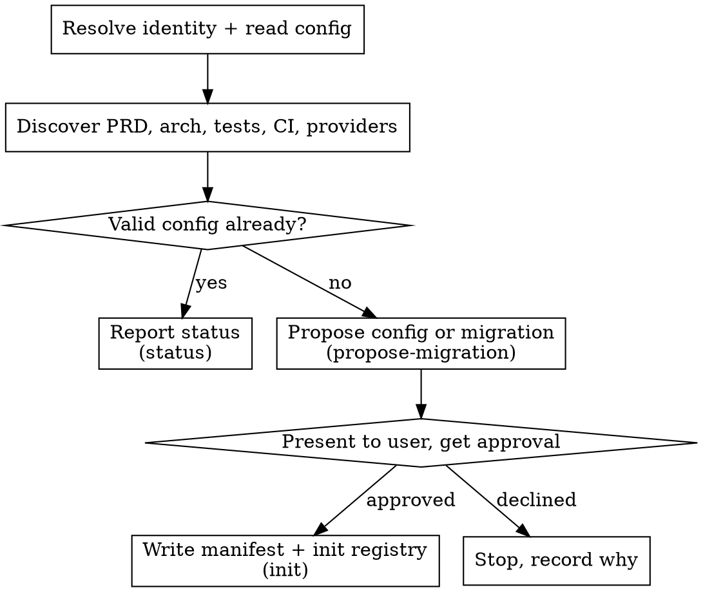

# Setup

Initialize and evolve the project's **case registry** and **asset routing** — the
durable, versioned policy for where each asset kind's canonical data lives. Runs
on explicit `/mu-setup` (or the host equivalent). It is **idempotent**: rerunning
reports current state and makes no unrelated or destructive rewrite.

Read `@../../knowledge/principles/project-context.md` first — mu-setup resolves
project identity and reuses the project-context capability/authorization split.
Cached capability is never authority to perform a remote write (UC-CR3).

The registry is **logical**: one traceable graph over five asset kinds (product
use cases, rules, acceptance examples, test cases, test results) whose canonical
data may live in a SaaS tool, in repository files, or in an explicitly selected
local database. A dated Scope Issue selects and changes a subset of this graph
for one delivery; it is never the long-term home of the cases (UC-CR1).

## Runtime

Claude skills invoke `${CLAUDE_PLUGIN_ROOT}/runtime/project-registry/cli.mjs`;
portable skills invoke their vendored
`references/devmuse/runtime/project-registry/cli.mjs`. Its read/validate/propose
commands (`resolve` via project-context, `propose-migration`, `serialize-manifest`,
`status`, `read-kind`, `read-routing`, `read-preferences`, `resolve-routing`)
never write. After the user approves, the write commands persist: `write-manifest`
serializes and writes `.devmuse/project.yaml`, `init` creates the registry files,
and `write-preferences` records the user-level default routes **outside** any repo
— **each requires `approved: true` in the request** (the present-before-write
gate, enforced in code) and never stores credentials. snake_case in, snake_case
out.

## Process

1. **Resolve identity and read config.** Run project-context `resolve`. Read the
   current manifest. A valid v2 manifest with a `cases:` block means the project
   is already set up → go to step 6 (report). An unsupported schema is read-only:
   report it and stop, never rewrite (AC#9).
2. **Discover.** Look for an existing PRD, architecture docs, test code, case
   catalogs, CI, and available provider integrations. Infer routes where evidence
   is sufficient (tests in `xray/` → `test_cases: xray`; a `tests/` tree with no
   provider → `test_cases: repository`).
3. **Ask only unresolved choices** that change canonical ownership. Do not invent
   a SaaS, database, or process the evidence does not show (UC-CR4). For routes
   the project evidence leaves unset, seed the default from the user's personal
   preferences with `resolve-routing` (pass the inferred `project_routes`): the
   project's own evidence always wins, the user default fills only the gaps, and
   an asset kind with neither still defaults to `repository` (UC-C9). Applying a
   preference is read-only — it never rewrites the user file. If the user settles
   a choice they want to reuse across projects, offer `write-preferences` to save
   it as their default; that write is user-level, approval-gated, and never
   touches this repo's tracked config.
4. **Propose.** Build the v1→v2 migration with `propose-migration`, passing the
   inferred `cases:` block. **Present the full proposed configuration and the
   change list to the user before any tracked write** (UC-C5).
5. **On approval**, write the v2 manifest and run `init` to create the
   repository-backed registry files (idempotent — existing kind files are kept).
   Never store credentials, cached authorization, or provider tokens in the
   tracked configuration (UC-CR3). On decline, record why and stop.
6. **Report / rerun.** Run `status`; show per-kind presence and counts. Make no
   unrelated or destructive rewrite (UC-C5).

## Maintenance paths

- **Provider outage** — a configured canonical provider being unavailable is not
  "no provider" (UC-C6). Record pending/unavailable state; never silently fork a
  second local authority. Ask before replacing an unavailable provider with a
  local one.
- **Provider migration** — moving an asset kind to another provider is explicit
  and preserves stable IDs, old→new locators, revisions, links, and provenance
  (UC-C7). Present the mapping before writing.
- **Schema migration** — only mu-setup performs a manifest version bump, and only
  behind the present-before-write gate.

## Storage tiers (do not call all of this "memory")

- **Tracked project configuration** — identity, canonical locations, routes, team policy. Reviewable in Git; the authority.
- **User configuration** — personal default routes across projects, in a user-level file (`$DEVMUSE_CONFIG_HOME`, else `$XDG_CONFIG_HOME/devmuse`, else `~/.config/devmuse/preferences.json`), schema `{cases:{routes:{<kind>:<provider>}}}`. Read with `read-preferences`, written with `write-preferences`, applied with `resolve-routing`. Project policy wins per-route without rewriting it (UC-C9).
- **Disposable Git-common cache** — worktree pointers, capability probes, sync cursors (project-context's cache). Hints only.
- **Credentials** — the host/provider credential system; never project config or cache.

## Done

Report the configuration state (initialized, migrated, or already-current) and
the per-kind registry status. Setup wrote only after explicit approval, stored no
credentials, and left existing cases untouched.
