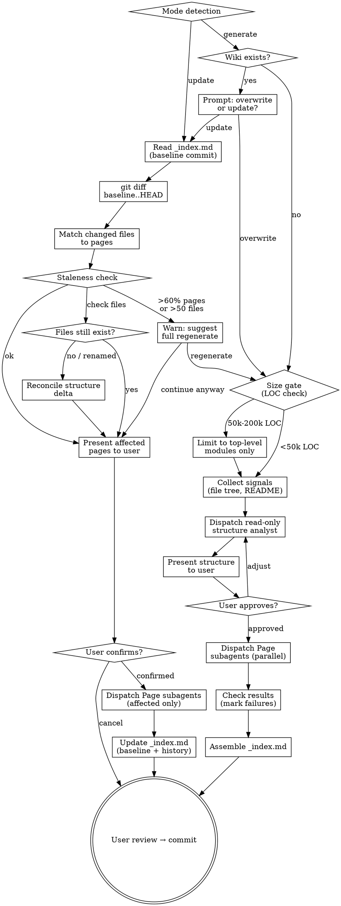

# Wiki

Generate and maintain a **project-level architecture wiki** — structured,
source-cited Markdown pages describing the current system. Output lives in
`docs/wiki/`.

**`docs/wiki/` is the single durable home of current architecture state** —
what the system *is* right now. A design spec describes what one change *will
do* and cites the wiki for surrounding context. The wiki is rebuildable from
source: when it disagrees with current code, the code wins and the wiki is
updated.

## Anti-Pattern: Leaving a requested durable deliverable in chat

When the user explicitly asks for lasting architecture documentation, a chat
answer is not the deliverable. mu-wiki produces persistent, navigable,
source-cited pages. Violations:

- Ending an explicit wiki/documentation request with chat only
- Generating pages without source citations — unverifiable claims rot faster than no documentation
- Skipping the structure review — poor page decomposition wastes all Phase 2 work
- Running generate when update suffices — unnecessary full rebuilds waste time and lose history

## What mu-wiki is NOT

- **Not an ephemeral explanation** — read-only code questions are answered in chat. Wiki is the team-facing deliverable when the user explicitly wants durable architecture documentation.
- **Not design decisions** — that's `mu-arch` (ADRs for a specific change). Wiki documents what IS, not what SHOULD BE.
- **Not a README** — README is entry point. Wiki covers internal architecture depth.
- **Not auto-generated API docs** — wiki explains WHY and HOW, not just WHAT.

## Mode Selection

| Mode | When | Command |
|------|------|---------|
| **generate** | No wiki exists, or user wants full rebuild | `/mu-wiki generate` |
| **update** | Wiki exists and user wants to sync with recent changes | `/mu-wiki update` |

If `docs/wiki/_index.md` exists and user says `/mu-wiki` without a mode, ask which mode they want.

## Process Flow



## Generate Mode Checklist

Covers: UC-1, UC-E2, UC-E3, UC-ERR1

1. **Check for existing wiki** — look for `docs/wiki/_index.md`. If it exists,
   prompt user: "Wiki 已存在。覆盖重建还是增量 update？" (UC-E3). If the
   user chooses update, switch modes. For overwrite, read the current index and
   pages first: **preserve existing curated blocks** and index History. Curated
   content is human-owned and survives both update and full regeneration.

2. **Size gate** — estimate project size:
   ```bash
   git ls-files | xargs wc -l 2>/dev/null | tail -1
   ```
   Apply thresholds (UC-E2):

   | LOC | Action |
   |-----|--------|
   | < 50k | Full scan — all files available for page generation |
   | 50k–200k | Top-level only — Structure subagent receives top-level directory listing, not full file tree |
   | > 200k | Limit to top-level modules — inform user they can deep-dive specific subsystems later |

3. **Collect signals** — gather inputs for Structure subagent:
   - File tree: `git ls-files` (full tree for <50k; top-level grouping for larger projects)
   - README.md content (read via Read tool)
   - CLAUDE.md content if it exists (read via Read tool)

4. **Dispatch Structure subagent** — use the platform's built-in read-only
   codebase analysis agent. Pass the full prompt below and capture the returned
   JSON structure. This is a subagent type, not another persistent workflow.

5. **Present structure to user** — display the proposed sections, pages, and relevant_files mapping. Ask user to review:
   - "以下是建议的 wiki 结构，请确认或调整："
   - Show each section with its pages, each page with title + description + relevant_files
   - User may add/remove/reorder pages, adjust relevant_files
   - On rebuild, identify old pages with non-empty curated blocks that no longer
     map to a proposed page. The user maps each block to a new page or explicitly
     approves its removal before generation.

6. **User approval loop** — if user requests changes, adjust the structure JSON and re-present. Repeat until approved.

7. **Dispatch Page subagents** — for each page in the approved structure,
   dispatch a general-purpose subagent using the Page Subagent Prompt. Pass the
   prior curated block for a matching/mapped page, or the empty scaffold for a
   genuinely new page. All page subagents run in parallel.

8. **Check subagent results** — inspect each subagent's result:
   - Success: page file written to `docs/wiki/<page-id>.md`
   - Failure: mark the page as `status: failed` in _index.md (UC-ERR1). Log the error. Other pages are unaffected.

9. **Assemble _index.md** — use the template at `@../../knowledge/templates/wiki-index.md`. Fill in:
   - `<project-name>`: from structure JSON title
   - Generated date: today's date
   - Baseline commit: `git rev-parse HEAD`
   - Pages table: one row per page with title, link, status (✅ or ❌ failed), relevant files
   - Sections: from structure JSON sections
   - History: preserve prior rows on rebuild, then append today's `generate`
     entry; use `all (initial)` only when no prior wiki existed

10. **User review** — present the generated wiki for review. Show summary: N pages generated, M failed (if any). User approves → commit all files in `docs/wiki/`.

### Structure Subagent Prompt

Dispatch with the platform's read-only codebase analysis subagent. The prompt
to pass:

```
You are analyzing a software project to design an architecture wiki structure.

## Inputs

**File tree:**
<file_tree>
{file_tree}
</file_tree>

**README content:**
<readme>
{readme_content}
</readme>

{if claude_md}
**CLAUDE.md content:**
<claude_md>
{claude_md_content}
</claude_md>
{/if}

**Project size category:** {size_category: full | top-level-only | limited}

## Task

Analyze the file tree and README to understand the project's architecture. Design a wiki structure that covers the project's key architectural aspects.

## Output Requirements

Return a JSON object conforming to this schema — output ONLY the JSON, no other text:

{
  "title": "string — wiki title (e.g., 'ProjectName Architecture Wiki')",
  "description": "string — one-line project description",
  "sections": [
    {
      "id": "string — kebab-case section identifier",
      "title": "string — section display title",
      "pages": ["page-id-1", "page-id-2"]
    }
  ],
  "pages": [
    {
      "id": "string — kebab-case, becomes the markdown filename",
      "title": "string — page heading",
      "description": "string — what this page covers (1-2 sentences)",
      "importance": "high | medium | low",
      "relevant_files": ["path/to/file — MUST exist in the file tree above"],
      "related_pages": ["other-page-id — cross-reference to related pages"]
    }
  ]
}

## Constraints

- Scale page count to real architecture boundaries: 1-3 pages for a small
  cohesive project, 4-8 for a multi-module project, and top-level module pages
  for a very large project. A page exists only when it owns a distinct concern.
- Every page MUST list one or more relevant files, and the set must be sufficient
  to support the page's substantive claims
- relevant_files paths MUST be actual paths from the file tree — never fabricate paths
- Section grouping should reflect logical architecture boundaries (e.g., "Core", "Infrastructure", "Integration")
- Page IDs must be unique kebab-case strings (they become filenames like `data-flow.md`)
- Cover these aspects where applicable: overview/getting-started, core domain, data model/flow, API/interfaces, configuration, testing, deployment, error handling
- Language: generate title and description in the user's preferred language
```

### Page Subagent Prompt

Dispatch with Agent tool, type: general-purpose (default). One subagent per page, all in parallel. The prompt to pass:

```
You are generating a single architecture wiki page for a software project.

## Page Specification

- **Page ID:** {page_id}
- **Title:** {page_title}
- **Description:** {page_description}
- **Related pages:** {related_pages}

## Source Files to Read

Read ALL of the following files using the Read tool before writing:

{relevant_files — one per line}

## Output Requirements

Write the wiki page to: docs/wiki/{page_id}.md — drafted per @../../knowledge/principles/prose-discipline.md

The page MUST follow this structure:

1. **H1 title** — the page title

2. **Generated block** — everything derived from source, fenced by markers so
`update` can replace it:

<!-- mu-wiki:generated -->

   2a. **Source file listing** — start the generated block with a `<details>`
   block listing ALL source files you referenced. Source file listing lives inside the generated block so its mapping cannot drift after update:

<details>
<summary>Referenced source files ({N} files)</summary>

- `path/to/file1`
- `path/to/file2`
- ...

</details>

   2b. **Introduction** — 1-2 paragraphs summarizing what this page covers and why it matters

   2c. **H2/H3 sections** — organized coverage of the topic. Each section should:
   - Explain the WHAT and WHY, not just list code
   - Include source citations inline: `Source: [path/to/file](../../path/to/file), lines 10–20`
   - Use Mermaid only when a relationship, hierarchy, or flow is materially clearer as a diagram (`graph TD` for graphs). Before writing it, read @../../knowledge/principles/mermaid-compat.md; use ASCII when that subset is insufficient.
   - Use Markdown tables for structured comparisons or configuration details

   2d. **Cross-references** — link to related wiki pages where relevant: `See also: [Related Page Title](related-page-id.md)`

<!-- /mu-wiki:generated -->

3. **Curated block** — pass `{existing_curated_block}` through verbatim when
provided; otherwise emit this empty scaffold. Generated content never rewrites
it. This is where source gaps, doc-vs-code contradictions, and decisions the
code cannot explain live.

<!-- mu-wiki:curated -->
## 未验证 / Unverified

<!-- Gaps and uncertainties from building this page. Regeneration never clears them. -->

## 补注 / Notes

<!-- Anything the source cannot tell you. Survives every regeneration. -->
<!-- /mu-wiki:curated -->

## Mandatory Constraints

- **Source citations:** Every substantive claim MUST cite its source. Cite the
  files needed by the claim; there is no arbitrary source-count quota. Format:
  `Source: [path/to/file](../../path/to/file), lines 10–20`.
- **No fabrication:** ALL information must come from the source files you read. Do not use external knowledge or make assumptions about code you haven't read.
- **Mermaid diagrams:** Add a diagram only when it materially improves the
  explanation. Follow @../../knowledge/principles/mermaid-compat.md. Use
  `graph TD` for graphs and `sequenceDiagram` for sequences.
- **Tables:** Use markdown tables for any structured data (configs, comparisons, parameter lists).
- **Language:** Write content in the user's preferred language. Technical terms (file names, code identifiers) remain in English.
- **Completeness:** Read ALL listed source files. If a file cannot be read, note it explicitly.
```

## Update Mode Checklist

Covers: UC-2, UC-E1, UC-ERR2

1. **Read _index.md** — read `docs/wiki/_index.md`. Extract the baseline commit SHA from the `> **Baseline commit:**` line. If _index.md does not exist or is unparseable, inform user: "index 异常，建议 `/mu-wiki generate` 重建" and stop.

2. **Diff detection** — run:
   ```bash
   git diff --name-status <baseline_commit>..HEAD
   ```
   Capture added, modified, deleted, and renamed files. If no changes, inform
   the user: "No files changed since last wiki generation." and stop.

3. **Match changed files to pages** — for each page row in `_index.md`, match
   changed paths to Relevant Files and build affected pages. Also build
   **unmapped changed files** from source, test, build, deployment, and
   configuration paths that match no page. When that set is non-empty, rerun
   structure analysis for those files and their nearest module: update an
   existing page's Relevant Files or propose a new page. Present that structure
   delta with the affected-page list; a new file must not disappear merely
   because it was absent from the previous index.

4. **File existence check** (UC-ERR2) — verify Relevant Files for affected
   pages. Apply detected renames to the mapping. A deleted source triggers a
   structure delta: remove it, add its replacement when one exists, and retire
   a page that no longer owns a live concern. Fall back to full generate only
   when the index is unparseable or the current structure cannot be reconciled.

5. **Staleness check** (UC-E1) — if affected pages > 60% of total pages OR changed files > 50:
   - Warn user: "变更范围较大（{N}个页面受影响，{M}个文件变更），建议执行 `/mu-wiki generate` 完整重建而非增量更新。继续增量更新？"
   - If user chooses regenerate, switch to Generate Mode.
   - If user chooses continue, proceed.

6. **Present affected pages** — show user which pages will be updated:
   - "以下页面受变更影响，将重新生成："
   - List each affected page with title and the changed files that triggered it
   - User may confirm, adjust (add/remove pages), or cancel

7. **Dispatch Page subagents** — for affected pages only, using the same Page Subagent Prompt as in Generate Mode, **plus the preservation rule: read the existing page first and pass its `<!-- mu-wiki:curated -->` block through verbatim.** Only the `<!-- mu-wiki:generated -->` block is rewritten. A page that comes back without its curated block has lost the one thing nobody can regenerate. All run in parallel.

8. **Update _index.md** — modify `docs/wiki/_index.md`:
   - Update baseline commit to current `git rev-parse HEAD`
   - Update the Generated date
   - Apply approved page, section, and Relevant Files changes from the structure delta
   - Update status for regenerated pages
   - Append history entry: date, commit SHA, action "update", pages affected (list page IDs)

9. **User review** — present changes for review. User approves → commit updated files.

## Structure JSON Schema

For reference, the complete schema returned by the Structure subagent:

```json
{
  "title": "string",
  "description": "string",
  "sections": [
    {
      "id": "string",
      "title": "string",
      "pages": ["page-id"]
    }
  ],
  "pages": [
    {
      "id": "string — kebab-case, becomes filename",
      "title": "string",
      "description": "string",
      "importance": "high|medium|low",
      "relevant_files": ["path/to/file"],
      "related_pages": ["page-id"]
    }
  ]
}
```

## Key Principles

- **Two-phase is the architecture** — Structure first (Phase 1), then Pages (Phase 2). Never skip structure review. Poor decomposition wastes all downstream work.
- **Source citations are non-negotiable** — every substantive claim cites the
  source that supports it. Uncited claims are unverifiable and rot quickly.
- **Update over regenerate** — when wiki exists and changes are incremental, prefer update mode. Full regenerate loses history and wastes time.
- **User reviews structure before page generation** — the most impactful review point. Adjusting pages after generation is expensive.
- **Parallel page generation** — pages are independent. Dispatch all page subagents in parallel for speed.
- **Failed pages don't block others** — mark failures in _index.md, let successful pages through.
- **Terminal at commit** — mu-wiki does not invoke any downstream skill. Commit is the end state.

## Anti-Rationalizations

| Excuse | Reality |
|--------|---------|
| "I'll skip the structure review, the AI got it right" | Structure review is the highest-leverage checkpoint. Skipping it means fixing pages after they're generated. |
| "Source citations slow things down" | Citations ARE the value. A wiki without citations is a hallucination document. |
| "The project is small, so it still needs the default page count" | Page count follows distinct concerns. A cohesive project may need only one page. |
| "Update is close enough, skip the diff check" | Blind regeneration loses _index.md history and wastes time on unchanged pages. |
| "Every page needs a diagram" | A diagram earns its place only when it clarifies a relationship, hierarchy, or flow better than prose or a small table. |

## Error Handling

| Failure | Detection | Recovery |
|---------|-----------|----------|
| Structure subagent fails | Agent tool returns error | Surface error, prompt user to retry |
| Page subagent fails | Check result for error | Mark `status: failed` in _index.md, other pages unaffected (UC-ERR1) |
| _index.md missing for update | File not found | Inform user, suggest `/mu-wiki generate` |
| _index.md unparseable | Regex parse fails on baseline commit | Inform user, suggest `/mu-wiki generate` to rebuild |
| Relevant files deleted/renamed | Name-status diff + existence check | Reconcile a structure delta; full generate only if the index cannot be reconciled (UC-ERR2) |
| Project > 200k LOC | Size gate check | Limit to top-level modules, inform user (UC-E2) |
| Diff too large | >60% pages or >50 files in update | Warn, suggest full regenerate (UC-E1) |
| Wiki exists on generate | _index.md found | Prompt: overwrite or update? (UC-E3) |

## Integration

- **Invoked by:** user directly (`/mu-wiki generate` or `/mu-wiki update`).
  On-demand only — bootstrap points to the slash command when the requested
  deliverable is durable current-state architecture documentation.
- **Produces:** `docs/wiki/` directory containing `_index.md` + `<page-id>.md` files.
- **Terminal state:** commit. mu-wiki is terminal — it does not invoke any downstream skill.
- **Template:** `@../../knowledge/templates/wiki-index.md`
- **Shared knowledge:** `@../../knowledge/principles/architecture-assessment.md` (C4 model reference, diagram types, Mermaid examples)
