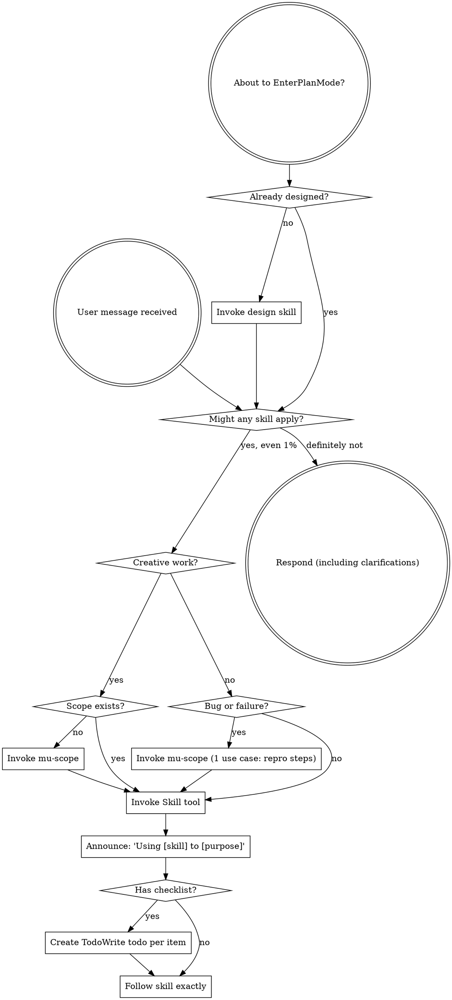

<SUBAGENT-STOP>
If you were dispatched as a subagent to execute a specific task, skip this skill.
</SUBAGENT-STOP>

<EXTREMELY-IMPORTANT>
If you think there is even a 1% chance a skill might apply to what you are doing, you ABSOLUTELY MUST invoke the skill.

IF A SKILL APPLIES TO YOUR TASK, YOU DO NOT HAVE A CHOICE. YOU MUST USE IT.

This is not negotiable. This is not optional. You cannot rationalize your way out of this.
</EXTREMELY-IMPORTANT>

## Instruction Priority

DevMuse skills override default system prompt behavior, but **user instructions always take precedence**:

1. **User's explicit instructions** (CLAUDE.md, AGENTS.md, direct requests) — highest priority
2. **DevMuse skills** — override default system behavior where they conflict
3. **Default system prompt** — lowest priority

If CLAUDE.md or AGENTS.md says "don't use TDD" and a skill says "always use TDD," follow the user's instructions. The user is in control.

## How to Access Skills

Use the `Skill` tool. When you invoke a skill, its content is loaded and presented to you—follow it directly. Never use the Read tool on skill files.

# Using Skills

## The Rule

**Invoke relevant or requested skills BEFORE any response or action.** Even a 1% chance a skill might apply means that you should invoke the skill to check. If an invoked skill turns out to be wrong for the situation, you don't need to use it.

## Red Flags

These thoughts mean STOP—you're rationalizing:

| Thought | Reality |
|---------|---------|
| "This is just a simple question" | Questions are tasks. Check for skills. |
| "I need more context first" | Skill check comes BEFORE clarifying questions. |
| "Let me explore the codebase first" | Skills tell you HOW to explore. Check first. |
| "I can check git/files quickly" | Files lack conversation context. Check for skills. |
| "Let me gather information first" | Skills tell you HOW to gather information. |
| "This doesn't need a formal skill" | If a skill exists, use it. |
| "I remember this skill" | Skills evolve. Read current version. |
| "This doesn't count as a task" | Action = task. Check for skills. |
| "The skill is overkill" | Simple things become complex. Use it. |
| "I'll just do this one thing first" | Check BEFORE doing anything. |
| "This feels productive" | Undisciplined action wastes time. Skills prevent this. |
| "I know what that means" | Knowing the concept ≠ using the skill. Invoke it. |
| "This is too simple to need scoping" | Simple tasks are where omissions hurt most. Scope can be 1 use case. |
| "I already know what to build" | You know what YOU want. Scope finds what you missed. |
| "Just a quick fix" | Quick Probe takes 30 seconds. Just do it. |

## Skill Priority & Pipeline Paths

DevMuse has three tiers: **Product-level** (mu-biz, mu-prd), **Feature-level** (mu-scope → mu-arch → mu-plan → mu-code → mu-review), **Orthogonal** (mu-explore, mu-debug, mu-retro), and a **Router** (mu-route).

### Routing: how tasks get started

**For any unprefixed user message, invoke `mu-route` first.** It pattern-matches the user's intent + repo state and proposes one of 7 routable opening moves (Explore / Validate / Design-product / Design-tech / Reproduce / Plan / Implement). User confirms with bare "ok" or overrides with one word.

**Direct slash invocation bypasses mu-route** — `/mu-arch`, `/mu-biz`, `/mu-explore`, etc. route directly to the named skill (power-user escape hatch, matches industry convention: Aider / Roo / Continue).

See `skills/mu-route/SKILL.md` for the full routing decision table and trigger signals.

### Creative-skill stance

`mu-biz`, `mu-prd`, and `mu-arch` each run a **Phase 0 stance detection** (`create` / `update` / `extract` / `skip`) on entry. The user confirms in one word or overrides via slash hint (e.g., `/mu-arch create`). See `knowledge/principles/stance-detection.md`.

### Sign-off gate

When stakeholder-scope indicates team-touching (CODEOWNERS present + multi-author git history, or user declaration), creative skills run a sign-off gate protocol at terminal. Non-blocking; user can always override with "skip sign-off". See `knowledge/principles/sign-off-gate.md`.

### Examples (mu-route would propose these)

| User message | mu-route proposes |
|-------------|-------------------|
| "I want to build a new product / startup / Chrome extension" | `Validate` (then Design-product etc.) |
| "Let's add feature X to this project" | `Design-product` or `Design-tech` depending on prd/specs presence |
| "Fix this bug" | `Reproduce` (via mu-scope 1-UC + mu-debug) |
| "Help me understand this repo / take over / evaluate" | `Explore` |
| "Is this worth doing?" / "Should I build this?" | `Validate` |
| "Refactor the auth module" | `Design-tech` (or `Explore` first if unfamiliar) |
| "How did last week go?" | `Retrospect` (cadence — prefer `/mu-retro` direct) |

Users who know exactly where they're going can bypass mu-route with slash hints: `/mu-biz full`, `/mu-arch`, etc.

## Skill Types

**Rigid** (code with TDD, review with verification): Follow exactly. Don't adapt away discipline.

**Flexible** (design, debug): Adapt principles to context.

The skill itself tells you which.

## User Instructions

Instructions say WHAT, not HOW. "Add X" or "Fix Y" doesn't mean skip workflows.
