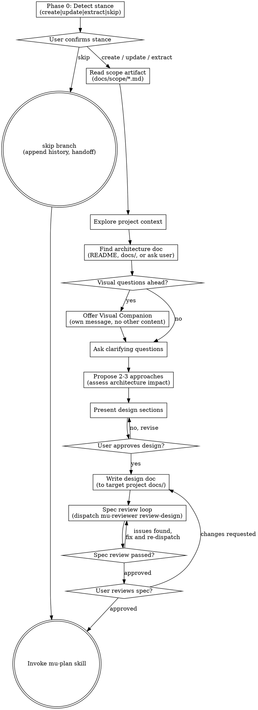

# Technical Architecture

**Scope:** Technical architecture only (components, interfaces, data flow, error handling, testing strategy). For product requirements (user flows, wireframes, feature specs, tiering rules), use **mu-prd** first. For business strategy (market, business model, MVP scope), use **mu-biz** first.

Help turn approved requirements into fully formed technical designs and specs through natural collaborative dialogue.

Start by understanding the current project context, then ask questions one at a time to refine the idea. Once you understand what you're building, present the design and get user approval.

<HARD-GATE>
Do NOT invoke any implementation skill, write any code, scaffold any project, or take any implementation action until you have presented a design and the user has approved it. This applies to EVERY project regardless of perceived simplicity.
</HARD-GATE>

<HARD-GATE>
mu-arch requires a scope artifact (docs/scope/*.md) as input. If no scope artifact exists, invoke mu-scope first. Do NOT proceed with design without a scope artifact.
</HARD-GATE>

**HARD-GATEs evaluated BEFORE Phase 0.** A `skip` stance does not bypass them.

## Phase 0: Stance Detection

Before engaging the design process, detect the current state of any existing arch artifact and pick an entry stance.

1. Read `@../../knowledge/principles/stance-detection.md`
2. Run the detection algorithm with:
   - **Artifact type**: `arch`
   - **Artifact dir**: `docs/specs/*-design*.md`
   - **Watched source dirs**: `src/`, `lib/`, `internal/`, `pkg/`, `cmd/` (whichever exist; else H3 returns `insufficient-signal`)
   - **Legacy locations**: root `ARCHITECTURE.md`, `DESIGN.md`
   - **General rule**: artifact dir (`docs/specs/`) is never in its own watched set — prevents circular staleness.
3. Present the recommendation in one sentence (example wording; exact phrasing may adapt):
   > "Detected: stance=`<stance>` (sub=`<sub-type>`), confidence=`<high|ambiguous>`. Reason: `<one-line>`. OK to proceed, or override?"
4. Accept user override in one word (`create` / `update` / `extract` / `skip`) or proceed on bare "ok". Slash-command hints (`/mu-arch <stance>`) are treated as **pre-confirmed** — no dialog, proceed directly.
5. Record approved stance. Route to matching branch below.

**Branch routing**:

| Stance | Action |
|--------|--------|
| `create` | Run the full existing Process (checklist steps 1-11) unchanged. |
| `update` | Load existing design artifact → apply sub-type logic (`expand` fills stub sections; `gap-fill` appends a new section titled "Gap-fill: `<task>`"; `sync` diffs against current code and proposes paragraph updates) → merge via the existing section-approval loop. |
| `extract` | If target code region is unfamiliar, optionally delegate to `mu-explore` first (pre-change variant) for a mental model. Then read source dirs section-by-section and populate the arch artifact from current code, with each section approved by the user. Commit prefix: `extract:`. |
| `skip` | Append a pass-through entry to the existing artifact's History section (`| <date> | <sha> | skip | — | passthrough for <task> |`); commit only if header/History needed initialization; invoke `mu-plan` per existing Integration. |

**Stance → artifact metadata**: update the artifact's header with `> **Stance:** <stance>`, `> **Sub-type:** <sub-type or —>`, `> **Detected at:** YYYY-MM-DD (commit <short-sha>)`. Commit message prefix uses `docs(specs): <stance>[(sub-type)]: ...` pattern. Users who want to opt out of stance metadata this invocation pass `--no-stance-meta`.

## Anti-Pattern: "This Is Too Simple To Need A Design"

Every project goes through this process. A todo list, a single-function utility, a config change — all of them. "Simple" projects are where unexamined assumptions cause the most wasted work. The design can be short (a few sentences for truly simple projects), but you MUST present it and get approval.

## Checklist

You MUST create a task for each of these items and complete them in order:

0. **Phase 0: Stance Detection** — see §Phase 0 above; establishes entry stance before any other work. Branch routing below assumes stance is already picked and confirmed.
1. **Read scope artifact** — read the Use Case Set, understand all use cases, conflicts, and constraints
2. **Explore project context** — check files, docs, recent commits
3. **Find architecture doc** — look for existing architecture/design docs in the project (README, docs/, ARCHITECTURE.md, DESIGN.md, or similar). If found, read it. If not found or unclear, ask the user.
4. **Offer visual companion** (if topic will involve visual questions) — this is its own message, not combined with a clarifying question. See the Visual Companion section below.
5. **Ask clarifying questions** — one at a time, **technical direction only** (not "what to build" — that's in the scope)
6. **Propose 2-3 approaches** — with trade-offs, your recommendation, impact on existing architecture, and **UC coverage per approach**
7. **Present design** — in sections scaled to their complexity, get user approval after each section
8. **Write design doc** — save to the project's docs directory (default: `docs/specs/YYYY-MM-DD-<topic>-design.md`), **include Requirements Reference field**, and commit
9. **Spec review loop** — dispatch mu-reviewer subagent (review-design mode) with precisely crafted review context; fix issues and re-dispatch until approved (max 3 iterations, then surface to human)
10. **User reviews written spec** — ask user to review the spec file before proceeding
11. **Transition to implementation** — invoke mu-plan skill to create implementation plan

## Process Flow



**The terminal state is invoking mu-plan.** Do NOT invoke any other implementation skill. The ONLY skill you invoke after mu-arch is mu-plan.

## The Process

**Understanding the project architecture:**

- Check out the current project state first (files, docs, recent commits)
- Look for existing architecture/design documentation: README, ARCHITECTURE.md, DESIGN.md, `docs/` directory, or any file the user points you to. If found, read it to understand the system's structure, core decisions, and constraints. If not found, ask the user if there's a document you should reference.
- When proposing changes, assess impact on the existing architecture. Call out which components, interfaces, or data flows are affected. If the change requires updating the architecture doc, note that.

**Understanding the idea:**

**When a scope artifact exists (normal case):**
- The scope answers "what to build" — DO NOT re-ask purpose, user scenarios, or success criteria
- Focus clarifying questions on TECHNICAL DIRECTION: approach preferences, performance constraints, compatibility requirements, integration points
- The use cases from scope are your design constraints — your design must cover all of them

- Before asking detailed questions, assess scope: if the request describes multiple independent subsystems (e.g., "build a platform with chat, file storage, billing, and analytics"), flag this immediately. Don't spend questions refining details of a project that needs to be decomposed first.
- If the project is too large for a single spec, help the user decompose into sub-projects: what are the independent pieces, how do they relate, what order should they be built? Then design the first sub-project through the normal flow. Each sub-project gets its own spec → plan → implementation cycle. Scope decomposition is handled by mu-scope. If the scope covers multiple subsystems, mu-scope should have decomposed it before reaching mu-arch.
- For appropriately-scoped projects, ask questions one at a time to refine the idea
- Prefer multiple choice questions when possible, but open-ended is fine too
- Only one question per message - if a topic needs more exploration, break it into multiple questions
- Focus on understanding: technical approach, integration constraints, compatibility requirements

**Exploring approaches:**

- Propose 2-3 different approaches with trade-offs
- Present options conversationally with your recommendation and reasoning
- Lead with your recommended option and explain why

**Inversion test:** Before presenting approaches, apply the inversion reflex from @../../knowledge/principles/inversion.md. For each approach, document "what would make this approach fail?" alongside trade-offs. Present failure modes as a column in the comparison, not as a separate section.

**Architecture diagram:** After the user approves the approach, produce an architecture diagram before presenting the detailed design. Follow the guidelines in @../../knowledge/principles/architecture-assessment.md Phase 2:

- Choose the right diagram type for this project (C1/C2/C3/DFD — see the "Diagram Type by Project Type" table in the knowledge file)
- Show the **current** relevant architecture, then overlay the **proposed changes** (mark additions ➕, modifications ✏️, removals ➖)
- Use Mermaid format (renders on GitHub); fall back to ASCII if Mermaid isn't practical
- **Skip if** the Quick Probe showed "1 component affected, no boundaries crossed, no new components" — a brief text description suffices for small changes

**Presenting the design:**

- Once you believe you understand what you're building, present the design
- Scale each section to its complexity: a few sentences if straightforward, up to 200-300 words if nuanced
- Ask after each section whether it looks right so far
- Cover: architecture (diagram already presented above), components, data flow, error handling, testing
- Be ready to go back and clarify if something doesn't make sense

**Design for isolation and clarity:**

- Break the system into smaller units that each have one clear purpose, communicate through well-defined interfaces, and can be understood and tested independently
- For each unit, you should be able to answer: what does it do, how do you use it, and what does it depend on?
- Can someone understand what a unit does without reading its internals? Can you change the internals without breaking consumers? If not, the boundaries need work.
- Smaller, well-bounded units are also easier for you to work with - you reason better about code you can hold in context at once, and your edits are more reliable when files are focused. When a file grows large, that's often a signal that it's doing too much.

**Working in existing codebases:**

- Explore the current structure before proposing changes. Follow existing patterns.
- Where existing code has problems that affect the work (e.g., a file that's grown too large, unclear boundaries, tangled responsibilities), include targeted improvements as part of the design - the way a good developer improves code they're working in.
- Don't propose unrelated refactoring. Stay focused on what serves the current goal.

## After the Design

**Documentation:**

- Write the design doc to the **target project's** docs directory, not the plugin's
  - Default: `docs/specs/YYYY-MM-DD-<topic>-design.md` in the current working project
  - User preferences or CLAUDE.md for spec location override this default
- If the change impacts the project's architecture doc, note what needs updating (but don't update it now — that happens after implementation is verified)
- Commit the design document to git

**Required field in every design doc:**

```markdown
## Requirements Reference
- Scope: docs/scope/YYYY-MM-DD-<name>.md
- Covers: UC-1, UC-2, UC-3, ...
- NFRs: NFR-1, NFR-2, ...
```

This field establishes the traceability link from design back to scope.

**Spec Review Loop:**
After writing the spec document:

0. **Before dispatching:** verify the spec file path exists and is readable (Read the file). If not found, fix the path before dispatching.
1. Dispatch mu-reviewer subagent with review-design mode — see @../../agents/mu-reviewer.md
2. If Issues Found: fix, re-dispatch, repeat until Approved
3. If loop exceeds 3 iterations, surface to human for guidance

**User Review Gate:**
After the spec review loop passes, ask the user to review the written spec before proceeding:

> "Spec written and committed to `<path>`. Please review it and let me know if you want to make any changes before we start writing out the implementation plan."

Wait for the user's response. If they request changes, make them and re-run the spec review loop. Only proceed once the user approves.

**Implementation:**

- Invoke the mu-plan skill to create a detailed implementation plan
- Do NOT invoke any other skill. mu-plan is the next step.

## Key Principles

- **One question at a time** - Don't overwhelm with multiple questions
- **Multiple choice preferred** - Easier to answer than open-ended when possible
- **YAGNI ruthlessly** - Remove unnecessary features from all designs
- **Explore alternatives** - Always propose 2-3 approaches before settling
- **Incremental validation** - Present design, get approval before moving on
- **Be flexible** - Go back and clarify when something doesn't make sense

## Visual Companion

A browser-based companion for showing mockups, diagrams, and visual options during design. Available as a tool — not a mode. Accepting the companion means it's available for questions that benefit from visual treatment; it does NOT mean every question goes through the browser.

**Offering the companion:** When you anticipate that upcoming questions will involve visual content (mockups, layouts, diagrams), offer it once for consent:
> "Some of what we're working on might be easier to explain if I can show it to you in a web browser. I can put together mockups, diagrams, comparisons, and other visuals as we go. This feature is still new and can be token-intensive. Want to try it? (Requires opening a local URL)"

**This offer MUST be its own message.** Do not combine it with clarifying questions, context summaries, or any other content. The message should contain ONLY the offer above and nothing else. Wait for the user's response before continuing. If they decline, proceed with text-only design.

**Per-question decision:** Even after the user accepts, decide FOR EACH QUESTION whether to use the browser or the terminal. The test: **would the user understand this better by seeing it than reading it?**

- **Use the browser** for content that IS visual — mockups, wireframes, layout comparisons, architecture diagrams, side-by-side visual designs
- **Use the terminal** for content that is text — requirements questions, conceptual choices, tradeoff lists, A/B/C/D text options, scope decisions

A question about a UI topic is not automatically a visual question. "What does personality mean in this context?" is a conceptual question — use the terminal. "Which wizard layout works better?" is a visual question — use the browser.

If they agree to the companion, read the detailed guide before proceeding:
`skills/mu-arch/visual-companion.md`
