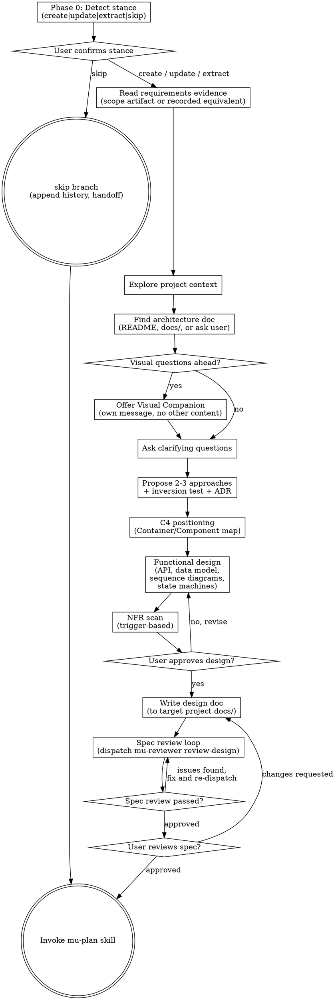

# Technical Architecture

**Scope:** Technical architecture only (components, interfaces, data flow, error handling, testing strategy). For product requirements (user flows, wireframes, feature specs, tiering rules), use **mu-prd** first. For market questions (worth building, competitors, MVP scope), use **mu-mrd** first.

Help turn approved requirements into fully formed technical designs and specs through natural collaborative dialogue.

Start by understanding the current project context, then ask questions one at a time to refine the idea. Once you understand what you're building, present the design and get user approval.

<HARD-GATE>
Do NOT invoke any implementation skill, write any code, scaffold any project, or take any implementation action until you have presented a design and the user has approved it. This applies to EVERY project regardless of perceived simplicity.
</HARD-GATE>

**Input evidence (guided, per the Pipeline Graph):** design needs requirements evidence before any approach talk — an approved scope artifact (default), or an equivalent that already enumerates the feature's cases (e.g., a detailed PRD feature section plus the object's `CONTEXT.md` §6 machine). With an equivalent, record it under Requirements Reference and run mu-scope's evidence fast path first — its non-duplicated trio (Quick Probe, conflict cross-check, reverse UCs) as one report, one confirmation — then design. With no evidence at all, recommend mu-scope and offer the alternatives; the user decides, and an override is flagged in the spec.

## Phase 0: Stance Detection

Before engaging the design process, detect the current state of any existing arch artifact and pick an entry stance.

**Succession runs first** (@../../knowledge/principles/artifact-succession.md): a spec is a dated snapshot, so the prior question is whether this round writes a *new* file at all. An unconsumed spec (no plan cites it) is revised in place — filename and date unchanged. A consumed one gets a new file with `Supersedes:` / `Extends:` in both directions. Stance detection below then governs how the same file is entered.

1. Read `@../../knowledge/principles/stance-detection.md`
2. Run the detection algorithm with:
   - **Artifact type**: `arch`
   - **Artifact dir**: `docs/specs/*-design*.md`
   - **Watched source dirs**: `src/`, `lib/`, `internal/`, `pkg/`, `cmd/` (whichever exist; else H3 returns `insufficient-signal`)
   - **Legacy locations**: root `ARCHITECTURE.md`, `DESIGN.md`
   - **General rule**: artifact dir (`docs/specs/`) is never in its own watched set — prevents circular staleness.
3. Apply the Shared Consumption Protocol in that file (confidence handling, slash pre-confirmation, stance metadata), then route below.

**Branch routing**:

| Stance | Action |
|--------|--------|
| `create` | Run the full Process (checklist steps 1-13). |
| `update` | Load existing design artifact → apply sub-type logic (`expand` fills stub sections; `gap-fill` appends a new section titled "Gap-fill: `<task>`"; `sync` diffs against current code and proposes paragraph updates) → merge via the existing section-approval loop. |
| `extract` | If target code region is unfamiliar, optionally delegate to `mu-explore` first (pre-change variant) for a mental model. Then read source dirs section-by-section and populate the arch artifact from current code, with each section approved by the user. Commit prefix: `extract:`. |
| `skip` | Append a pass-through entry to the existing artifact's History section (`| <date> | <sha> | skip | — | passthrough for <task> |`); commit only if header/History needed initialization; invoke `mu-plan` per existing Integration. |

**Commit prefix:** `docs(specs): <stance>[(sub-type)]: ...`


## Anti-Pattern: "This Is Too Simple To Need A Design"

Every project goes through this process. A todo list, a single-function utility, a config change — all of them. "Simple" projects are where unexamined assumptions cause the most wasted work. The design can be short (a few sentences for truly simple projects), but you MUST present it and get approval.

## Checklist

You MUST create a task for each of these items and complete them in order:

0. **Succession, then stance** — first @../../knowledge/principles/artifact-succession.md: new file, or the same one? Then §Phase 0 decides how the same one is entered. Branch routing below assumes both are picked and confirmed.
1. **Read the requirements evidence** — the scope artifact, or the recorded equivalent (PRD section + `CONTEXT.md` §6 machine); understand all cases, conflicts, and constraints
2. **Explore project context** — check files, docs, recent commits
3. **Find architecture doc** — look for existing architecture/design docs in the project (README, docs/, ARCHITECTURE.md, DESIGN.md, docs/wiki/_index.md, or similar). If found, read it. If not found or unclear, ask the user.
4. **Offer visual companion** (if topic will involve visual questions) — this is its own message, not combined with a clarifying question. See the Visual Companion section below.
5. **Grill for technical direction** — apply @../../knowledge/principles/grilling.md (one question per message with a recommendation, facts self-served, decisions to the user, converge every fork); **technical direction only** (not "what to build" — that's in the scope)
6. **Propose 2-3 approaches** — with trade-offs, your recommendation, impact on existing architecture, and **UC coverage per approach**. Apply inversion test per approach. **Record ADR** for the selected approach (see §Architecture Decision Records).
7. **C4 positioning** — identify which C4 levels the approved approach touches per @../../knowledge/principles/architecture-assessment.md. **Draw only the neighbourhood this change touches**, with the ➕/✏️/➖ overlay; cite `docs/wiki/` pages for the surrounding picture instead of redrawing it. No wiki present → draw what the change needs and record that no architecture map exists.
8. **Functional design** — based on C4 components identified in step 7, design the details:
   - **Within components:** data model (schema changes), state machine (if entity has lifecycle — see §Conditional Design Tools)
   - **Between components:** interface contracts (API endpoints, message formats), sequence diagrams per scenario (if multi-party interaction — see §Conditional Design Tools)
   - **Name with the project's language:** consult repo-root `CONTEXT.md` before naming components or concepts; reuse its terms. Record newly coined names per §Domain Language.
   - Present in sections scaled to complexity, get user approval after each section. **Record ADRs** for any decisions with meaningful trade-offs.
9. **NFR scan** — scan @../../knowledge/principles/nfr-checklist.md trigger conditions against the current feature. Elaborate only on categories where triggers fire. Skip categories with no triggers — no need to list them as "N/A".
10. **Write design doc** — save to the project's docs directory (default: `docs/specs/YYYY-MM-DD-<topic>-design.md`), **include Requirements Reference field**, and commit. Draft per @../../knowledge/principles/prose-discipline.md
11. **Spec review loop** — dispatch mu-reviewer subagent (review-design mode) with precisely crafted review context; fix issues and re-dispatch until approved (max 3 iterations, then surface to human)
12. **User reviews written spec** — ask user to review the spec file before proceeding
13. **Transition to implementation** — invoke mu-plan skill to create implementation plan

## Process Flow


```dot
digraph mu_design {
    "Phase 0: Detect stance\n(create|update|extract|skip)" [shape=box];
    "User confirms stance" [shape=diamond];
    "skip branch\n(append history, handoff)" [shape=doublecircle];
    "Read requirements evidence\n(scope artifact or recorded equivalent)" [shape=box];
    "Explore project context" [shape=box];
    "Find architecture doc\n(README, docs/, or ask user)" [shape=box];
    "Visual questions ahead?" [shape=diamond];
    "Offer Visual Companion\n(own message, no other content)" [shape=box];
    "Ask clarifying questions" [shape=box];
    "Propose 2-3 approaches\n+ inversion test + ADR" [shape=box];
    "C4 positioning\n(Container/Component map)" [shape=box];
    "Functional design\n(API, data model,\nsequence diagrams,\nstate machines)" [shape=box];
    "NFR scan\n(trigger-based)" [shape=box];
    "User approves design?" [shape=diamond];
    "Write design doc\n(to target project docs/)" [shape=box];
    "Spec review loop\n(dispatch mu-reviewer review-design)" [shape=box];
    "Spec review passed?" [shape=diamond];
    "User reviews spec?" [shape=diamond];
    "Invoke mu-plan skill" [shape=doublecircle];

    "Phase 0: Detect stance\n(create|update|extract|skip)" -> "User confirms stance";
    "User confirms stance" -> "skip branch\n(append history, handoff)" [label="skip"];
    "User confirms stance" -> "Read requirements evidence\n(scope artifact or recorded equivalent)" [label="create / update / extract"];
    "skip branch\n(append history, handoff)" -> "Invoke mu-plan skill";
    "Read requirements evidence\n(scope artifact or recorded equivalent)" -> "Explore project context";
    "Explore project context" -> "Find architecture doc\n(README, docs/, or ask user)";
    "Find architecture doc\n(README, docs/, or ask user)" -> "Visual questions ahead?";
    "Visual questions ahead?" -> "Offer Visual Companion\n(own message, no other content)" [label="yes"];
    "Visual questions ahead?" -> "Ask clarifying questions" [label="no"];
    "Offer Visual Companion\n(own message, no other content)" -> "Ask clarifying questions";
    "Ask clarifying questions" -> "Propose 2-3 approaches\n+ inversion test + ADR";
    "Propose 2-3 approaches\n+ inversion test + ADR" -> "C4 positioning\n(Container/Component map)";
    "C4 positioning\n(Container/Component map)" -> "Functional design\n(API, data model,\nsequence diagrams,\nstate machines)";
    "Functional design\n(API, data model,\nsequence diagrams,\nstate machines)" -> "NFR scan\n(trigger-based)";
    "NFR scan\n(trigger-based)" -> "User approves design?";
    "User approves design?" -> "Functional design\n(API, data model,\nsequence diagrams,\nstate machines)" [label="no, revise"];
    "User approves design?" -> "Write design doc\n(to target project docs/)" [label="yes"];
    "Write design doc\n(to target project docs/)" -> "Spec review loop\n(dispatch mu-reviewer review-design)";
    "Spec review loop\n(dispatch mu-reviewer review-design)" -> "Spec review passed?";
    "Spec review passed?" -> "Spec review loop\n(dispatch mu-reviewer review-design)" [label="issues found,\nfix and re-dispatch"];
    "Spec review passed?" -> "User reviews spec?" [label="approved"];
    "User reviews spec?" -> "Write design doc\n(to target project docs/)" [label="changes requested"];
    "User reviews spec?" -> "Invoke mu-plan skill" [label="approved"];
}
```

**Done:** design approved and committed. The Pipeline Graph (bootstrap) names the next move — mu-plan.

## The Process

**Understanding the project architecture:**

- Check out the current project state first (files, docs, recent commits)
- Look for existing architecture/design documentation: README, ARCHITECTURE.md, DESIGN.md, `docs/` directory, or any file the user points you to. If found, read it to understand the system's structure, core decisions, and constraints. If not found, ask the user if there's a document you should reference.
- When proposing changes, assess impact on the existing architecture. Call out which components, interfaces, or data flows are affected. If the change requires updating the architecture doc, note that.

**Understanding the idea:**

**When a scope artifact exists (normal case):**
- The scope answers "what to build" — DO NOT re-ask purpose, user scenarios, or success criteria
- Focus clarifying questions on TECHNICAL DIRECTION: approach preferences, performance constraints, compatibility requirements, integration points
- The use cases from scope are your design constraints — your design must cover all of them

- Before asking detailed questions, assess scope: if the request describes multiple independent subsystems (e.g., "build a platform with chat, file storage, billing, and analytics"), flag this immediately. Don't spend questions refining details of a project that needs to be decomposed first.
- If the project is too large for a single spec, help the user decompose into sub-projects: what are the independent pieces, how do they relate, what order should they be built? Then design the first sub-project through the normal flow. Each sub-project gets its own spec → plan → implementation cycle. Scope decomposition is handled by mu-scope. If the scope covers multiple subsystems, mu-scope should have decomposed it before reaching mu-arch.
- For appropriately-scoped projects, ask questions one at a time to refine the idea
- Prefer multiple choice questions when possible, but open-ended is fine too
- Only one question per message - if a topic needs more exploration, break it into multiple questions
- Focus on understanding: technical approach, integration constraints, compatibility requirements

**Exploring approaches:**

- Propose 2-3 different approaches with trade-offs
- Present options conversationally with your recommendation and reasoning
- Lead with your recommended option and explain why

**Inversion test:** Before presenting approaches, apply the inversion reflex from @../../knowledge/principles/inversion.md. For each approach, document "what would make this approach fail?" alongside trade-offs. Present failure modes as a column in the comparison, not as a separate section.

**C4 positioning (structural map):** After the user approves the approach, produce a C4 diagram before detailed design — **scoped to the neighbourhood this change touches**, not the whole system. The surrounding structure is cited from `docs/wiki/`, which is its single home; a spec that redraws the global picture creates a second copy that drifts from the day it ships, and specs are frozen while the system keeps moving. Follow @../../knowledge/principles/architecture-assessment.md:

- Choose the right diagram type for this project (C1/C2/C3/DFD — see the "Diagram Type by Project Type" table)
- Show the **current** relevant architecture, then overlay the **proposed changes** (mark additions ➕, modifications ✏️, removals ➖)
- Use Mermaid format (renders on GitHub); fall back to ASCII if Mermaid isn't practical
- **Skip if** the Quick Probe showed "1 component affected, no boundaries crossed, no new components" — a brief text description suffices for small changes

**Functional design (detail by C4 component):**

Based on the C4 map, design details at each component level:

- **Within components:** data model (schema changes, field design), state machine (if applicable — see §Conditional Design Tools)
- **Between components:** interface contracts (API endpoints, request/response formats, error codes), sequence diagrams per scenario (if applicable — see §Conditional Design Tools)
- Scale each section to its complexity: a few sentences if straightforward, up to 200-300 words if nuanced
- Ask after each section whether it looks right so far
- Be ready to go back and clarify if something doesn't make sense

**NFR scan:** After functional design, scan @../../knowledge/principles/nfr-checklist.md. Walk through the trigger conditions for each NFR category. Elaborate only on categories where triggers fire (2-5 sentences each: the concern, how the design addresses it, trade-offs). Skip categories with no triggers.

**Design for isolation and clarity:**

- Break the system into smaller units that each have one clear purpose, communicate through well-defined interfaces, and can be understood and tested independently
- For each unit, you should be able to answer: what does it do, how do you use it, and what does it depend on?
- Can someone understand what a unit does without reading its internals? Can you change the internals without breaking consumers? If not, the boundaries need work.
- Smaller, well-bounded units are also easier for you to work with - you reason better about code you can hold in context at once, and your edits are more reliable when files are focused. When a file grows large, that's often a signal that it's doing too much.

**Working in existing codebases:**

- Explore the current structure before proposing changes. Follow existing patterns.
- Where existing code has problems that affect the work (e.g., a file that's grown too large, unclear boundaries, tangled responsibilities), include targeted improvements as part of the design - the way a good developer improves code they're working in.
- Don't propose unrelated refactoring. Stay focused on what serves the current goal.

## Conditional Design Tools

These tools are used during functional design (step 8) when their trigger conditions are met. See @../../knowledge/principles/architecture-assessment.md for Mermaid syntax examples.

### Sequence Diagrams (per scenario)

**Trigger:** The design involves multi-party interactions (frontend ↔ backend ↔ external service), callbacks, webhooks, OAuth flows, or any request chain where data passes through multiple participants.

**How to use:**
1. For each scenario from the scope artifact, draw a separate sequence diagram showing all participants and the data exchanged at each hop
2. At each hop, annotate what data is available (headers, cookies, body, session) and what data is required by the design
3. If any scenario shows required data is unavailable at the execution point, the design has a gap — revise before proceeding

**Why per-scenario, not one combined diagram:** Different scenarios may have different request origins (AJAX vs browser redirect vs webhook vs cron). A combined diagram hides these differences. Per-scenario diagrams expose data availability gaps — e.g., a browser redirect after OAuth loses custom headers that an AJAX call would carry.

### State Machine Diagrams

**Trigger:** The design involves entities with lifecycle states (order status, subscription state, approval workflow, account status, content publishing state).

**How to use:**
0. If `CONTEXT.md` §6 carries a machine for the object, start from its states and transitions — inherit the names verbatim and design only the technical realization: idempotency, transactions, compensation states, timers. Implementation-only states the product layer never sees (e.g., "refund-in-flight") extend the domain model: add them to `CONTEXT.md` rather than renaming domain states or keeping a private list (see @../../knowledge/principles/state-modeling.md Layer Boundaries).
1. Enumerate all states the entity can be in
2. Draw all valid transitions with their trigger actions
3. Check for missing transitions (e.g., can a "shipped" order be "cancelled"?)
4. Check for dead-end states (states with no outgoing transitions that shouldn't be terminal)
5. Record the state machine in the design doc

## Architecture Decision Records

ADRs are a **cross-cutting concern** throughout the design process, not a single step. Whenever you make a decision with meaningful trade-offs (step 6 approach selection, step 8 functional design choices, step 9 NFR trade-offs), record an ADR.

**Home, numbering, format and the earns-one test: @../../knowledge/principles/adr.md.** In short: `docs/adr/NNNN-<slug>.md`, one global sequence, never inside the spec. A decision outlives the change that produced it — and a spec freezes, so an ADR embedded in one becomes unfindable the moment the next spec is written.

**The spec cites, never restates:**

```markdown
## Architecture Decision Records

- [ADR-0007](../adr/0007-out-of-band-control.md) — control signals travel out-of-band, not via function-calling
- [ADR-0008](../adr/0008-single-pg-both-planes.md) — management and call-handling planes share one Postgres
```

Pre-existing specs with inline ADR bodies stay as they are — moving them retro-edits a frozen artifact. New ADRs go to `docs/adr/`.

**What warrants an ADR:**
- Choosing between 2+ viable approaches (step 6)
- Selecting a specific technology, pattern, or integration point
- Making a trade-off between NFR categories (e.g., performance vs simplicity)
- Decisions that would surprise a future reader of the code ("why did they do it this way?")

**What does NOT warrant an ADR:**
- Following established project conventions
- Obvious choices with no real alternatives
- Implementation details that don't affect the architecture

## Domain Language

Naming is a cross-cutting concern like ADRs. **If `CONTEXT.md` does not exist and this design introduces domain concepts rather than only technical components, recommend `/mu-model` first — non-blocking, the user may decline.** Before coining any component or concept name, read the repo-root `CONTEXT.md` (if present) and reuse its terms — including respecting `_Avoid_` lists. When the design coins a new name and the user approves it, add the entry (definition + `_Avoid_` synonyms) to `CONTEXT.md` in the same commit as the design doc, per the qualification test in `@../../knowledge/principles/domain-model.md`.

## After the Design

**Documentation:**

- Write the design doc to the **target project's** docs directory, not the plugin's
  - Default: `docs/specs/YYYY-MM-DD-<topic>-design.md` in the current working project
  - User preferences or CLAUDE.md for spec location override this default
- If the change impacts the project's architecture doc, note what needs updating (but don't update it now — that happens after implementation is verified)
- Commit the design document to git

**Required field in every design doc:**

```markdown
## Requirements Reference
- Requirements evidence: docs/scope/YYYY-MM-DD-<name>.md (or the recorded equivalent — e.g., docs/prd/YYYY-MM-DD-<product>.md §<feature> + its CONTEXT.md §6 machines, per the Pipeline Graph's evidence rule)
- Covers: UC-1, UC-2, UC-3, ... (or the evidence's case identifiers)
- NFRs: NFR-1, NFR-2, ...
```

This field establishes the traceability link from design back to scope.

**Spec Review Loop:**
After writing the spec document:

0. **Before dispatching:** verify the spec file path exists and is readable (Read the file). If not found, fix the path before dispatching.
1. Dispatch mu-reviewer subagent with review-design mode — see @../../agents/mu-reviewer.md
2. If Issues Found: fix, re-dispatch, repeat until Approved
3. If loop exceeds 3 iterations, surface to human for guidance

**User Review Gate:**
After the spec review loop passes, ask the user to review the written spec before proceeding:

> "Spec written and committed to `<path>`. Please review it and let me know if you want to make any changes before we start writing out the implementation plan."

Wait for the user's response. If they request changes, make them and re-run the spec review loop. Only proceed once the user approves.

**Sign-off gate (before terminal):**

Before invoking mu-plan, consult `@../../knowledge/principles/sign-off-gate.md`. If stakeholder-scope indicates team-touching (per that principle's detection heuristics), run the gate protocol and collect sign-off. Otherwise proceed directly. Sign-off gate is skipped when stance was `skip`.

**Wiki update check (before terminal):**

If `docs/wiki/_index.md` exists AND the design introduces new components, changes module boundaries, or alters data flow, suggest: "设计涉及架构变更，建议 `/mu-wiki update` 更新架构 wiki。跳过？(yes/skip)". Non-blocking — if user skips, proceed normally.

**Implementation:**

- Hand off per the Pipeline Graph (bootstrap) — mu-plan turns the approved spec into an implementation plan.

## Key Principles

- **One question at a time** - Don't overwhelm with multiple questions
- **Multiple choice preferred** - Easier to answer than open-ended when possible
- **YAGNI ruthlessly** - Remove unnecessary features from all designs
- **Explore alternatives** - Always propose 2-3 approaches before settling
- **Incremental validation** - Present design, get approval before moving on
- **Be flexible** - Go back and clarify when something doesn't make sense

## Visual Companion

A browser-based companion for showing mockups, diagrams, and visual options during design. Available as a tool — not a mode. Accepting the companion means it's available for questions that benefit from visual treatment; it does NOT mean every question goes through the browser.

**Offering the companion:** When you anticipate that upcoming questions will involve visual content (mockups, layouts, diagrams), offer it once for consent:
> "Some of what we're working on might be easier to explain if I can show it to you in a web browser. I can put together mockups, diagrams, comparisons, and other visuals as we go. This feature is still new and can be token-intensive. Want to try it? (Requires opening a local URL)"

**This offer MUST be its own message.** Do not combine it with clarifying questions, context summaries, or any other content. The message should contain ONLY the offer above and nothing else. Wait for the user's response before continuing. If they decline, proceed with text-only design.

**Per-question decision:** Even after the user accepts, decide FOR EACH QUESTION whether to use the browser or the terminal. The test: **would the user understand this better by seeing it than reading it?**

- **Use the browser** for content that IS visual — mockups, wireframes, layout comparisons, architecture diagrams, side-by-side visual designs
- **Use the terminal** for content that is text — requirements questions, conceptual choices, tradeoff lists, A/B/C/D text options, scope decisions

A question about a UI topic is not automatically a visual question. "What does personality mean in this context?" is a conceptual question — use the terminal. "Which wizard layout works better?" is a visual question — use the browser.

If they agree to the companion, read the detailed guide before proceeding:
`skills/mu-arch/visual-companion.md`

## Integration

- **Invoked by:** mu-scope (terminal state); or directly when a scope artifact already exists (e.g., the user's design-tech override)
- **Produces:** Architecture spec at `docs/specs/YYYY-MM-DD-<name>.md`
- **Consumed by:** mu-plan (reads spec, breaks into tasks)
- **Terminal state:** per the Pipeline Graph (bootstrap)
- **Template:** @../../knowledge/templates/architecture.md
- **Principle references:** stance-detection.md, inversion.md, architecture-assessment.md, nfr-checklist.md, sign-off-gate.md
