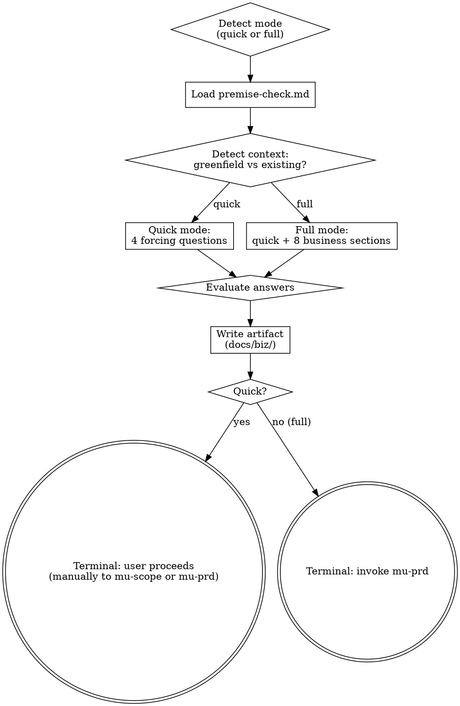

# Business Analysis

**Scope:** Product-level business strategy — market, business model, personas, MVP scope. For product requirements (user flows, specs), use mu-prd after this. For technical architecture, use mu-arch after mu-prd.

Independent of the main feature-level pipeline. Product-level skill that runs **once per product**, not per feature.

<HARD-GATE>
Do NOT invoke mu-prd or any feature-level skill until the user has approved the biz artifact. Two depth modes — pick one explicitly.
</HARD-GATE>

**HARD-GATEs evaluated BEFORE Phase 0.** A `skip` stance does not bypass them.

## Phase 0: Stance Detection

Before Depth Mode Selection, detect the current state of any existing biz artifact and pick an entry stance.

1. Read `@../../knowledge/principles/stance-detection.md`
2. Run the detection algorithm with:
   - **Artifact type**: `biz`
   - **Artifact dir**: `docs/biz/`
   - **Watched source dirs**: root `README*` only. **Note**: biz staleness is weakly defined — the business model shifting is a human judgment, not a file signal. H3 for mu-biz catches only the coarse "README says something very different now" case. Users override to `update(sync)` manually when they know a pivot has happened. **Never watch** `docs/prd/` (PRD edits don't imply biz staleness) or `docs/biz/` itself (circular).
   - **Legacy locations**: `docs/premise/` (deprecated), root `BUSINESS.md`
3. Present the recommendation in one sentence (exact phrasing may adapt):
   > "Detected: stance=`<stance>` (sub=`<sub-type>`), confidence=`<high|ambiguous>`. Reason: `<one-line>`. OK to proceed, or override?"
4. Accept user override in one word (`create` / `update` / `extract` / `skip`) or proceed on bare "ok". Slash-command hints (`/mu-biz <stance>`) are treated as **pre-confirmed** — no dialog, proceed directly. See **Stance × Depth Mode interaction** below for how stance tokens interact with depth-mode tokens like `quick` / `full`.
5. Record approved stance. Route to matching branch below.

**Branch routing**:

| Stance | Action |
|--------|--------|
| `create` | Run Depth Mode Selection, then existing Process (Quick or Full) unchanged. |
| `update` | Load existing biz artifact → apply sub-type logic (`expand` fills stub sections; `gap-fill` adds a new section for a sister-product / new-market; `sync` updates stale market/product claims to current state) → merge via section approval. |
| `extract` | Read product signals (code, commits, README, user interviews if user provides them) and synthesize a biz artifact section-by-section. Commit prefix: `extract:`. |
| `skip` | Append pass-through history entry; move to downstream (manually if Quick depth mode, or `mu-prd create` if Full depth mode — see Full-mode Terminal). |

**Stance × Depth Mode interaction**:

mu-biz has two independent concepts: **Stance** (Phase 0, `create`/`update`/`extract`/`skip`) and **Depth Mode** (below, `quick`/`full`). Slash hints may specify either or both; tokens are split cleanly:

| User input | Stance | Depth mode |
|------------|--------|-----------|
| `/mu-biz` | auto-detect in Phase 0 | auto-detect in Depth Mode Selection |
| `/mu-biz create` | `create` (forced) | auto-detect |
| `/mu-biz quick` | auto-detect | `quick` (forced) |
| `/mu-biz create quick` | `create` | `quick` |
| `/mu-biz full` | auto-detect | `full` |

Phase 0 parses only the stance token; Depth Mode Selection parses only the depth token. They run sequentially and do not interfere.

**Stance → artifact metadata**: add `> **Stance:** <stance>`, `> **Sub-type:** <sub-type or —>`, `> **Detected at:** YYYY-MM-DD (commit <short-sha>)` to the Artifact Format header (below). Commit prefix: `docs(biz): <stance>[(sub-type)]: ...`. User opts out per invocation via `--no-stance-meta`.

## Depth Mode Selection

Detect depth mode from user signal, then confirm:

| Signal | Depth mode | Rationale |
|---|---|---|
| "new product", "startup", "business plan", `/mu-biz full` | **Full** | Comprehensive analysis warranted |
| "quick version", "solo project", "is this worth doing?", `/mu-biz quick`, existing premise/biz artifact | **Quick** | Lightweight validation sufficient |
| Unclear | Ask the user which depth mode; default to quick |

## Process Flow



## Quick Mode

Use when: validating whether work is worth doing; solo projects; existing project considering pivot.

**Process:**

1. Load @../../knowledge/principles/premise-check.md
2. Detect context:
   - Greenfield: "Should we build this?"
   - Existing: "Is this change/pivot worth the disruption?"
3. Ask 4 forcing questions one at a time (Q1 → Q2 → Q3 → Q4):
   - Q1: Problem Specificity — "Who exactly has this problem? What do they do today?"
   - Q2: Temporal Durability — "If the world changes in 3 years, is this more or less essential?"
   - Q3: Narrowest Wedge — "What's the smallest thing we could build to test whether this matters?"
   - Q4: Observation Test — "Have you watched someone use a similar solution without helping them?"
4. Evaluate answers:
   - Strong evidence on 3+ questions → "Premise validated"
   - Weak/vague on 2+ questions → "Premise weakly validated — consider narrowing scope"
   - No useful answer after 3 rounds → "Premise not validated — proceeding at user's request"
5. Write artifact to `docs/biz/YYYY-MM-DD-<name>-quick.md`
6. Commit

**Terminal:** User proceeds manually — either to mu-scope (feature-level work on existing project) or to mu-biz full + mu-prd (if scaling up to real product).

## Full Mode

Use when: greenfield product, team project, investor-facing analysis, major pivot.

**Process:**

1. Run quick mode first — its 4 questions are premise validation for the full analysis too
2. Then produce 8 business sections (one at a time, user approves each):
   1. **Competitive analysis** — matrix of 3-5+ competitors on key dimensions + differentiation statement
   2. **Business Model Canvas** — 9 blocks (Customer Segments, Value Propositions, Channels, Relationships, Revenue Streams, Key Resources, Key Activities, Key Partners, Cost Structure)
   3. **Value Proposition Canvas** — customer jobs / pains / gains paired with product pain relievers / gain creators
   4. **Target persona** — detailed (demographics, context, jobs-to-be-done, buying triggers)
   5. **Brand & naming** (optional; skip if not relevant)
   6. **North Star Metric + funnel** — primary metric + input funnel metrics + success thresholds
   7. **MVP feature scope + tiering** — product-level feature list (not UC-level). Free/paid tier boundaries if applicable.
   8. **Cost/revenue model** — unit economics, cost drivers, pricing, breakeven analysis
3. Write artifact to `docs/biz/YYYY-MM-DD-<product>.md`
4. Commit

**Terminal:** Invoke mu-prd skill with pre-confirmed stance `create` — per spec §2.5 (Pipeline-handoff regression guard), passes stance hint so mu-prd's Phase 0 does not present a confirmation dialog. (Greenfield products typically need PRD next.)

## Artifact Format

**Quick mode:**

```markdown
# Biz Quick Check: <topic>

> **Date:** YYYY-MM-DD
> **Depth mode:** quick
> **Stance:** <create | update | extract | skip>
> **Sub-type:** <expand | gap-fill | sync | —>
> **Detected at:** YYYY-MM-DD (commit `<short-sha>`)

## Context
- Greenfield or existing project
- Brief description of what's being evaluated

## Validation

| Question | Answer | Signal |
|---|---|---|
| Problem specificity | <answer> | ✅ strong / ⚠️ weak / ❌ none |
| Temporal durability | <answer> | ✅ / ⚠️ / ❌ |
| Narrowest wedge | <answer> | ✅ / ⚠️ / ❌ |
| Observation test | <answer> | ✅ / ⚠️ / ❌ |

**Status:** Validated / Weakly validated / Not validated (proceeding at user's request)

## History

| Date | Commit | Stance | Sub-type | Change |
|------|--------|--------|----------|--------|
| YYYY-MM-DD | `<sha>` | create | — | Initial creation |
```

**Full mode:** Same header + Validation section + 8 business sections (each its own `##` heading) + History section at the bottom.

### Commit Convention

Commit message prefix reflects the stance and (if update) sub-type:

- `docs(biz): create: ...` — from-zero creation
- `docs(biz): update(expand): ...` — filled stub sections
- `docs(biz): update(gap-fill): ...` — added section for sister product / new market
- `docs(biz): update(sync): ...` — aligned to current market/product state
- `docs(biz): extract: ...` — reverse-engineered from product signals
- `docs(biz): skip: passthrough for <task>` — short history-only commit if header needed initialization

**Opt-out**: the user can pass `--no-stance-meta` on invocation to suppress the Stance / Sub-type / Detected-at header fields for that session and fall back to the legacy commit convention. Default is on.

## Key Principles

- **One question at a time** — don't overwhelm
- **Accept strong evidence quickly** — if user has data, don't interrogate further
- **Respect user override** — if they say "just do it", flag and proceed
- **Context-adaptive framing** — greenfield vs existing codebase changes the question tone
- **Mode is explicit** — confirm with user before running full mode (it's 8x more work than quick)
- **Business language** — outputs should be understandable by investor / co-founder, not tech-heavy
- **No technical design** — that's mu-arch's job
- **No feature specs** — that's mu-prd's job (product-level feature list is OK here; user-facing rules/wireframes/flows belong in mu-prd)

**Sign-off gate (before terminal):**

Before terminal (user-decides in Quick mode, invoke mu-prd in Full mode), consult `@../../knowledge/principles/sign-off-gate.md`. If stakeholder-scope indicates team-touching, run the gate protocol. Sign-off gate is skipped when stance was `skip`.

## Integration

- **Invoked by:** user manually (`/mu-biz` or `/mu-biz quick` / `/mu-biz full`); or implicitly during greenfield ideation
- **Reads:** @../../knowledge/principles/premise-check.md (always); @../../knowledge/principles/stance-detection.md (Phase 0); @../../knowledge/principles/sign-off-gate.md (terminal if team-touching); prior biz/premise artifacts if present
- **Produces:** `docs/biz/YYYY-MM-DD-<name>[-quick].md`
- **Terminal state:**
  - Quick mode → user decides (no chaining)
  - Full mode → invoke `mu-prd create` (pre-confirmed stance, per spec §2.5)
