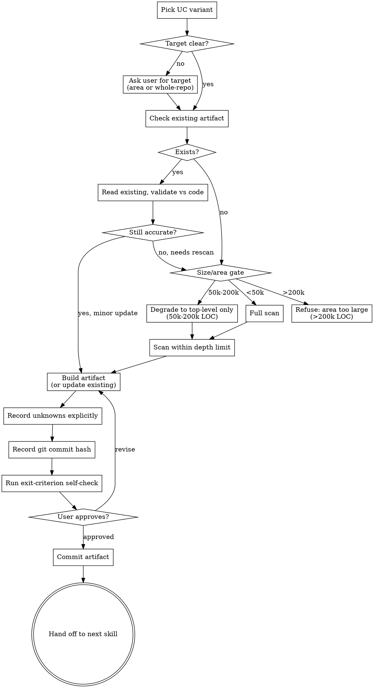

# Explore

Build a mental model of unfamiliar code. Produce a **persistent, living artifact** that captures components, entry points, domain terms, and explicit unknowns. Distinct from architectural design (`mu-arch`), use case scoping (`mu-scope`), and ephemeral codebase Q&A (just use Grep/Read).

<HARD-GATE>
Do NOT hand off to Implement / Design-tech / Reproduce until a persistent artifact has been written to `docs/explore/` AND the user has confirmed it. A chat-only summary is NOT an artifact. Skipping persistence is the default failure mode this skill exists to prevent.
</HARD-GATE>

## Anti-Pattern: "I'll just summarize in chat"

Producing a chat-only summary feels fast and productive. It is the single most common failure mode. Violations:

- Writing a multi-section markdown response in the chat instead of to a file
- "I'll remember this for the rest of the session" — future sessions have no memory
- Skipping the artifact because "the user just wants a quick answer"
- Treating `docs/explore/` as optional

**A chat summary without an artifact is a lost mental model.** Next session starts from zero. Every Explore MUST end in a committed file.

## What mu-explore is NOT

- **Not architectural design** — that's `mu-arch` (and its `extract` mode for reverse-engineering arch from code). Explore produces orientation notes, not architecture decisions.
- **Not use case scoping** — that's `mu-scope` (UCs for a change). Explore produces a mental model for understanding.
- **Not codebase Q&A** — ephemeral questions like "where is JWT validated?" use Grep/Read directly. No artifact needed for one-shot lookups.
- **Not debugging** — that's `mu-debug`. Explore may precede it for unfamiliar bug areas.

## Use Case Variants

Pick ONE before starting. Different variants have different depth and focus:

| Variant | When | Focus | Depth |
|---------|------|-------|-------|
| **onboarding** | Just cloned repo | Top-level structure, core idea | repo-wide, shallow |
| **takeover** | Inheriting abandoned project | Tribal knowledge, dead code, unclear ownership | repo-wide, deep |
| **dependency-eval** | Deciding whether to adopt | Public API, quality signals, posture | outside-in, shallow |
| **pre-change** | Modifying unfamiliar area | Target area + blast radius (callers, dependents) | area, file-count capped |
| **pre-debug** | Bug in unfamiliar area | Bug-adjacent code + data flow | area, symptom-focused |

If unclear which variant fits, ask user in one sentence before proceeding.

## Process Flow

## Checklist

Create a task for each and complete in order:

1. **Pick UC variant** — onboarding / takeover / dependency-eval / pre-change / pre-debug. Ask user if ambiguous.
2. **Confirm target** — whole repo (→ `_overview.md`) or a component (→ `<component>.md`). For monorepos, always ask.
3. **Check for existing artifact** at the chosen path. If it exists, read it and validate against current code.
4. **Size/area gate**: run `git ls-files | xargs wc -l` or similar for LOC estimate. Apply thresholds.
5. **Scan within depth limit** (see depth discipline below).
6. **Build artifact** using template at `@../../knowledge/templates/explore.md`.
7. **Record explicit unknowns** — every uncertainty goes in the Unknowns section. Do not fabricate coverage.
8. **Record git commit hash** (`git rev-parse HEAD`) in the artifact as baseline for future re-explores.
9. **Run exit-criterion self-check**: can the artifact answer "what does changing X affect?" for the chosen target?
10. **User approval loop** — show artifact, iterate until user confirms.
11. **Commit** the artifact.
12. **Hand off** to the appropriate next skill (see Integration).

## Path Conventions

Living artifacts, no date in filename. Updates overwrite in place; a History section appends entries.

- Whole-repo orientation → `docs/explore/_overview.md` (underscore prefix sorts first)
- Per component → `docs/explore/<component>.md`
- Per subcomponent → `docs/explore/<component>/<subcomponent>.md`

## Depth Discipline

| UC variant | Depth rule |
|-----------|-----------|
| onboarding / takeover / dep-eval | Component graph depth ≤ 2. Surface deferred branches so user can request deeper. |
| pre-change | No depth limit; cap at **50 files** in call chain. Paginate/truncate beyond, surface the cut. |
| pre-debug | Bug-adjacent only; follow data flow from symptom, cap at 50 files. |

Exceeding these limits is a signal to stop and ask the user to narrow the target, not a reason to produce a shallow fake-complete artifact.

## Size/Area Gate (ER-1 resolution)

| Area size | Action |
|-----------|--------|
| < 50k LOC | Full scan |
| 50k–200k LOC | Run, but top-level components only (no deep dive) |
| > 200k LOC | Refuse; force user to pick a subsystem |

## Handling Conflicts

When README/docs disagree with code (ER-4): record BOTH versions in the artifact's "Doc vs Code Conflicts" section. Flag "documentation may be stale." Do not adjudicate silently.

## Key Principles

- **Persistence is the whole point** — chat-only summaries are failures (see HARD-GATE).
- **Explicit unknowns beat fabricated confidence** — every gap goes in the Unknowns list.
- **Living artifact, not dated snapshot** — path has no date; History section appends entries with commit hash + date.
- **Exit criterion is operational** — "can answer 'what does changing X affect?'" — test it before asking for approval.
- **Depth limits are hard stops** — never produce a shallow overview while claiming full coverage.
- **Ask once when ambiguous** — don't silently guess UC variant or target area.
- **Delegate mechanics to Explore agent** — for individual lookups, use Claude Code's built-in Explore agent; this skill defines the workflow.

## Anti-Rationalizations

| Excuse | Reality |
|--------|---------|
| "The user just wants a quick answer" | Quick = Grep/Read. mu-explore means persistent artifact. If they want quick, this skill shouldn't have been invoked. |
| "I'll add the file at the end" | You won't. Write it during the scan, not after. |
| "Unknowns list is obvious, skip it" | Unknowns are the most reused section across future sessions. Never skip. |
| "50 files is too restrictive" | The cap is the point. Hitting it = signal to narrow target, not raise the cap. |
| "I covered everything, no unknowns" | You didn't. Every exploration has gaps. List them. |

## Integration

- **Invoked by**: `mu-route` (when Axis B = add/reshape/fix AND familiarity = unfamiliar); direct `/mu-explore` from user.
- **Produces**: Living artifact at `docs/explore/_overview.md` or `docs/explore/<area>.md`.
- **Consumed by**: `mu-scope` (for change tasks), `mu-arch` (for design), `mu-debug` (for bug investigation), `mu-code` (as context). Artifact path is passed as input; downstream skills MAY read it.
- **Terminal state**: hand-off to the next skill determined by the original user intent, NOT by mu-explore. If intent was "understand only," terminal state is commit + done.
- **Template**: `@../../knowledge/templates/explore.md`
