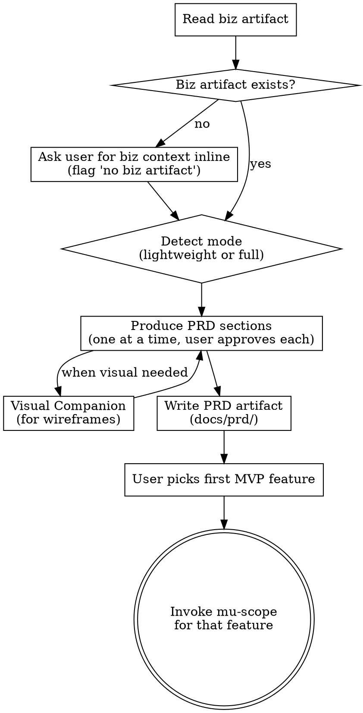

# Product Requirements

**Scope:** User-facing product requirements — personas, flows, wireframes, feature specs, tiering rules, NFRs, metrics. For business strategy use **mu-biz** first. For technical architecture use **mu-arch** after this.

Independent of the feature-level pipeline. Product-level skill that runs **once per product**, not per feature. Reads biz artifact as input; outputs PRD that becomes input for per-feature mu-scope.

<HARD-GATE>
Do NOT invoke mu-scope or any feature-level skill until the user has approved the PRD artifact. The PRD must cover all MVP features from the biz artifact.
</HARD-GATE>

## Mode Selection

| Signal | Mode | Scope |
|---|---|---|
| Solo dev, small project, "lightweight PRD", `/mu-prd lightweight` | **Lightweight** | Core flows + key specs only |
| Team project, investor-facing, formal product, `/mu-prd full` | **Full** | All 9 sections |
| Unclear | Ask; default to lightweight |

## Process Flow



## Process

### 1. Read biz artifact

Look for `docs/biz/YYYY-MM-DD-*.md`. If found, extract:
- Target persona (baseline)
- MVP feature list
- Tiering rules (if any)
- Success metrics / North Star

If not found, ask the user to provide business context inline. Log "no biz artifact referenced" in the PRD header.

### 2. PRD Sections

Produce sections one at a time, approving each before moving on.

#### Full mode (9 sections)

1. **Persona deepening** — concrete scenarios for the target persona(s). "A day in the life" / usage contexts.
2. **Information architecture / feature map** — hierarchy of features, navigation structure
3. **Core user flows** — journey maps or sequence diagrams for primary tasks
4. **Key screen wireframes** — text/mermaid wireframes for critical screens. Use Visual Companion for mockups when visual questions arise.
5. **Per-feature specs** — for each MVP feature: what it does, why, user-facing rules (edge cases in user terms, not code). **Scope boundary:** these are product-level rules (what the user sees and agrees to) — mu-scope later enumerates all concrete paths (happy / edge / error use cases) through those rules on a per-feature basis. Do not pre-enumerate UCs here.
6. **Tiering rules** — free vs paid behavioral boundaries (quotas, features, upgrade triggers)
7. **Non-functional requirements** — performance targets, privacy/compliance needs, accessibility, localization
8. **Success metrics → instrumentation** — which events to track for each flow; how funnel metrics are computed
9. **Open questions / assumptions** — things not yet decided that downstream work must resolve

#### Lightweight mode (3 sections)

Minimum viable PRD for solo/small projects:
1. **Core user flow(s)** — 1-3 primary flows only
2. **Key per-feature specs** — MVP features, minimal detail
3. **Open questions** — what to defer

### 3. Visual Companion

For screen/layout questions, offer the Visual Companion (same pattern as mu-arch). Accept → browser-based wireframing. Decline → mermaid/ASCII in the doc.

### 4. Write artifact

Save to `docs/prd/YYYY-MM-DD-<product>.md`. Commit.

### 5. Invoke mu-scope

Ask the user which MVP feature to start with. Then invoke mu-scope for that feature. Remaining features go through mu-scope iteratively, one at a time.

## Artifact Format

```markdown
# PRD: <product name>

> **Date:** YYYY-MM-DD
> **Mode:** lightweight | full
> **Biz reference:** docs/biz/YYYY-MM-DD-<name>.md (or "inline" if none)

## 1. Persona Deepening
...

## 2. Information Architecture
...

## 3. Core User Flows
[mermaid or text diagrams]

## 4. Key Screen Wireframes
[mermaid / ASCII / companion screenshots]

## 5. Per-Feature Specs
### Feature: <name>
- **What:** ...
- **Why:** ...
- **Rules:** ...

## 6. Tiering Rules
| Capability | Free | Paid |
|---|---|---|
...

## 7. NFRs
- Performance: ...
- Privacy: ...
- Accessibility: ...

## 8. Success Metrics
| Metric | Target | Instrumentation |
|---|---|---|
...

## 9. Open Questions
- ...
```

## Key Principles

- **One section at a time** — get approval before moving on
- **User-facing, not tech** — describe what users see/do, not how it's built
- **Concrete specs** — "rules" are user-observable behaviors, not API contracts
- **Reference the biz artifact** — personas and MVP scope come from there; don't re-derive
- **Defer technical choices** — tech stack, API schema, DB design belong in mu-arch, not here
- **Defer use case enumeration** — per-feature UCs (happy/edge/error paths) are mu-scope's job, not mu-prd's. PRD states product rules; mu-scope enumerates concrete scenarios through them.
- **Visual when helpful** — flows and wireframes benefit from diagrams; requirements/rules are text

## Integration

- **Invoked by:** user manually (`/mu-prd`); or auto-invoked by `mu-biz full` on completion
- **Reads:** `docs/biz/*.md` (biz artifact if present)
- **Produces:** `docs/prd/YYYY-MM-DD-<product>.md`
- **Terminal state:** Invoke mu-scope for the first MVP feature. Further features iterate through mu-scope one at a time.
