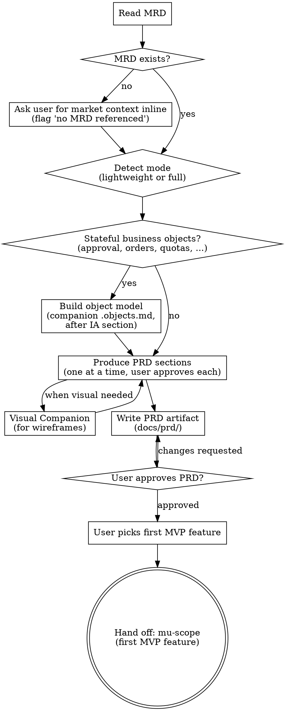

# Product Requirements

**Scope:** User-facing product requirements — personas, flows, wireframes, feature specs, tiering rules, NFRs, metrics. For market questions (worth building? competitors? revenue opportunity?) use **mu-mrd** first. For technical architecture use **mu-arch** after this.

Independent of the feature-level pipeline. Product-level skill that runs **once per product**, not per feature. Reads the MRD as input; outputs PRD that becomes input for per-feature mu-scope.

<HARD-GATE>
Do NOT invoke mu-scope or any feature-level skill until the user has approved the PRD artifact. The PRD must cover all MVP features from the MRD when a full-mode MRD exists; otherwise, the features the user names.
</HARD-GATE>

**HARD-GATEs evaluated BEFORE Phase 0.** A `skip` stance does not bypass them.

## Phase 0: Stance Detection

Before Depth Mode Selection, detect the current state of any existing PRD artifact and pick an entry stance.

1. Read `@../../knowledge/principles/stance-detection.md`
2. Run the detection algorithm with:
   - **Artifact type**: `prd`
   - **Artifact dir**: `docs/prd/`
   - **Watched source dirs**: `src/pages/`, `src/screens/`, `src/views/`, `app/`. **Fallback**: if none of those exist (backend/CLI/library projects), fall back to top-level `src/` directly; if that also doesn't exist, H3 returns `insufficient-signal`.
   - **Legacy locations**: root `PRD.md`
   - Never watch `docs/prd/` itself (circular).
3. Apply the Shared Consumption Protocol in that file (confidence handling, slash pre-confirmation — including the `/mu-prd create` prompted by mu-mrd's terminal — stance metadata), then route below.

**Branch routing**:

| Stance | Action |
|--------|--------|
| `create` | Run Depth Mode Selection, then existing Process (Lightweight or Full) unchanged. |
| `update` | Load the existing PRD artifact and its object model (the companion `.objects.md` linked from the header, or in-body tables), when one exists → classify each change and apply sub-type logic (`expand` fills stub sections; `gap-fill` appends a new feature spec section titled "Gap-fill: `<feature>`" — state changes it implies are edited in the object model, with the body citing state names; `sync` aligns feature descriptions and object-model states — including its excluded-candidates and non-transition notes — to current code behavior) → merge via section approval, machines before the body sections that cite them. Each touched state machine is one approval unit: re-run the state-modeling self-check on it, and treat a terminal-state change as a fork to confirm with the user. New state names follow the same CONTEXT.md vocabulary rule as creation. Multiple sub-types in one invocation: commit prefix takes the highest-priority sub-type (expand > gap-fill > sync); History records one row per change. |
| `extract` | Read source dirs (pages/screens/views/app or fallback src/) section-by-section, synthesize a PRD covering observed features + flows + screens. Commit prefix: `extract:`. |
| `skip` | Append pass-through history entry; invoke `mu-scope` for the first MVP feature per existing Integration. No stance hint is passed to `mu-scope` since it isn't a creative skill. |

**Stance × Depth Mode interaction**:

mu-prd has two independent concepts: **Stance** (Phase 0) and **Depth Mode** (lightweight/full, below). Slash hints may specify either or both; tokens are split cleanly per spec §2.5:

| User / upstream input | Stance | Depth mode |
|-----------------------|--------|-----------|
| `/mu-prd` | auto-detect in Phase 0 | auto-detect in Depth Mode Selection |
| `/mu-prd create` | `create` (forced) | auto-detect |
| `/mu-prd lightweight` | auto-detect | `lightweight` (forced) |
| `/mu-prd create full` | `create` | `full` |
| `/mu-prd create` (prompted by mu-mrd's full-mode terminal) | `create` (pre-confirmed, no dialog) | auto-detect |

Phase 0 parses only the stance token; Depth Mode Selection parses only the depth token.


## Depth Mode Selection

| Signal | Depth mode | Scope |
|---|---|---|
| Solo dev, small project, "lightweight PRD", `/mu-prd lightweight` | **Lightweight** | Core flows + key specs only |
| Team project, investor-facing, formal product, `/mu-prd full` | **Full** | All 9 sections |
| Unclear | One probe: "Stakes — hobby / internal tool / public launch?" hobby → lightweight; internal → lightweight; launch → full |

**Length scales with stakes:** hobby ≈ a page or two; internal ≈ a few pages; launch ≈ as long as its features require. Depth mode picks the section set; stakes calibrate how much each section carries.

## Process Flow


```dot
digraph mu_prd {
    "Read MRD" [shape=box];
    "MRD exists?" [shape=diamond];
    "Ask user for market context inline\n(flag 'no MRD referenced')" [shape=box];
    "Detect mode\n(lightweight or full)" [shape=diamond];
    "Stateful business objects?\n(approval, orders, quotas, ...)" [shape=diamond];
    "Build object model\n(companion .objects.md,\nafter IA section)" [shape=box];
    "Produce PRD sections\n(one at a time, user approves each)" [shape=box];
    "Visual Companion\n(for wireframes)" [shape=box];
    "Write PRD artifact\n(docs/prd/)" [shape=box];
    "User approves PRD?" [shape=diamond];
    "User picks first MVP feature" [shape=box];
    "Hand off: mu-scope\n(first MVP feature)" [shape=doublecircle];

    "Read MRD" -> "MRD exists?";
    "MRD exists?" -> "Detect mode\n(lightweight or full)" [label="yes"];
    "MRD exists?" -> "Ask user for market context inline\n(flag 'no MRD referenced')" [label="no"];
    "Ask user for market context inline\n(flag 'no MRD referenced')" -> "Detect mode\n(lightweight or full)";
    "Detect mode\n(lightweight or full)" -> "Stateful business objects?\n(approval, orders, quotas, ...)";
    "Stateful business objects?\n(approval, orders, quotas, ...)" -> "Build object model\n(companion .objects.md,\nafter IA section)" [label="yes"];
    "Stateful business objects?\n(approval, orders, quotas, ...)" -> "Produce PRD sections\n(one at a time, user approves each)" [label="no"];
    "Build object model\n(companion .objects.md,\nafter IA section)" -> "Produce PRD sections\n(one at a time, user approves each)";
    "Produce PRD sections\n(one at a time, user approves each)" -> "Visual Companion\n(for wireframes)" [label="when visual needed"];
    "Visual Companion\n(for wireframes)" -> "Produce PRD sections\n(one at a time, user approves each)";
    "Produce PRD sections\n(one at a time, user approves each)" -> "Write PRD artifact\n(docs/prd/)";
    "Write PRD artifact\n(docs/prd/)" -> "User approves PRD?";
    "User approves PRD?" -> "Write PRD artifact\n(docs/prd/)" [label="changes requested"];
    "User approves PRD?" -> "User picks first MVP feature" [label="approved"];
    "User picks first MVP feature" -> "Hand off: mu-scope\n(first MVP feature)";
}
```

## Process

### 1. Read the MRD

Look for `docs/mrd/YYYY-MM-DD-*.md` (legacy: `docs/biz/*.md`). If found, extract:
- Target persona (baseline)
- MVP feature list
- Tiering rules (if any)
- Success metrics / North Star

If not found, ask the user to provide market context inline. Log "no MRD referenced" in the PRD header.

### 2. PRD Sections

Produce sections one at a time, approving each before moving on. Drive each section's open points per @../../knowledge/principles/grilling.md — one question per message with a recommendation, facts self-served, converge every fork before the section is approved.

#### Full mode (9 sections)

1. **Persona deepening** — concrete scenarios for the target persona(s). "A day in the life" / usage contexts.
2. **Information architecture / feature map** — hierarchy of features, navigation structure
3. **Core user flows** — journey maps or sequence diagrams for primary tasks
4. **Key screen wireframes** — text/mermaid wireframes for critical screens. Use Visual Companion for mockups when visual questions arise.
5. **Per-feature specs** — for each MVP feature: what it does, why, user-facing rules (edge cases in user terms, not code). **Scope boundary:** these are product-level rules (what the user sees and agrees to) — mu-scope later enumerates all concrete paths (happy / edge / error use cases) through those rules on a per-feature basis. Do not pre-enumerate UCs here. Guarantees that survive retries and races ("double-clicking never creates two orders", "a lapsed booking cannot be revived") are rules, not use cases — they live in the object model, and a feature touching a modeled object cites its states by name.
6. **Tiering rules** — free vs paid behavioral boundaries (quotas, features, upgrade triggers)
7. **Non-functional requirements** — performance targets, privacy/compliance needs, accessibility, localization
8. **Success metrics → instrumentation** — which events to track for each flow; how funnel metrics are computed
9. **Open questions / assumptions** — things not yet decided that downstream work must resolve

#### Lightweight mode (3 sections)

Minimum viable PRD for solo/small projects:
1. **Core user flow(s)** — 1-3 primary flows only
2. **Key per-feature specs** — MVP features, minimal detail
3. **Open questions** — what to defer

### 3. Product Object Model (conditional)

**Trigger:** any MVP feature involves approval, booking, ordering/payment, subscription, publishing, multi-role handoff, quotas, or time-bounded validity — i.e., a business object whose allowed actions depend on where it is in a lifecycle. No trigger → skip silently, zero ceremony.

When triggered, build the model per @../../knowledge/principles/state-modeling.md: classify candidate states (business state vs attribute / computed / page / sub-object), then per object produce the closed state list, transition table (state × event × actor → next state, with boundary semantics), invariants, terminal states, and retry/race guarantees, plus the model's negative space (excluded-candidate table, non-transition notes). Drive every unfilled blank with the lifecycle sentence; run the self-check before the model is approved.

- **Placement:** build it after the Information Architecture section (the feature map names the objects) and before Core User Flows — flows walk the machine, and feature specs cite its states by name. Lightweight mode has no IA section: place the tables directly before the core flows.
- **Artifact:** full mode → companion file `docs/prd/YYYY-MM-DD-<product>.objects.md`, linked from the PRD header and committed with it. Lightweight mode → the model inside the PRD body, before the core flows: states+transitions per object, with invariants, guarantees, and negative space at proportionate size.
- **Vocabulary:** approved state names are domain language — add those passing the qualification test in @../../knowledge/principles/domain-glossary.md to repo-root `CONTEXT.md` (create it if absent; definition + `_Avoid_` synonyms) in the same commit. Downstream skills use these names exactly.

### 4. Visual Companion

For screen/layout questions, offer the Visual Companion (same pattern as mu-arch). Accept → browser-based wireframing. Decline → mermaid/ASCII in the doc.

### 5. Write artifact

Save to `docs/prd/YYYY-MM-DD-<product>.md` (plus the `.objects.md` companion when one exists). Commit together.

### 6. Hand off

Ask the user which MVP feature to start with. Then invoke mu-scope for that feature. Remaining features go through mu-scope iteratively, one at a time.

## Artifact Format

```markdown
# PRD: <product name>

> **Date:** YYYY-MM-DD
> **Depth mode:** lightweight | full
> **Stance:** <create | update | extract | skip>
> **Sub-type:** <expand | gap-fill | sync | —> (highest-priority when one update carries several; omitted on fresh create)
> **Detected at:** YYYY-MM-DD (commit `<short-sha>`) (omitted on fresh create — appears from first update/extract)
> **MRD reference:** docs/mrd/YYYY-MM-DD-<name>.md (legacy docs/biz/*.md; or "inline" if none)
> **Object model:** docs/prd/YYYY-MM-DD-<product>.objects.md (lightweight: "in-body"; omit if the Product Object Model did not trigger)

## 1. Persona Deepening
...

## 2. Information Architecture
...

## 3. Core User Flows
[mermaid or text diagrams]

## 4. Key Screen Wireframes
[mermaid / ASCII / companion screenshots]

## 5. Per-Feature Specs
### Feature: <name>
- **What:** ...
- **Why:** ...
- **Rules:** ...

## 6. Tiering Rules
| Capability | Free | Paid |
|---|---|---|
...

## 7. NFRs
- Performance: ...
- Privacy: ...
- Accessibility: ...

## 8. Success Metrics
| Metric | Target | Instrumentation |
|---|---|---|
...

## 9. Open Questions
- ...

## History

| Date | Commit | Stance | Sub-type | Change |
|------|--------|--------|----------|--------|
| YYYY-MM-DD | `<sha>` | create | — | Initial creation |
```

### Commit Convention

- `docs(prd): create: ...` — from-zero PRD
- `docs(prd): update(expand): ...` — filled stub sections
- `docs(prd): update(gap-fill): ...` — added new feature section
- `docs(prd): update(sync): ...` — aligned to current code behavior
- `docs(prd): extract: ...` — reverse-engineered from source dirs
- `docs(prd): skip: passthrough for <task>` — history-only commit if needed

**Opt-out**: user can pass `--no-stance-meta` to suppress the Stance / Sub-type / Detected-at header fields. Default is on.

## Key Principles

- **One section at a time** — get approval before moving on
- **User-facing, not tech** — describe what users see/do, not how it's built
- **Concrete specs** — "rules" are user-observable behaviors, not API contracts
- **Reference the MRD** — personas and MVP scope come from there; don't re-derive
- **Defer technical choices** — tech stack, API schema, DB design belong in mu-arch, not here
- **Defer use case enumeration** — per-feature UCs (happy/edge/error paths) are mu-scope's job, not mu-prd's. PRD states product rules — including the object model's state guarantees — and mu-scope enumerates concrete scenarios through them.
- **Single-home every rule** — state each rule in exactly one section and reference it elsewhere; two copies of a rule will diverge.
- **Visual when helpful** — flows and wireframes benefit from diagrams; requirements/rules are text

**Sign-off gate (before terminal):**

Before invoking mu-scope, consult `@../../knowledge/principles/sign-off-gate.md`. If stakeholder-scope indicates team-touching, run the gate protocol. Sign-off gate is skipped when stance was `skip`.

## Integration

- **Invoked by:** user manually (`/mu-prd`); mu-mrd's full-mode terminal prompts `/mu-prd create` (slash hint pre-confirmed per spec §2.5)
- **Reads:** `docs/mrd/*.md` (MRD if present; legacy `docs/biz/*.md`); `@../../knowledge/principles/stance-detection.md` (Phase 0); `@../../knowledge/principles/state-modeling.md` (Product Object Model, when triggered); `@../../knowledge/principles/domain-glossary.md` (vocabulary qualification); `@../../knowledge/principles/sign-off-gate.md` (terminal if team-touching)
- **Produces:** `docs/prd/YYYY-MM-DD-<product>.md`; `docs/prd/YYYY-MM-DD-<product>.objects.md` (when the Product Object Model triggers, full mode)
- **Terminal state:** per the Pipeline Graph (bootstrap) — mu-scope for the first MVP feature; further features iterate through mu-scope one at a time.
