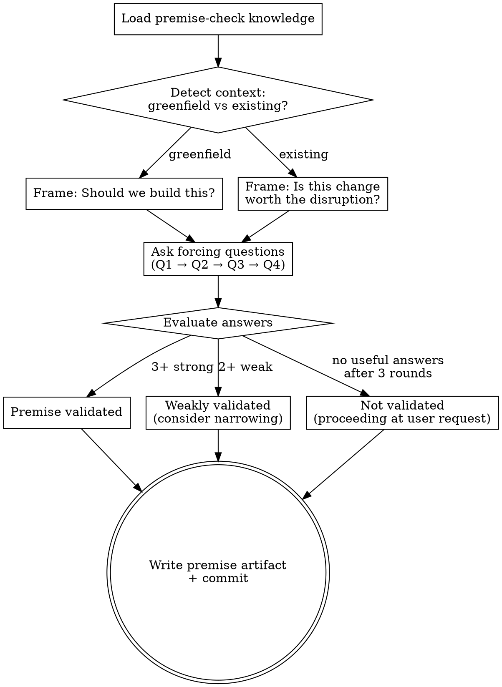

# Premise Validation

Validate the premise before investing in scoping and design. Uses forcing questions to test whether this work is worth doing.

Independent of the main pipeline. Can be invoked standalone via `/mu-premise`, or mu-scope will inline a lightweight version during Quick Probe if no premise artifact exists.

## Process Flow



## Process

1. **Load knowledge:** Read @../../knowledge/principles/premise-check.md
2. **Detect context:**
   - Is this a greenfield project? → Frame questions as "Should we build this?"
   - Is this a change to an existing codebase? → Frame as "Is this change worth the disruption?"
3. **Ask forcing questions one at a time** (Q1 → Q2 → Q3 → Q4):
   - Q1: Problem Specificity — "Who exactly has this problem? What do they do today?"
   - Q2: Temporal Durability — "If the world changes in 3 years, is this more or less essential?"
   - Q3: Narrowest Wedge — "What's the smallest thing we could build to test whether this matters?"
   - Q4: Observation Test — "Have you watched someone use a similar solution without helping them?"
4. **Evaluate answers:**
   - Strong evidence on 3+ questions → "Premise validated"
   - Weak/vague on 2+ questions → "Premise weakly validated — consider narrowing scope"
   - No useful answer after 3 rounds → "Premise not validated — proceeding at user's request"
5. **Write premise artifact** to `docs/premise/YYYY-MM-DD-<name>.md`
6. **Commit artifact**

## Artifact Format

```markdown
# Premise: <topic>

> **Date:** YYYY-MM-DD

## Validation

| Question | Answer | Signal |
|---|---|---|
| Problem specificity | <answer> | ✅ strong / ⚠️ weak / ❌ none |
| Temporal durability | <answer> | ✅ / ⚠️ / ❌ |
| Narrowest wedge | <answer> | ✅ / ⚠️ / ❌ |
| Observation test | <answer> | ✅ / ⚠️ / ❌ |

**Status:** Validated / Weakly validated / Not validated (proceeding at user's request)
```

## Key Principles

- **One question at a time** — don't overwhelm
- **Accept strong evidence quickly** — if user has data, don't interrogate further
- **Respect user override** — if they say "just do it", flag and proceed
- **Context-adaptive framing** — greenfield vs existing codebase changes the question tone
- **Standalone, no chaining** — does NOT invoke mu-scope. User proceeds when ready.
