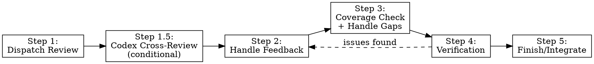

# Review

## Overview

Review code changes, handle feedback, verify completeness, integrate work.

## Process



## Step 1: Dispatch Review

Dispatch mu-reviewer subagent to catch issues before they cascade. The reviewer gets precisely crafted context for evaluation — never your session's history. This keeps the reviewer focused on the work product, not your thought process, and preserves your own context for continued work.

**Core principle:** Review early, review often.

### Security Check (conditional)

Before dispatching review-code, quick-scan the diff for security signals:

```bash
git diff $BASE_SHA..$HEAD_SHA | grep -ciE '(auth|password|token|cookie|session|sql|exec|eval|secret|credential|api.key|jwt|oauth|csrf|cors|helmet|bcrypt|crypto)'
```

If count > 0: dispatch mu-reviewer with **review-security** mode in addition to review-code. Run both reviews (security first, then code quality).

If count = 0: skip review-security, proceed with review-code only.

### When to Request Review

**Mandatory:**
- After each task in subagent-driven development
- After completing major feature
- Before merge to main

**Optional but valuable:**
- When stuck (fresh perspective)
- Before refactoring (baseline check)
- After fixing complex bug

### How to Request

**1. Get git SHAs:**
```bash
BASE_SHA=$(git rev-parse HEAD~1)  # or origin/main
HEAD_SHA=$(git rev-parse HEAD)
```

**2. Dispatch mu-reviewer subagent:**

Use Task tool with devmuse:mu-reviewer type, fill template at @../../agents/mu-reviewer.md review-code

**Placeholders:**
- `{WHAT_WAS_IMPLEMENTED}` - What you just built
- `{PLAN_OR_REQUIREMENTS}` - What it should do
- `{BASE_SHA}` - Starting commit
- `{HEAD_SHA}` - Ending commit
- `{DESCRIPTION}` - Brief summary

**3. Validate inputs before dispatch:**

BEFORE dispatching mu-reviewer:
  - review-code: verify BASE_SHA and HEAD_SHA are valid (`git rev-parse {SHA}`)
  - review-design: verify spec file path exists (`Read` the file)
  - review-coverage: verify scope file exists + SHAs valid
  IF any input invalid: warn user, do NOT dispatch.

**4. Act on feedback by severity:**
- Fix Critical issues immediately
- Fix Important issues before proceeding
- Note Minor issues for later
- Push back if reviewer is wrong (with reasoning)

**5. Handle incomplete coverage:**

IF reviewer output contains files in "NOT reviewed" list:
  Re-dispatch a new reviewer instance for the remaining files only.
  Repeat until all files are covered.
  Merge findings from all rounds into a single report.

### Example

```
[Just completed Task 2: Add verification function]

You: Let me request code review before proceeding.

BASE_SHA=$(git log --oneline | grep "Task 1" | head -1 | awk '{print $1}')
HEAD_SHA=$(git rev-parse HEAD)

[Dispatch mu-reviewer subagent]
  WHAT_WAS_IMPLEMENTED: Verification and repair functions for conversation index
  PLAN_OR_REQUIREMENTS: Task 2 from docs/plans/deployment-plan.md
  BASE_SHA: a7981ec
  HEAD_SHA: 3df7661
  DESCRIPTION: Added verifyIndex() and repairIndex() with 4 issue types

[Subagent returns]:
  Strengths: Clean architecture, real tests
  Issues:
    Important: Missing progress indicators
    Minor: Magic number (100) for reporting interval
  Assessment: Ready to proceed

You: [Fix progress indicators]
[Continue to Task 3]
```

### Integration with Workflows

**Subagent-Driven Development:**
- Review after EACH task
- Catch issues before they compound
- Fix before moving to next task

**Executing Plans:**
- Review after each batch (3 tasks)
- Get feedback, apply, continue

**Ad-Hoc Development:**
- Review before merge
- Review when stuck

## Step 1.5: Codex Cross-Review (Conditional)

Optional cross-review using OpenAI Codex CLI for a second opinion from a different model family. This step is entirely invisible when Codex is not installed.

### Codex Availability Detection

**Run once per session, cache result:**

```bash
command -v codex >/dev/null 2>&1
```

- **Found:** Codex capability available — proceed to trigger evaluation
- **Not found:** Skip this entire step silently. Do not mention Codex, do not suggest installation, do not reference this step in any output. The capability does not exist.

### Trigger Paths

**Path A — User Explicit Request:**
If the user explicitly asks for Codex review (e.g., "let codex review this", "get codex's opinion"), proceed directly to Codex Invocation.

**Path B — System Suggestion (after Step 1 completes):**
Evaluate these high-risk signals. If ANY one fires, suggest Codex cross-review to the user:

| Signal | Detection |
|--------|-----------|
| Security-sensitive | `review-security` mode was dispatched in Step 1 |
| Large diff | `git diff --stat ${BASE_SHA}..${HEAD_SHA}` total lines > 300 |
| Cross-module | Extract top-level module dirs from diff file paths, dedup, count ≥ 2 |
| Low confidence | Claude reviewer output contains "Low confidence" or ≥ 3 PENDING items |

**Suggestion wording:**
> "This change has [signal description]. A Codex cross-review could provide a second opinion. Run it? (y/n)"

- **User confirms:** proceed to Codex Invocation
- **User declines (UC-9):** continue to Step 2. Do not suggest Codex again in this session.

### Size-Based Invocation Routing

`codex review --base` builds the full diff internally before sending to the
model. Very large ranges (full-project reviews against the first commit,
mass refactors) exceed Codex's processing limits and time out with exit 1.
Route by diff size:

```bash
DIFF_FILES=$(git diff --name-only "${BASE_SHA}..${HEAD_SHA}" | wc -l | tr -d ' ')
DIFF_LINES=$(git diff --shortstat "${BASE_SHA}..${HEAD_SHA}" \
  | grep -oE '[0-9]+ insertion' | grep -oE '[0-9]+')
DIFF_LINES=${DIFF_LINES:-0}
```

| Condition | Path | Invocation |
|-----------|------|------------|
| `DIFF_FILES ≤ 500` AND `DIFF_LINES ≤ 10000` | **A. Direct review** (fast, structured) | `codex review --base` (see Codex Invocation below) |
| `DIFF_FILES > 500` OR `DIFF_LINES > 10000` | **B. Agentic exploration** (self-directed) | `codex exec` with read-only sandbox + output schema (see below) |

**Why route by size:** `codex review --base` serializes the entire diff up
front — fast for small changes, but fails on full-project reviews. `codex
exec` runs as an agent that explores the repo itself, prioritizes
high-signal files, and works for arbitrarily large ranges. Trading speed
for scalability.

### Path B: Agentic Exploration (Large Diffs)

Write a JSON Schema once per session and invoke `codex exec` to perform
self-directed review. Agent picks which files to read; output is
constrained to the schema for parseable results.

```bash
# 1. Output schema (write once, reuse)
cat > /tmp/codex-review-schema.json <<'EOF'
{
  "type": "object",
  "required": ["assessment", "confidence", "critical", "important", "minor"],
  "properties": {
    "assessment": { "type": "string", "enum": ["approved", "needs-changes", "needs-rework"] },
    "confidence": { "type": "string", "enum": ["low", "medium", "high"] },
    "critical":  { "type": "array", "items": { "type": "object", "required": ["file", "description", "suggestion"], "properties": { "file": {"type":"string"}, "description": {"type":"string"}, "suggestion": {"type":"string"} } } },
    "important": { "type": "array", "items": { "$ref": "#/properties/critical/items" } },
    "minor":     { "type": "array", "items": { "$ref": "#/properties/critical/items" } }
  }
}
EOF

# 2. Agentic review (read-only sandbox; codex exec is non-interactive by default)
codex exec \
  --sandbox read-only \
  --output-schema /tmp/codex-review-schema.json \
  --output-last-message /tmp/codex-review-output.json \
  "$(cat <<EOF
Review the changes between commits ${BASE_SHA} and ${HEAD_SHA} in this repository.

Approach: explore the repo yourself rather than reading the diff line by line. Use \`git diff --name-only ${BASE_SHA}..${HEAD_SHA}\` to enumerate changed files, then prioritize high-signal areas (auth boundaries, public APIs, security-sensitive paths, error handling, persistence layers). Don't try to read every file — budget your attention.

Focus on: correctness, security, behavioral regressions, breaking API changes, missing error handling. Skip stylistic nits.

Context: ${WHAT_WAS_IMPLEMENTED}

Output your findings as a JSON object matching the provided schema. Use "approved" / "needs-changes" / "needs-rework" for assessment.
EOF
)" 2>&1

# 3. Parse structured result
CODEX_RESULT=$(cat /tmp/codex-review-output.json)
```

**Parsing:** `/tmp/codex-review-output.json` contains the schema-conformant
JSON. Map its `critical` / `important` / `minor` arrays into the existing
Result Presentation format (next section).

**Per-commit last resort:** if the agentic path also fails (exit ≠ 0, timeout,
schema validation error), fall back to per-commit iteration as a final
attempt before giving up on Codex entirely:

```bash
for sha in $(git rev-list --reverse "${BASE_SHA}..${HEAD_SHA}"); do
  echo "=== Reviewing $sha ==="
  codex review --commit "$sha" 2>&1
done
```

Loses cross-commit context; findings fragment per commit. Only use when
Paths A and B both fail.

### Path A: Codex Invocation (Small Diffs)

Use `codex review` native command — it reads the repo directly via sandbox
and produces structured output. Never pipe `git diff` via stdin; large diffs
exceed token limits and cause hangs. For oversized ranges, use Path B above.

**Preferred: `codex review --base`** (reviews changes against a base ref):

```bash
codex review --base "${BASE_SHA}" 2>&1
```

**Alternative: `codex review --commit`** (reviews a single commit):

```bash
codex review --commit "${HEAD_SHA}" 2>&1
```

**Custom instructions caveat:**

`codex review --base <BRANCH>` and a positional `[PROMPT]` argument are
mutually exclusive. The CLI rejects the combination:

```
error: the argument '--base <BRANCH>' cannot be used with '[PROMPT]'
```

Cross-review is a second-opinion pass, so the default Codex review prompt
is sufficient — do not attempt to attach custom instructions to a `--base`
invocation. If targeted-focus context is genuinely required, scope to a
single commit (`--commit` accepts a stdin prompt) instead of a base range.

**Placeholder values** (same as mu-reviewer dispatch):
- `${BASE_SHA}` / `${HEAD_SHA}` — git range for the changes
- `${WHAT_WAS_IMPLEMENTED}` — description of what was built
- `${PLAN_OR_REQUIREMENTS}` — what it should do

**Why not `codex exec` with piped diff:**
- Large diffs (300+ lines) exceed stdin token limits and cause hangs
- `codex review` has native repo access via read-only sandbox — it reads files directly
- `codex review` handles file batching and context windowing internally
- `--output-schema` + `-o` flags with large inputs are unreliable

### Error Handling

After codex completes (either path), evaluate the result. **Exit code 0 is
not sufficient evidence of success** — codex exec returns 0 even after
exhausting upstream retries (e.g., 5xx Service Unavailable). Always
validate the output artifact:

```
Path A (codex review --base):
  IF exit code = 0 AND stdout contains review findings → proceed to Result Presentation

Path B (codex exec):
  IF /tmp/codex-review-output.json exists AND is valid JSON matching schema
    → proceed to Result Presentation
  ELSE
    → treat as failure (see below) regardless of exit code

Common failure handling:
  IF stderr/stdout contains "auth" / "unauthorized" / "API key":
    → Report: "Codex auth failed. Run 'codex login' or set OPENAI_API_KEY env var."
    → Fall back to Claude-only review (proceed to Step 2)

  IF stderr/stdout contains "503" / "Service Unavailable" / "Reconnecting":
    → Report: "Codex upstream unavailable (likely rate limit or provider outage)."
    → Fall back to Claude-only review (proceed to Step 2)

  IF other failure (timeout, schema validation, agent stuck, empty output):
    → Report: "Codex review failed: <stderr snippet>"
    → If Path A failed and diff is borderline-size, retry once via Path B
    → If Path B failed, try per-commit last resort
    → If all paths exhausted, fall back to Claude-only review
```

**Output validation (Path B):**

```bash
# Codex exec exits 0 on upstream failures — must validate artifact
if [ ! -s /tmp/codex-review-output.json ] \
   || ! jq -e . /tmp/codex-review-output.json >/dev/null 2>&1; then
  echo "Codex exec produced no valid output — treating as failure"
  # Trigger fallback path
fi
```

**Fallback principle:** All failures fall back silently to Claude-only review. Codex failure never blocks the review pipeline (UC-R2). Size-based routing pre-empts the most common large-diff failure mode by selecting the agentic path before invocation.

### Result Presentation

**Codex-primary mode** (Path A, user explicitly requested):

Present the codex report directly:

```
## Codex Cross-Review Results

**Assessment:** <assessment> | **Confidence:** <confidence>

### Issues (<N> critical, <N> important, <N> minor)

**Critical:**
1. [<file>] <description> — <suggestion>

**Important:**
1. [<file>] <description> — <suggestion>

**Minor:**
1. [<file>] <description> — <suggestion>
```

Enter Step 2 using the "External Reviewers" handling path.

**Dual report mode** (both Claude and Codex reviews completed):

Present side-by-side comparison:

```
## Review Results: Claude vs Codex

| Dimension | Claude (mu-reviewer) | Codex |
|-----------|---------------------|-------|
| Assessment | <assessment> | <assessment> |
| Critical issues | <count> | <count> |
| Important issues | <count> | <count> |

### Claude-only findings:
- [<severity>] <description>

### Codex-only findings:
- [<severity>] <description>

### Shared findings:
- [<severity>] <description>
```

**Dedup logic:** Match issues by exact file path + description text. Matching items go to "Shared", unique items stay with their source.

**Contradictory assessments (UC-7):** If assessments differ, add:
> "⚠️ Contradictory assessments. Claude says '<X>', Codex says '<Y>'. Please decide how to proceed."

Enter Step 2 with the combined findings. User decides which findings to act on.

## Step 2: Handle Feedback

Code review requires technical evaluation, not emotional performance.

**Core principle:** Verify before implementing. Ask before assuming. Technical correctness over social comfort.

### The Response Pattern

```
WHEN receiving code review feedback:

1. READ: Complete feedback without reacting
2. UNDERSTAND: Restate requirement in own words (or ask)
3. VERIFY: Check against codebase reality
4. EVALUATE: Technically sound for THIS codebase?
5. RESPOND: Technical acknowledgment or reasoned pushback
6. IMPLEMENT: One item at a time, test each
```

### Forbidden Responses

**NEVER:**
- "You're absolutely right!" (explicit CLAUDE.md violation)
- "Great point!" / "Excellent feedback!" (performative)
- "Let me implement that now" (before verification)

**INSTEAD:**
- Restate the technical requirement
- Ask clarifying questions
- Push back with technical reasoning if wrong
- Just start working (actions > words)

### Handling Unclear Feedback

```
IF any item is unclear:
  STOP - do not implement anything yet
  ASK for clarification on unclear items

WHY: Items may be related. Partial understanding = wrong implementation.
```

**Example:**
```
your human partner: "Fix 1-6"
You understand 1,2,3,6. Unclear on 4,5.

❌ WRONG: Implement 1,2,3,6 now, ask about 4,5 later
✅ RIGHT: "I understand items 1,2,3,6. Need clarification on 4 and 5 before proceeding."
```

### Source-Specific Handling

#### From your human partner
- **Trusted** - implement after understanding
- **Still ask** if scope unclear
- **No performative agreement**
- **Skip to action** or technical acknowledgment

#### From External Reviewers
```
BEFORE implementing:
  1. Check: Technically correct for THIS codebase?
  2. Check: Breaks existing functionality?
  3. Check: Reason for current implementation?
  4. Check: Works on all platforms/versions?
  5. Check: Does reviewer understand full context?

IF suggestion seems wrong:
  Push back with technical reasoning

IF can't easily verify:
  Say so: "I can't verify this without [X]. Should I [investigate/ask/proceed]?"

IF conflicts with your human partner's prior decisions:
  Stop and discuss with your human partner first
```

**your human partner's rule:** "External feedback - be skeptical, but check carefully"

### YAGNI Check for "Professional" Features

```
IF reviewer suggests "implementing properly":
  grep codebase for actual usage

  IF unused: "This endpoint isn't called. Remove it (YAGNI)?"
  IF used: Then implement properly
```

**your human partner's rule:** "You and reviewer both report to me. If we don't need this feature, don't add it."

### Implementation Order

```
FOR multi-item feedback:
  1. Clarify anything unclear FIRST
  2. Then implement in this order:
     - Blocking issues (breaks, security)
     - Simple fixes (typos, imports)
     - Complex fixes (refactoring, logic)
  3. Test each fix individually
  4. Verify no regressions
```

### When To Push Back

Push back when:
- Suggestion breaks existing functionality
- Reviewer lacks full context
- Violates YAGNI (unused feature)
- Technically incorrect for this stack
- Legacy/compatibility reasons exist
- Conflicts with your human partner's architectural decisions

**How to push back:**
- Use technical reasoning, not defensiveness
- Ask specific questions
- Reference working tests/code
- Involve your human partner if architectural

**Signal if uncomfortable pushing back out loud:** "Strange things are afoot at the Circle K"

### Acknowledging Correct Feedback

When feedback IS correct:
```
✅ "Fixed. [Brief description of what changed]"
✅ "Good catch - [specific issue]. Fixed in [location]."
✅ [Just fix it and show in the code]

❌ "You're absolutely right!"
❌ "Great point!"
❌ "Thanks for catching that!"
❌ "Thanks for [anything]"
❌ ANY gratitude expression
```

**Why no thanks:** Actions speak. Just fix it. The code itself shows you heard the feedback.

**If you catch yourself about to write "Thanks":** DELETE IT. State the fix instead.

### Gracefully Correcting Your Pushback

If you pushed back and were wrong:
```
✅ "You were right - I checked [X] and it does [Y]. Implementing now."
✅ "Verified this and you're correct. My initial understanding was wrong because [reason]. Fixing."

❌ Long apology
❌ Defending why you pushed back
❌ Over-explaining
```

State the correction factually and move on.

### GitHub Thread Replies

When replying to inline review comments on GitHub, reply in the comment thread (`gh api repos/{owner}/{repo}/pulls/{pr}/comments/{id}/replies`), not as a top-level PR comment.

### Common Mistakes (Feedback Handling)

| Mistake | Fix |
|---------|-----|
| Performative agreement | State requirement or just act |
| Blind implementation | Verify against codebase first |
| Batch without testing | One at a time, test each |
| Assuming reviewer is right | Check if breaks things |
| Avoiding pushback | Technical correctness > comfort |
| Partial implementation | Clarify all items first |
| Can't verify, proceed anyway | State limitation, ask for direction |

### Real Examples

**Performative Agreement (Bad):**
```
Reviewer: "Remove legacy code"
❌ "You're absolutely right! Let me remove that..."
```

**Technical Verification (Good):**
```
Reviewer: "Remove legacy code"
✅ "Checking... build target is 10.15+, this API needs 13+. Need legacy for backward compat. Current impl has wrong bundle ID - fix it or drop pre-13 support?"
```

**YAGNI (Good):**
```
Reviewer: "Implement proper metrics tracking with database, date filters, CSV export"
✅ "Grepped codebase - nothing calls this endpoint. Remove it (YAGNI)? Or is there usage I'm missing?"
```

**Unclear Item (Good):**
```
your human partner: "Fix items 1-6"
You understand 1,2,3,6. Unclear on 4,5.
✅ "Understand 1,2,3,6. Need clarification on 4 and 5 before implementing."
```

**The Bottom Line:** External feedback = suggestions to evaluate, not orders to follow. Verify. Question. Then implement. No performative agreement. Technical rigor always.

## Step 3: Requirements Coverage Check

After code quality review passes, verify all use cases from scope are covered.

**Dispatch review-coverage:**
1. Read the Design Spec for this feature
2. Find the `Requirements Reference` section → extract scope file path
3. If no Requirements Reference found (legacy spec without scope): skip this step, log warning, continue to Verification
4. Dispatch mu-reviewer subagent with review-coverage mode:
   - `{SCOPE_FILE_PATH}`: the scope file path from Requirements Reference
   - `{BASE_SHA}` / `{HEAD_SHA}`: git range for this feature

**Handle coverage gaps:**

```
All Covered → continue to Verification
Gaps Found →
  ├─ Missing implementation (❌) → send back to mu-code to implement
  ├─ Missing test (⚠️) → add test for the uncovered use case
  └─ Missing in scope itself → inform user (not a code problem, scope was incomplete)
```

This step is always executed when a scope artifact exists. It is never skipped — the coverage report may be small (2 rows) or large (20 rows), but it always runs.

## Step 4: Verification

Claiming work is complete without verification is dishonesty, not efficiency.

**Core principle:** Evidence before claims, always.

**Violating the letter of this rule is violating the spirit of this rule.**

### The Iron Law

```
NO COMPLETION CLAIMS WITHOUT FRESH VERIFICATION EVIDENCE
```

If you haven't run the verification command in this message, you cannot claim it passes.

### The Gate Function

```
BEFORE claiming any status or expressing satisfaction:

1. IDENTIFY: What command proves this claim?
2. RUN: Execute the FULL command (fresh, complete)
3. READ: Full output, check exit code, count failures
4. VERIFY: Does output confirm the claim?
   - If NO: State actual status with evidence
   - If YES: State claim WITH evidence
5. ONLY THEN: Make the claim

Skip any step = lying, not verifying
```

### Common Failures

| Claim | Requires | Not Sufficient |
|-------|----------|----------------|
| Tests pass | Test command output: 0 failures | Previous run, "should pass" |
| Linter clean | Linter output: 0 errors | Partial check, extrapolation |
| Build succeeds | Build command: exit 0 | Linter passing, logs look good |
| Bug fixed | Test original symptom: passes | Code changed, assumed fixed |
| Regression test works | Red-green cycle verified | Test passes once |
| Agent completed | VCS diff shows changes | Agent reports "success" |
| Requirements met | Line-by-line checklist | Tests passing |

### Verification Red Flags - STOP

- Using "should", "probably", "seems to"
- Expressing satisfaction before verification ("Great!", "Perfect!", "Done!", etc.)
- About to commit/push/PR without verification
- Trusting agent success reports
- Relying on partial verification
- Thinking "just this once"
- Tired and wanting work over
- **ANY wording implying success without having run verification**

### Rationalization Prevention

| Excuse | Reality |
|--------|---------|
| "Should work now" | RUN the verification |
| "I'm confident" | Confidence ≠ evidence |
| "Just this once" | No exceptions |
| "Linter passed" | Linter ≠ compiler |
| "Agent said success" | Verify independently |
| "I'm tired" | Exhaustion ≠ excuse |
| "Partial check is enough" | Partial proves nothing |
| "Different words so rule doesn't apply" | Spirit over letter |

### Key Patterns

**Tests:**
```
✅ [Run test command] [See: 34/34 pass] "All tests pass"
❌ "Should pass now" / "Looks correct"
```

**Regression tests (TDD Red-Green):**
```
✅ Write → Run (pass) → Revert fix → Run (MUST FAIL) → Restore → Run (pass)
❌ "I've written a regression test" (without red-green verification)
```

**Build:**
```
✅ [Run build] [See: exit 0] "Build passes"
❌ "Linter passed" (linter doesn't check compilation)
```

**Requirements:**
```
✅ Re-read plan → Create checklist → Verify each → Report gaps or completion
❌ "Tests pass, phase complete"
```

**Agent delegation:**
```
✅ Agent reports success → Check VCS diff → Verify changes → Report actual state
❌ Trust agent report
```

### Why Verification Matters

From 24 failure memories:
- your human partner said "I don't believe you" - trust broken
- Undefined functions shipped - would crash
- Missing requirements shipped - incomplete features
- Time wasted on false completion → redirect → rework
- Violates: "Honesty is a core value. If you lie, you'll be replaced."

### When To Apply Verification

**ALWAYS before:**
- ANY variation of success/completion claims
- ANY expression of satisfaction
- ANY positive statement about work state
- Committing, PR creation, task completion
- Moving to next task
- Delegating to agents

**Rule applies to:**
- Exact phrases
- Paraphrases and synonyms
- Implications of success
- ANY communication suggesting completion/correctness

**The Bottom Line:** No shortcuts for verification. Run the command. Read the output. THEN claim the result. This is non-negotiable.

## Step 5: Finish

Guide completion of development work by presenting clear options and handling chosen workflow.

**Core principle:** Verify tests → Present options → Execute choice → Clean up.

### Verify Tests

**Before presenting options, verify tests pass:**

```bash
# Run project's test suite
npm test / cargo test / pytest / go test ./...
```

**If tests fail:**
```
Tests failing (<N> failures). Must fix before completing:

[Show failures]

Cannot proceed with merge/PR until tests pass.
```

Stop. Don't proceed to options.

**If tests pass:** Continue to determine base branch.

### Determine Base Branch

```bash
# Try common base branches
git merge-base HEAD main 2>/dev/null || git merge-base HEAD master 2>/dev/null
```

Or ask: "This branch split from main - is that correct?"

### Present Options

Present exactly these 4 options:

```
Implementation complete. What would you like to do?

1. Merge back to <base-branch> locally
2. Push and create a Pull Request
3. Keep the branch as-is (I'll handle it later)
4. Discard this work

Which option?
```

**Don't add explanation** - keep options concise.

### Execute Choice

#### Option 1: Merge Locally

```bash
# Switch to base branch
git checkout <base-branch>

# Pull latest
git pull

# Merge feature branch
git merge <feature-branch>

# Verify tests on merged result
<test command>

# If tests pass
git branch -d <feature-branch>
```

Then: Cleanup worktree (see below)

#### Option 2: Push and Create PR

```bash
# Push branch
git push -u origin <feature-branch>

# Create PR
gh pr create --title "<title>" --body "$(cat <<'EOF'
## Summary
<2-3 bullets of what changed>

## Test Plan
- [ ] <verification steps>
EOF
)"
```

Then: Cleanup worktree (see below)

#### Option 3: Keep As-Is

Report: "Keeping branch <name>. Worktree preserved at <path>."

**Don't cleanup worktree.**

#### Option 4: Discard

**Confirm first:**
```
This will permanently delete:
- Branch <name>
- All commits: <commit-list>
- Worktree at <path>

Type 'discard' to confirm.
```

Wait for exact confirmation.

If confirmed:
```bash
git checkout <base-branch>
git branch -D <feature-branch>
```

Then: Cleanup worktree (see below)

### Cleanup Worktree

**For Options 1, 2, 4:**

Check if in worktree:
```bash
git worktree list | grep $(git branch --show-current)
```

If yes:
```bash
git worktree remove <worktree-path>
```

**For Option 3:** Keep worktree.

### Quick Reference

| Option | Merge | Push | Keep Worktree | Cleanup Branch |
|--------|-------|------|---------------|----------------|
| 1. Merge locally | ✓ | - | - | ✓ |
| 2. Create PR | - | ✓ | ✓ | - |
| 3. Keep as-is | - | - | ✓ | - |
| 4. Discard | - | - | - | ✓ (force) |

### Common Mistakes (Finish)

**Skipping test verification**
- **Problem:** Merge broken code, create failing PR
- **Fix:** Always verify tests before offering options

**Open-ended questions**
- **Problem:** "What should I do next?" → ambiguous
- **Fix:** Present exactly 4 structured options

**Automatic worktree cleanup**
- **Problem:** Remove worktree when might need it (Option 2, 3)
- **Fix:** Only cleanup for Options 1 and 4

**No confirmation for discard**
- **Problem:** Accidentally delete work
- **Fix:** Require typed "discard" confirmation

## Red Flags

**Review dispatch:**
- Skip review because "it's simple"
- Ignore Critical issues
- Proceed with unfixed Important issues
- Argue with valid technical feedback

**Feedback handling:**
- Performative agreement ("You're absolutely right!")
- Blind implementation without verification
- Partial implementation when items are unclear
- Avoiding pushback when reviewer is wrong

**Verification:**
- Using "should", "probably", "seems to"
- Expressing satisfaction before verification
- Trusting agent success reports
- Relying on partial verification
- ANY wording implying success without having run verification

**Finish:**
- Proceed with failing tests
- Merge without verifying tests on result
- Delete work without confirmation
- Force-push without explicit request

## Integration

- Called by **mu-code** after implementation completes
- Also independently triggerable for ad-hoc review
- Agent reference: @../../agents/mu-reviewer.md
- When reviewing refactoring or code removal, apply @../../knowledge/principles/chestertons-fence.md
- Worktree cleanup handled in Step 5: Finish
