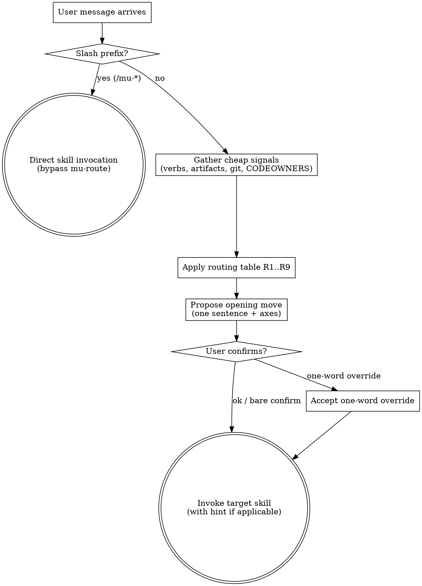

# Route

Pick the correct opening move for the user's task by pattern-matching intent + cheap repo signals against a routing table. Propose in one sentence; user confirms "ok" or overrides with a single word. Not a HARD-GATE — a **checkpoint**.

Consumes `@../../knowledge/principles/stance-detection.md` heuristics indirectly (target creative skill runs its own Phase 0). Does NOT run stance detection itself.

## When to Use

- **Every unprefixed user message** at session start (via `rules/bootstrap.md` delegation)
- **NOT** invoked when user prefixes their message with `/mu-<skill>` — those are direct-invocation escape hatches per v3 proposal Part 6

## When NOT to Use

- User typed `/mu-arch`, `/mu-biz`, etc. → honor direct invocation, skip routing
- Cadence work (e.g., user explicitly asks for weekly retro) → direct `/mu-retro`
- User's CLAUDE.md or AGENTS.md pins a specific skill for a repo → Instruction Priority honors that

## Design Principle: Plan-as-Checkpoint, Not HARD-GATE

mu-route follows the **plan-as-checkpoint pattern** (industry convention: Devin Interactive Planning, Cline Plan Mode, Cursor Plan Mode). Concretely:

- **Propose** the move in one structured sentence
- **Accept** a one-word override or bare confirmation ("ok")
- **Never block** waiting for perfect clarification
- **Default to proceed** on bare confirmation

This distinguishes mu-route from HARD-GATE-style enforcement (the old bootstrap "every task starts with scope"). mu-route is a **suggestion mechanism**, not a gate. Users who know where they're going can override in one word or bypass entirely via slash hint.

## Process Flow

## Checklist

Create tasks for each and complete in order:

1. **Check slash prefix** — if user message starts with `/mu-<skill>`, bypass mu-route entirely; invoke that skill directly
2. **Gather cheap signals** (all in <5s):
   - Axis-Intent: parse user message verbs against lexicon (table below)
   - Axis-Familiarity: `git log --author="$USER" --since="30 days ago" -- <area>` if target area inferable
   - Axis-Missing-artifact: file-exists on `docs/biz/`, `docs/prd/`, `docs/specs/`
   - Axis-Stakeholder: `test -f .github/CODEOWNERS || test -f CODEOWNERS` + git log multi-author check (feeds sign-off gate later; informational to user here)
3. **Apply routing decision table** (below) top-to-bottom, first match wins → one opening move
4. **Propose** in one sentence with axis rationale
5. **Accept user reply**: `ok` / bare confirm → proceed; one-word override → use overridden move; anything else → ask user to clarify (non-blocking)
6. **Invoke target skill** (via Skill tool) with optional hint (e.g., `stance=create` for downstream creative skills per spec §2.5 preservation)

## Trigger Signal Table

| Verb / phrase in user message | Axis-Intent | Default opening move |
|-------------------------------|-------------|----------------------|
| "understand", "figure out", "read", "take over", "evaluate", "what does this do" | understand | **Explore** |
| "should I build", "is this worth", "validate idea", "vague idea", "pivot" | validate | **Validate** |
| "add feature", "build feature", "product idea" | create-product | **Design-product** (or Validate if no biz) |
| "refactor", "clean up", "rename", "restructure" | reshape | **Design-tech** (or Explore if unfamiliar) |
| "fix", "broken", "error", "bug", "test failing", "crash" | fix | **Reproduce** |
| "implement", "write this", "build this", "code it up" | implement | **Implement** (if design exists; else Design-tech) |
| "retro", "look back", "how did X go" | retrospect | **Retrospect** (cadence — use `/mu-retro` directly) |

When multiple verbs fire, Axis-Intent prefers the **primary action** — fix > reshape > create-product > implement > understand > validate (most-specific wins).

## Routing Decision Table

Rows evaluated top-to-bottom; first match wins.

| # | Slash prefix | Axis-Intent | Axis-Missing-artifact | Axis-Familiarity | → Opening Move | Hint to target |
|---|--------------|-------------|----------------------|-----------------|----------------|----------------|
| R1 | `/mu-<skill>` | — | — | — | **bypass** direct invocation | — (user owns intent) |
| R2 | none | understand | — | — | **Explore** | — |
| R3 | none | fix | — | — | **Reproduce** (via `mu-scope` 1 UC repro) | — |
| R4 | none | reshape | — | unfamiliar | **Explore** (pre-change variant) → then Design-tech | — |
| R5 | none | validate / create-product | no biz | — | **Validate** | — |
| R6 | none | create-product | no prd | — | **Design-product** | stance=auto |
| R7 | none | reshape / create-product | no specs | familiar | **Design-tech** | stance=auto |
| R8 | none | implement | specs exist | — | **Implement** | — |
| R9 | none (no verb match) | — | — | — | **Explore** (safe default per spec §2.5 and scope EC-R2) | — |

**Hint semantics**: when the target is a creative skill (mu-biz / mu-prd / mu-arch), mu-route MAY pass a `stance=auto` hint indicating Phase 0 should run its own detection without further pre-confirmation. This is a no-op refinement; target still runs Phase 0. For the mu-biz full → mu-prd auto-handoff (spec §2.5), the pre-confirmed `stance=create` token is still passed by mu-biz terminal, not by mu-route — mu-route only routes the first move.

## Proposal Wording

Template:
> "Looks like **<Opening Move>**. Axes: Intent=`<verb>`, Familiarity=`<familiar|unfamiliar|n/a>`, Missing=`<biz|prd|specs|none>`. Confirm (`ok`) or override (one word: explore / validate / design-product / design-tech / reproduce / plan / implement / retrospect)?"

Example:
> "Looks like **Explore**. Axes: Intent=take-over, Familiarity=unfamiliar, Missing=none. Confirm (`ok`) or override?"

## Slash-Command Escape Hatch

Users can bypass mu-route entirely:

- `/mu-explore` → directly invoke mu-explore (skip routing)
- `/mu-arch` → directly invoke mu-arch
- etc.

This matches industry convention (Aider `/ask`/`/code`/`/architect`, Roo Code `/architect`/`/debug`/`/code`/etc.) and preserves muscle memory. mu-route is the default for unprefixed messages where classification adds value.

## Ambiguity Handling

- **2+ moves tie on routing rules** → propose the one that fires first in R1..R9 ordering; note in the proposal sentence: `"(tied with <other move>)"`. User overrides with one word.
- **No verb matches Axis-Intent** → R9 fires (default Explore). Safe default: understand before acting.
- **Repo state is unusual** (shallow clone, empty repo, submodule root) → fall through to R9; proposal sentence adds `"(repo state ambiguous)"`.

All paths non-blocking — mu-route always produces a proposal.

## Interaction with Sign-off Gate

mu-route does NOT run the sign-off-gate protocol itself. It surfaces Axis-Stakeholder as context (e.g., "CODEOWNERS detected; sign-off will be required at artifact exit") but the gate itself fires inside the target creative skill's exit step, per `@../../knowledge/principles/sign-off-gate.md`.

## HARD-GATE Status

mu-route has **no HARD-GATE**. It's a router. Target skills enforce their own gates.

## Key Principles

- **Propose, don't enforce** — plan-as-checkpoint, one-word override always honored
- **Cheap signals only** — detection must complete in <5s (file exists, git log --format)
- **Slash hints bypass** — power users never see mu-route unless they want to
- **R9 safe default** — when ambiguous, propose Explore (understand before acting)
- **No new abstraction** — routing table replaces bootstrap's pipeline-path section, not adds to it

## Integration

- **Invoked by:** `rules/bootstrap.md` for any unprefixed user message
- **Produces:** a skill invocation (Skill tool call to the target move's skill)
- **Terminal state:** invoking the target skill; mu-route exits
- **Consumed principle references:** `@../../knowledge/principles/sign-off-gate.md` (surfaced to user, not executed)
- **Bypassed by:** any `/mu-<skill>` slash prefix
