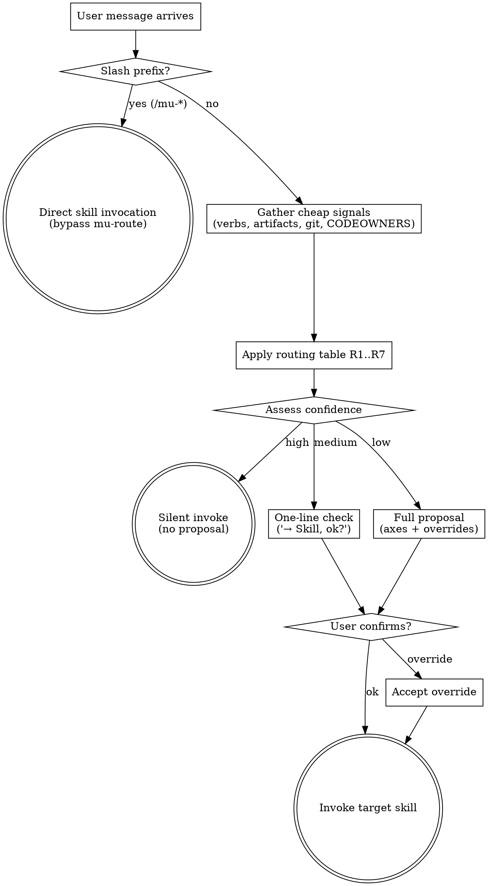

# Route

Pick the correct opening move for the user's task by pattern-matching intent + cheap repo signals against a routing table. Confidence determines behavior: high confidence invokes silently, medium gives a one-line check, low gives a full proposal. Not a HARD-GATE — a **smart router**.

Consumes `@../../knowledge/principles/stance-detection.md` heuristics indirectly (target creative skill runs its own Phase 0). Does NOT run stance detection itself.

## When to Use

- **First message in a conversation** within DevMuse's domain
- **Task transition**: user's intent shifts to a different skill category (e.g., debug→fix, explore→implement). Bootstrap detects this via the Continuation vs Transition table.
- Bootstrap pre-filters: messages outside DevMuse's domain never reach mu-route
- **NOT** invoked when user prefixes their message with `/mu-<skill>` — those are direct-invocation escape hatches

## When NOT to Use

- User typed `/mu-arch`, `/mu-biz`, etc. → honor direct invocation, skip routing
- Cadence work (e.g., user explicitly asks for weekly retro) → direct `/mu-retro`
- User's CLAUDE.md or AGENTS.md pins a specific skill for a repo → Instruction Priority honors that
- **Not a dev/product task** → bootstrap filters this out before mu-route is invoked
- **Continuation of the same task type** → same-type follow-ups during an active skill (e.g., "查下另一个日志" during mu-debug) don't need re-routing

## Confidence Levels

| Confidence | Criteria | Behavior |
|------------|----------|----------|
| **High** | Single verb match, unambiguous intent, sufficient context | **Silent invoke** — no proposal |
| **Medium** | Two possible moves, one clearly dominant | **One-line check** — "→ Skill, ok?" |
| **Low** | Three+ possible moves, or two equally plausible | **Full proposal** — axes + override options |

Default to medium when unsure.

## Process Flow

## Checklist

Create tasks for each and complete in order:

1. **Check slash prefix** — if user message starts with `/mu-<skill>`, bypass mu-route entirely; invoke that skill directly
2. **Gather cheap signals** (all in <5s):
   - Axis-Intent: parse user message verbs against lexicon (table below)
   - Axis-Familiarity: `git log --author="$USER" --since="30 days ago" -- <area>` if target area inferable
   - Axis-Missing-artifact: file-exists on `docs/biz/`, `docs/prd/`, `docs/specs/`. **Inline conversation content (payload examples, pseudocode, verbal descriptions) never counts as "specs exist"** — only on-disk artifact files do.
   - Axis-Stakeholder: `test -f .github/CODEOWNERS || test -f CODEOWNERS` + git log multi-author check (feeds sign-off gate later; informational to user here)
   - **Axis-Plugin**: scan the available skills list (from system-reminder) for **non-DevMuse skills** (i.e. skills whose name does NOT start with `devmuse:`). Check if the user's message plausibly matches any such skill's description or triggers. Record matched skill name(s), if any.
3. **Apply routing decision table** (below) top-to-bottom, first match wins → one opening move
4. **Assess confidence** and act accordingly:
   - **High** (single unambiguous verb match + sufficient context) → silently invoke target skill, no proposal
   - **Medium** (clear direction but some ambiguity) → one-line check: "→ `<Skill>`, ok?"
   - **Low** (multiple possible moves, vague intent) → full proposal with axes + override options
5. **If proposing**, accept user reply: `ok` / bare confirm → proceed; one-word override → use overridden move; anything else → ask user to clarify (non-blocking)
6. **Invoke target skill** (via Skill tool) with optional hint (e.g., `stance=create` for downstream creative skills)

## Trigger Signal Table

| Verb / phrase in user message | Axis-Intent | Default opening move |
|-------------------------------|-------------|----------------------|
| "understand", "figure out", "read", "take over", "evaluate", "what does this do" | understand | **Explore** |
| "add feature", "build feature" | create-feature | **Design-tech** (or Explore if unfamiliar) |
| "refactor", "clean up", "rename", "restructure" | reshape | **Design-tech** (or Explore if unfamiliar) |
| "fix", "broken", "error", "bug", "test failing", "crash" | fix | **Reproduce** |
| "implement", "write this", "build this", "code it up" | implement | **Implement** (if design exists; else Design-tech) |
**On-demand only (not auto-routed):** "validate idea", "business model", "product requirements", "user flows", "competitive analysis" → respond with a pointer to `/mu-biz` or `/mu-prd`. "retro", "look back", "how did X go" → respond with a pointer to `/mu-retro`. "wiki", "architecture docs", "generate documentation", "project documentation" → respond with a pointer to `/mu-wiki`.

When multiple verbs fire, Axis-Intent prefers the **primary action** — fix > reshape > create-feature > implement > understand (most-specific wins).

## Routing Decision Table

Rows evaluated top-to-bottom; first match wins.

| # | Slash prefix | Axis-Intent | Axis-Missing-artifact | Axis-Familiarity | → Opening Move | Hint to target |
|---|--------------|-------------|----------------------|-----------------|----------------|----------------|
| R1 | `/mu-<skill>` | — | — | — | **bypass** direct invocation | — (user owns intent) |
| R2 | none | understand | — | — | **Explore** | — |
| R3 | none | fix | — | — | **Reproduce** (via `mu-scope` 1 UC repro) | — |
| R4 | none | reshape | — | unfamiliar | **Explore** (pre-change variant) → then Design-tech | — |
| R5 | none | reshape / create-feature | no specs | familiar | **Design-tech** | stance=auto |
| R5.5 | none | implement | no specs | — | **Design-tech** | stance=auto |
| R6 | none | implement | specs exist | — | **Implement** | — |
| R6.5 | none | Axis-Plugin matched | — | — | **Delegate to plugin** (invoke matched skill via Skill tool) | — |
| R7 | none (no verb match) | — | — | — | **Explore** (safe default) | — |

**On-demand skills (mu-biz, mu-prd, mu-retro, mu-wiki) are not auto-routed.** mu-route responds with a pointer to the appropriate slash command instead of invoking the skill.

**Hint semantics**: when the target is mu-arch, mu-route MAY pass a `stance=auto` hint indicating Phase 0 should run its own detection without further pre-confirmation.

## Proposal Wording

### High confidence (silent invoke)
No proposal. Directly invoke the target skill. The user sees the skill's output, not a routing question.

### Medium confidence (one-line check)
> "→ **<Skill>**, ok?"

Example:
> "→ **Design-tech**, ok?"

### Low confidence (full proposal)
> "Looks like **<Opening Move>**. Axes: Intent=`<verb>`, Familiarity=`<familiar|unfamiliar|n/a>`, Missing=`<specs|none>`. Confirm (`ok`) or override (one word: explore / design-tech / reproduce / implement)?"

### On-demand skill pointer
When on-demand skill language is detected:
> "This sounds like `<biz/product/retro>` work. Use `/mu-biz`, `/mu-prd`, or `/mu-retro` to start."

### Plugin delegation
> "Detected installed skill **<skill-name>** matching your request. Route to `/<skill-name>`? Confirm (`ok`) or override."

## Slash-Command Escape Hatch

Users can bypass mu-route entirely:

- `/mu-explore` → directly invoke mu-explore (skip routing)
- `/mu-arch` → directly invoke mu-arch
- etc.

This matches industry convention (Aider `/ask`/`/code`/`/architect`, Roo Code `/architect`/`/debug`/`/code`/etc.) and preserves muscle memory. mu-route is the default for unprefixed messages where classification adds value.

## Ambiguity Handling

- **2+ moves tie on routing rules** → propose the one that fires first in R1..R7 ordering; note in the proposal sentence: `"(tied with <other move>)"`. User overrides with one word.
- **No verb matches Axis-Intent** → R7 fires (default Explore). Safe default: understand before acting.
- **Repo state is pathological** (empty repo, shallow clone, submodule root, repo outside git) → skip the routing table and ask user directly: *"Can't confidently route — repo state is unusual (`<detected anomaly>`). Which opening move? (explore / design-tech / reproduce / implement)"*.

## Failure Handling

- **ER-R1 Heuristics computation error** (git command fails, file read fails, regex error, etc.) → do NOT fabricate a signal. Surface the error briefly and ask user: *"Couldn't compute routing signals (`<specific failure>`). Which opening move?"*. Non-blocking.
- **ER-R2 User reply cannot be parsed** (multi-word / off-topic / typo) → ask user to restate with one word from the accepted list. Non-blocking.

All paths non-blocking — mu-route always produces a proposal or a single clarifying ask.

## Interaction with Sign-off Gate

mu-route does NOT run the sign-off-gate protocol itself. It surfaces Axis-Stakeholder as context (e.g., "CODEOWNERS detected; sign-off will be required at artifact exit") but the gate itself fires inside the target creative skill's exit step, per `@../../knowledge/principles/sign-off-gate.md`.

## Key Principles

- **Confidence adapts friction** — clear intent gets silent routing, ambiguity gets proposals
- **Cheap signals only** — detection must complete in <5s (file exists, git log --format)
- **Slash hints bypass** — power users never see mu-route unless they want to
- **R7 safe default** — when ambiguous, propose Explore (understand before acting)
- **No HARD-GATE** — mu-route is a router, target skills enforce their own gates

## Integration

- **Invoked by:** `rules/bootstrap.md` for any unprefixed user message
- **Produces:** a skill invocation (Skill tool call to the target move's skill)
- **Terminal state:** invoking the target skill; mu-route exits
- **Consumed principle references:** `@../../knowledge/principles/sign-off-gate.md` (surfaced to user, not executed)
- **Bypassed by:** any `/mu-<skill>` slash prefix
