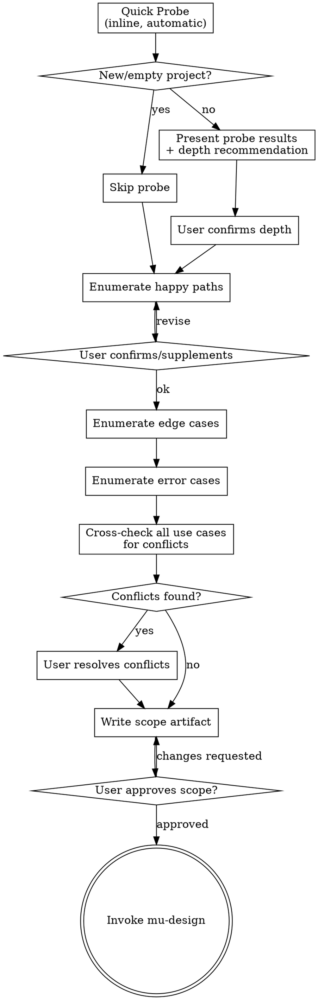

# Scope

Scope work by enumerating use cases, detecting conflicts, and assessing impact on existing code. Produces a Use Case Set that feeds into mu-design.

Start by probing the codebase for impact, then work with the user to exhaust scenarios and resolve conflicts.

<HARD-GATE>
Do NOT invoke mu-design or any implementation skill until you have a complete Use Case Set approved by the user. This applies to EVERY task regardless of perceived simplicity.
</HARD-GATE>

## Anti-Pattern: "This Is Too Simple To Need Scoping"

Every task goes through scoping. A bug fix, a config change, a one-liner — all of them. "Simple" tasks are where omissions cause the most wasted work. The scope can be a single use case (30 seconds), but you MUST produce it and get approval.

## Checklist

You MUST create a task for each of these items and complete them in order:

1. **Quick Probe** — scan codebase for impact (skip for new/empty projects)
2. **Depth decision** — present probe results, confirm depth with user
3. **Use case elicitation** — enumerate happy paths → edge cases → error cases
4. **Conflict detection** — cross-check all use cases, resolve with user
5. **Write scope artifact** — save to `docs/scope/YYYY-MM-DD-<name>.md`, user confirms
6. **Transition to design** — invoke mu-design skill with scope file path

## Process Flow



**The terminal state is invoking mu-design.** Do NOT invoke any other skill. The ONLY skill you invoke after mu-scope is mu-design.

## Phase 1: Quick Probe

Before asking the user anything, scan the codebase to understand what this change touches.

**Skip if:** The project is new (empty codebase) or user explicitly says "new project."

**Checks:**

| Check | Method | What it reveals |
|-------|--------|-----------------|
| Locate code | grep/glob for keywords from user's description | What files are involved |
| Fan-out | Count callers of affected functions/modules | Blast radius |
| Test coverage | Find existing tests for affected code | Safety net status |
| Historical signals | git log for recent changes and bug fixes | Stability of affected area |
| Interface risk | Check if change affects public API/contracts | Breaking change potential |

**Output to user:**

```
Quick Probe Results:
- Files: [list]
- Fan-out: [N callers / M dependents]
- Test coverage: [summary]
- Risk: [low/medium/high]

Recommendation: [quick scope (2-3 use cases) / full enumeration]
```

## Phase 2: Depth Decision

Present the probe results and recommend a depth level. The user confirms or overrides.

- **Low risk, small fan-out:** "This touches 1 file with no dependents. I'll list a couple of use cases to confirm, then proceed?"
- **Medium/high risk:** "This touches shared-form, used by 12 pages. Recommend enumerating all affected scenarios. Agree?"

## Phase 3: Use Case Elicitation

Work through scenarios with the user, one category at a time.

**Methodology (migrated from mu-design):**
- Ask one question at a time — do not overwhelm with multiple questions
- Prefer multiple choice when possible
- Focus on understanding: purpose, constraints, success criteria
- If the request covers multiple independent subsystems, flag immediately — decompose into sub-projects before detailing

**Order:** Happy paths first (establish the core), then edge cases (expand boundaries), then error cases (handle failures).

**Present each category, get user confirmation before moving to the next.**

**Use case format:**
```
- UC-<N>: [Given <precondition>] When <action> Then <expected result>
```

Simple cases can omit Given:
```
- UC-1: When user logs in with valid credentials, Then return JWT and redirect to dashboard
```

Complex cases include Given:
```
- UC-3: Given password expired, When user logs in, Then force password reset flow
```

## Phase 4: Conflict Detection

After all use cases are enumerated, cross-check every pair for contradictions.

**What to look for:**
- Two use cases that trigger under overlapping conditions with different outcomes
- Use cases that assume contradictory preconditions
- Undefined behavior in gaps between use cases

**Format:**
```
- ⚠️ CONFLICT: UC-X vs UC-Y — <description of contradiction>
  - Resolution: <user decision> | PENDING
```

**All conflicts must be resolved before proceeding.** Present each conflict, let the user decide. No PENDING items in the final artifact.

## Phase 5: Output

Write the Use Case Set to `docs/scope/YYYY-MM-DD-<name>.md` using the template at @../../knowledge/templates/scope.md.

Commit the file, then ask the user to review:

> "Scope written and committed to `<path>`. Please review and let me know if you want changes before we proceed to design."

Wait for confirmation.

## Key Principles

- **Exhaustive over efficient** — Better to enumerate one extra use case than miss a real scenario
- **Conflicts are valuable** — Finding a conflict now saves a rewrite later
- **YAGNI applies to scope too** — Don't add use cases for scenarios the user explicitly puts out of scope
- **Depth is probed, not preset** — Quick Probe data determines how thorough to be, not the user's word count
- **One question at a time** — Don't overwhelm, especially during conflict resolution
- **User is the authority** — AI enumerates and detects, user decides and resolves

## Integration

- **Invoked by:** bootstrap rule (highest-priority process skill)
- **Produces:** Use Case Set artifact at `docs/scope/YYYY-MM-DD-<name>.md`
- **Consumed by:** mu-design (reads scope, designs to cover all UCs)
- **Terminal state:** invoke mu-design
- **Template:** @../../knowledge/templates/scope.md
