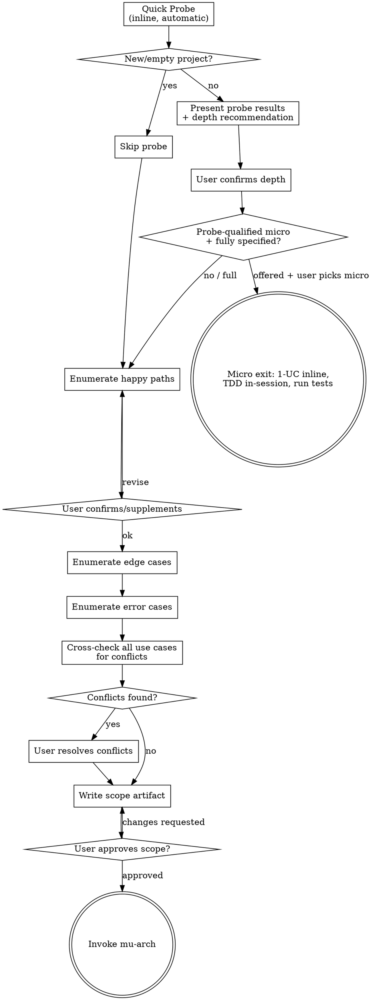

# Scope

Scope work by enumerating use cases, detecting conflicts, and assessing impact on existing code. Produces a Use Case Set that feeds into mu-arch.

Start by probing the codebase for impact, then work with the user to exhaust scenarios and resolve conflicts.

<HARD-GATE>
Do NOT invoke mu-arch or any implementation skill until you have a complete Use Case Set approved by the user. This applies to EVERY task regardless of perceived simplicity.
</HARD-GATE>

## Anti-Pattern: "This Is Too Simple To Need Scoping"

Every task goes through scoping. A bug fix, a config change, a one-liner — all of them. "Simple" tasks are where omissions cause the most wasted work. The scope can be a single use case (30 seconds), but you MUST produce it and get approval. The micro exit (Phase 2) is not an exception: the probe still runs and the UC is still stated and approved — it sheds the artifact file and the downstream phases, never the scoping itself.

## Checklist

You MUST create a task for each of these items and complete them in order:

1. **Quick Probe** — scan codebase for impact (skip for new/empty projects)
2. **Depth decision** — present probe results, confirm depth with user; probe-qualified micro changes may take the micro exit here (see Phase 2)
3. **Use case elicitation** — enumerate happy paths → edge cases → error cases
4. **Conflict detection** — cross-check all use cases, resolve with user
5. **Write scope artifact** — save to `docs/scope/YYYY-MM-DD-<name>.md`, user confirms
6. **Hand off** — announce the artifact; the Pipeline Graph (bootstrap) names the next move

## Process Flow


```dot
digraph mu_scope {
    "Quick Probe\n(inline, automatic)" [shape=box];
    "New/empty project?" [shape=diamond];
    "Skip probe" [shape=box];
    "Present probe results\n+ depth recommendation" [shape=box];
    "User confirms depth" [shape=box];
    "Enumerate happy paths" [shape=box];
    "User confirms/supplements" [shape=diamond];
    "Enumerate edge cases" [shape=box];
    "Enumerate error cases" [shape=box];
    "Cross-check all use cases\nfor conflicts" [shape=box];
    "Conflicts found?" [shape=diamond];
    "User resolves conflicts" [shape=box];
    "Write scope artifact" [shape=box];
    "User approves scope?" [shape=diamond];
    "Invoke mu-arch" [shape=doublecircle];

    "Quick Probe\n(inline, automatic)" -> "New/empty project?";
    "New/empty project?" -> "Skip probe" [label="yes"];
    "New/empty project?" -> "Present probe results\n+ depth recommendation" [label="no"];
    "Skip probe" -> "Enumerate happy paths";
    "Present probe results\n+ depth recommendation" -> "User confirms depth";
    "User confirms depth" -> "Probe-qualified micro\n+ fully specified?" ;
    "Probe-qualified micro\n+ fully specified?" [shape=diamond];
    "Micro exit: 1-UC inline,\nTDD in-session, run tests" [shape=doublecircle];
    "Probe-qualified micro\n+ fully specified?" -> "Micro exit: 1-UC inline,\nTDD in-session, run tests" [label="offered + user picks micro"];
    "Probe-qualified micro\n+ fully specified?" -> "Enumerate happy paths" [label="no / full"];
    "Enumerate happy paths" -> "User confirms/supplements";
    "User confirms/supplements" -> "Enumerate edge cases" [label="ok"];
    "User confirms/supplements" -> "Enumerate happy paths" [label="revise"];
    "Enumerate edge cases" -> "Enumerate error cases";
    "Enumerate error cases" -> "Cross-check all use cases\nfor conflicts";
    "Cross-check all use cases\nfor conflicts" -> "Conflicts found?";
    "Conflicts found?" -> "User resolves conflicts" [label="yes"];
    "Conflicts found?" -> "Write scope artifact" [label="no"];
    "User resolves conflicts" -> "Write scope artifact";
    "Write scope artifact" -> "User approves scope?";
    "User approves scope?" -> "Write scope artifact" [label="changes requested"];
    "User approves scope?" -> "Invoke mu-arch" [label="approved"];
}
```

**Done:** the UC set is approved — as a committed scope file, an inline 1-UC reproduction (fix route: `Given <broken state> When <action> Then <observed failure, vs expected>`), or a completed micro exit. The Pipeline Graph (bootstrap) names each next move. One intra-skill precedence rule stays here: on the fix route, the red test IS the reproduction — a stated edit that does not turn it green cancels the micro exit, and the repro hands to mu-debug.

## Phase 1: Quick Probe

Before asking the user anything, scan the codebase to understand what this change touches.

**Premise check:** Before scanning the codebase, check if any of these artifacts exist (any one satisfies the gate):
- `docs/premise/*.md` (legacy premise artifact)
- `docs/mrd/*.md` (MRD from mu-mrd quick or full mode; legacy `docs/biz/*.md`)
- `docs/prd/*.md` (PRD artifact from mu-prd)

If any found, skip the premise check. If none found, run a lightweight premise check (3 questions from @../../knowledge/principles/premise-check.md — skip Q4). If the user provides strong evidence immediately, pass quickly. If the user says "just do it" after 3 rounds without substantive answers, flag "Premise not validated — proceeding at user's request" and continue.

**Skip if:** The project is new (empty codebase) or user explicitly says "new project."

**Checks:**

| Check | Method | What it reveals |
|-------|--------|-----------------|
| Locate code | grep/glob for keywords from user's description | What files are involved |
| Fan-out | Count callers of affected functions/modules | Blast radius |
| Test coverage | Find existing tests for affected code | Safety net status |
| Historical signals | git log for recent changes and bug fixes | Stability of affected area |
| Interface risk | Check if change affects public API/contracts | Breaking change potential |
| Guard semantics | If modifying a condition/filter/guard, enumerate ALL scenarios it currently blocks | Regression gap from condition replacement |
| Architecture context | Read architecture doc (README, ARCHITECTURE.md, docs/); map change onto components | Which layers/boundaries are affected |

**Architecture context** (see @../../knowledge/principles/architecture-assessment.md Phase 1): Read the project's architecture doc if one exists. Identify which components/layers the proposed work touches, whether it crosses architectural boundaries, and whether new components are needed. This is a coarse 2-minute assessment, not a detailed diagram — that comes in mu-arch.

**Guard Semantic Analysis** (when the change modifies/replaces an existing condition, filter, or guard):

A single condition often carries **multiple implicit responsibilities**. Replacing it to fix one scenario can silently drop protection for others. Before proposing a replacement:

1. **Enumerate the block set** — list every scenario the current condition prevents (not just the one motivating the change)
2. **Compute the regression gap** — diff what the old condition blocks vs. what the new condition blocks; the difference is your risk surface
3. **Require explicit disposition** — for each item in the gap, the user must confirm "intentionally allowed" or "must still be blocked"

```
Guard Analysis: <condition being replaced>
Old condition blocks: [scenario A, scenario B, scenario C]
New condition blocks: [scenario A]
Regression gap:       [scenario B, scenario C]
  → scenario B: [intentionally allowed / must still block]
  → scenario C: [intentionally allowed / must still block]
```

**Output to user:**

```
Quick Probe Results:
- Files: [list]
- Fan-out: [N callers / M dependents]
- Test coverage: [summary]
- Guard analysis: [if applicable — gap items requiring disposition]
- Architecture impact: [components affected, boundaries crossed, new components needed]
- Risk: [low/medium/high]

Recommendation: [quick scope (2-3 use cases) / full enumeration]
- Wiki: [if risk >= medium AND docs/wiki/_index.md does not exist] "项目暂无架构 wiki，建议 `/mu-wiki generate`"
```

## Phase 2: Depth Decision

Present the probe results and recommend a depth level. The user confirms or overrides.

- **Low risk, small fan-out:** "This touches 1 file with no dependents. I'll list a couple of use cases to confirm, then proceed?"
- **Medium/high risk:** "This touches shared-form, used by 12 pages. Recommend enumerating all affected scenarios. Agree?"

**Micro exit (condition-gated by the probe, never by feel):** offer it only when the probe shows ALL of — single file, zero or one dependent, no public interface or contract change, no guard/condition/filter semantics change, low risk — AND the user's request itself fully specifies the change (nothing left to design; the message contains the exact edit). Offer: "Micro change — probe shows <evidence>. Skip the artifact and design phases: 1-UC inline scope, implement test-first here, run the affected tests. (micro / full)"

On confirmation: state the single UC in conversation, get a nod, implement test-first in this session, run the affected tests, present the diff. No scope file, no mu-arch, no mu-plan — mu-arch's design gate binds mu-arch executions and is not engaged here; the change lands on the current branch, with the micro confirmation as the consent. The probe and the UC approval still happen — micro sheds files and phases, not thinking.

**Cancels the exit** (revert the partial edit, return here, run the full flow): hidden dependents surfacing, unrelated tests failing, the edit growing past the stated scope, or any design question appearing mid-change. **Never qualifies:** guard/condition/filter edits (one-line condition changes are exactly where Guard Semantic Analysis earns its keep), auth/security-adjacent code, schema or data migrations, dependency/lockfile changes.

## Phase 3: Use Case Elicitation

**Evidence fast path:** when the requirements evidence already enumerates the cases — a detailed PRD feature section plus object model, an approved spec from elsewhere — do not re-interview. Scope's non-duplicated work is the probe (already run), the conflict cross-check over the evidence's rules, and reverse UCs; deliver them as one report with UCs cited from the evidence, one confirmation, and a thin artifact referencing the source. Elicitation below is for requirements that exist only in the user's head.

Work through scenarios with the user, one category at a time.

**Methodology:** grill per @../../knowledge/principles/grilling.md — one question per message with options + recommendation, facts self-served, decisions to the user, converge every fork. Focus on purpose, constraints, success criteria. If the request covers multiple independent subsystems, flag immediately — decompose into sub-projects before detailing.

**Order:** Happy paths first (establish the core), then edge cases (expand boundaries), then error cases (handle failures), then **reverse cases** (what must NOT happen).

**Transition coverage:** if a PRD object model exists (`docs/prd/*.objects.md`, or state tables in the PRD body), its transition table is a UC checklist — every transition the feature touches (including clock-driven ones) earns at least one use case, using the model's state names; retries and races around a transition are edge cases.

**Reverse use cases:** For every new behavior introduced, ask: "What existing behavior must remain unchanged?" Frame these as negative assertions:
```
- UC-R1: When <scenario that worked before>, Then <must still behave the same way>
```
This catches regressions that positive use cases miss — especially when replacing conditions/guards.

**Present each category, get user confirmation before moving to the next.** Quick scope (per the depth decision): collapse to one message — all categories together, one confirmation round.

**Use case format:**
```
- UC-<N>: [Given <precondition>] When <action> Then <expected result>
```

Simple cases can omit Given:
```
- UC-1: When user logs in with valid credentials, Then return JWT and redirect to dashboard
```

Complex cases include Given:
```
- UC-3: Given password expired, When user logs in, Then force password reset flow
```

## Phase 4: Conflict Detection

After all use cases are enumerated, cross-check every pair for contradictions.

**What to look for:**
- Two use cases that trigger under overlapping conditions with different outcomes
- Use cases that assume contradictory preconditions
- Undefined behavior in gaps between use cases
- **Regression gaps** — scenarios blocked by old code but unblocked by the proposed change (cross-reference Guard Analysis if present)

**Format:**
```
- ⚠️ CONFLICT: UC-X vs UC-Y — <description of contradiction>
  - Resolution: <user decision> | PENDING
```

**All conflicts must be resolved before proceeding.** Present each conflict, let the user decide. No PENDING items in the final artifact.

## Phase 5: Output

Write the Use Case Set to `docs/scope/YYYY-MM-DD-<name>.md` using the template at @../../knowledge/templates/scope.md.

Commit the file, then ask the user to review:

> "Scope written and committed to `<path>`. Please review and let me know if you want changes before we proceed to design."

Wait for confirmation.

## Key Principles

- **Every condition is a wall — look at both sides before removing it** — When replacing a guard/filter, enumerate what it blocks, not just what it enables
- **Exhaustive over efficient** — Better to enumerate one extra use case than miss a real scenario
- **Conflicts are valuable** — Finding a conflict now saves a rewrite later
- **YAGNI applies to scope too** — Don't add use cases for scenarios the user explicitly puts out of scope
- **Depth is probed, not preset** — Quick Probe data determines how thorough to be, not the user's word count
- **One question at a time** — Don't overwhelm, especially during conflict resolution
- **User is the authority** — AI enumerates and detects, user decides and resolves

## Integration

- **Invoked by:** bootstrap rule (highest-priority process skill)
- **Produces:** Use Case Set artifact at `docs/scope/YYYY-MM-DD-<name>.md`
- **Consumed by:** mu-arch (reads scope, designs to cover all UCs)
- **Terminal state:** per the Pipeline Graph (bootstrap)
- **Template:** @../../knowledge/templates/scope.md
