# Wiki

Generate and maintain a **project-level architecture wiki** — structured markdown pages with Mermaid diagrams, tables, and mandatory source citations. Output lives in `docs/wiki/`. Distinct from mu-explore (orientation artifact for personal mental model) and mu-arch (design decisions for a specific change).

## Anti-Pattern: "I'll just describe the architecture in chat"

Chat descriptions are lost next session. mu-wiki exists to produce persistent, navigable, source-cited documentation that any team member (or future you) can read. Violations:

- Writing architecture explanations in chat instead of `docs/wiki/` files
- Generating pages without source citations — unverifiable claims rot faster than no documentation
- Skipping the structure review — poor page decomposition wastes all Phase 2 work
- Running generate when update suffices — unnecessary full rebuilds waste time and lose history

## What mu-wiki is NOT

- **Not a mental model** — that's `mu-explore` (personal orientation artifact). Wiki is team-facing documentation.
- **Not design decisions** — that's `mu-arch` (ADRs for a specific change). Wiki documents what IS, not what SHOULD BE.
- **Not a README** — README is entry point. Wiki covers internal architecture depth.
- **Not auto-generated API docs** — wiki explains WHY and HOW, not just WHAT.

## Mode Selection

| Mode | When | Command |
|------|------|---------|
| **generate** | No wiki exists, or user wants full rebuild | `/mu-wiki generate` |
| **update** | Wiki exists and user wants to sync with recent changes | `/mu-wiki update` |

If `docs/wiki/_index.md` exists and user says `/mu-wiki` without a mode, ask which mode they want.

## Process Flow

```dot
digraph mu_wiki {
    rankdir=TB;

    // Generate flow
    "Mode detection" [shape=diamond];
    "Wiki exists?" [shape=diamond];
    "Prompt: overwrite\nor update?" [shape=box];
    "Size gate\n(LOC check)" [shape=diamond];
    "Limit to top-level\nmodules only" [shape=box];
    "Collect signals\n(file tree, README)" [shape=box];
    "Dispatch Structure\nsubagent (Explore)" [shape=box];
    "Present structure\nto user" [shape=box];
    "User approves?" [shape=diamond];
    "Dispatch Page\nsubagents (parallel)" [shape=box];
    "Check results\n(mark failures)" [shape=box];
    "Assemble _index.md" [shape=box];
    "User review → commit" [shape=doublecircle];

    // Update flow
    "Read _index.md\n(baseline commit)" [shape=box];
    "git diff\nbaseline..HEAD" [shape=box];
    "Match changed files\nto pages" [shape=box];
    "Staleness check" [shape=diamond];
    "Warn: suggest\nfull regenerate" [shape=box];
    "Files still exist?" [shape=diamond];
    "Degrade to\nfull regenerate" [shape=box];
    "Present affected\npages to user" [shape=box];
    "User confirms?" [shape=diamond];
    "Dispatch Page subagents\n(affected only)" [shape=box];
    "Update _index.md\n(baseline + history)" [shape=box];

    "Mode detection" -> "Wiki exists?" [label="generate"];
    "Mode detection" -> "Read _index.md\n(baseline commit)" [label="update"];

    "Wiki exists?" -> "Size gate\n(LOC check)" [label="no"];
    "Wiki exists?" -> "Prompt: overwrite\nor update?" [label="yes"];
    "Prompt: overwrite\nor update?" -> "Size gate\n(LOC check)" [label="overwrite"];
    "Prompt: overwrite\nor update?" -> "Read _index.md\n(baseline commit)" [label="update"];

    "Size gate\n(LOC check)" -> "Collect signals\n(file tree, README)" [label="<200k"];
    "Size gate\n(LOC check)" -> "Limit to top-level\nmodules only" [label=">=50k"];
    "Limit to top-level\nmodules only" -> "Collect signals\n(file tree, README)";
    "Collect signals\n(file tree, README)" -> "Dispatch Structure\nsubagent (Explore)";
    "Dispatch Structure\nsubagent (Explore)" -> "Present structure\nto user";
    "Present structure\nto user" -> "User approves?";
    "User approves?" -> "Dispatch Structure\nsubagent (Explore)" [label="adjust"];
    "User approves?" -> "Dispatch Page\nsubagents (parallel)" [label="approved"];
    "Dispatch Page\nsubagents (parallel)" -> "Check results\n(mark failures)";
    "Check results\n(mark failures)" -> "Assemble _index.md";
    "Assemble _index.md" -> "User review → commit";

    "Read _index.md\n(baseline commit)" -> "git diff\nbaseline..HEAD";
    "git diff\nbaseline..HEAD" -> "Match changed files\nto pages";
    "Match changed files\nto pages" -> "Staleness check";
    "Staleness check" -> "Present affected\npages to user" [label="ok"];
    "Staleness check" -> "Warn: suggest\nfull regenerate" [label=">60% pages\nor >50 files"];
    "Warn: suggest\nfull regenerate" -> "Present affected\npages to user" [label="continue anyway"];
    "Warn: suggest\nfull regenerate" -> "Size gate\n(LOC check)" [label="regenerate"];
    "Staleness check" -> "Files still exist?" [label="check files"];
    "Files still exist?" -> "Present affected\npages to user" [label="yes"];
    "Files still exist?" -> "Degrade to\nfull regenerate" [label="no"];
    "Degrade to\nfull regenerate" -> "Size gate\n(LOC check)";
    "Present affected\npages to user" -> "User confirms?";
    "User confirms?" -> "Dispatch Page subagents\n(affected only)" [label="confirmed"];
    "User confirms?" -> "User review → commit" [label="cancel"];
    "Dispatch Page subagents\n(affected only)" -> "Update _index.md\n(baseline + history)";
    "Update _index.md\n(baseline + history)" -> "User review → commit";
}
```



## Generate Mode Checklist

Covers: UC-1, UC-E2, UC-E3, UC-ERR1

1. **Check for existing wiki** — look for `docs/wiki/_index.md`. If it exists, prompt user: "Wiki 已存在。覆盖重建还是增量 update？" (UC-E3). If user chooses update, switch to Update Mode. If overwrite, continue.

2. **Size gate** — estimate project size:
   ```bash
   git ls-files | xargs wc -l 2>/dev/null | tail -1
   ```
   Apply thresholds (UC-E2):

   | LOC | Action |
   |-----|--------|
   | < 50k | Full scan — all files available for page generation |
   | 50k–200k | Top-level only — Structure subagent receives top-level directory listing, not full file tree |
   | > 200k | Limit to top-level modules — inform user they can deep-dive specific subsystems later |

3. **Collect signals** — gather inputs for Structure subagent:
   - File tree: `git ls-files` (full tree for <50k; top-level grouping for larger projects)
   - README.md content (read via Read tool)
   - CLAUDE.md content if it exists (read via Read tool)

4. **Dispatch Structure subagent** — use Agent tool with type `Explore`. Pass the full prompt below (see Structure Subagent Prompt). Capture the returned JSON structure.

5. **Present structure to user** — display the proposed sections, pages, and relevant_files mapping. Ask user to review:
   - "以下是建议的 wiki 结构，请确认或调整："
   - Show each section with its pages, each page with title + description + relevant_files
   - User may add/remove/reorder pages, adjust relevant_files

6. **User approval loop** — if user requests changes, adjust the structure JSON and re-present. Repeat until approved.

7. **Dispatch Page subagents** — for each page in the approved structure, dispatch a general-purpose subagent using Agent tool. All page subagents run in parallel. Pass the Page Subagent Prompt (see below) with the specific page spec.

8. **Check subagent results** — inspect each subagent's result:
   - Success: page file written to `docs/wiki/<page-id>.md`
   - Failure: mark the page as `status: failed` in _index.md (UC-ERR1). Log the error. Other pages are unaffected.

9. **Assemble _index.md** — use the template at `@../../knowledge/templates/wiki-index.md`. Fill in:
   - `<project-name>`: from structure JSON title
   - Generated date: today's date
   - Baseline commit: `git rev-parse HEAD`
   - Pages table: one row per page with title, link, status (✅ or ❌ failed), relevant files
   - Sections: from structure JSON sections
   - History: initial entry with today's date, commit SHA, action "generate", pages "all (initial)"

10. **User review** — present the generated wiki for review. Show summary: N pages generated, M failed (if any). User approves → commit all files in `docs/wiki/`.

### Structure Subagent Prompt

Dispatch with Agent tool, type: `Explore`. The prompt to pass:

```
You are analyzing a software project to design an architecture wiki structure.

## Inputs

**File tree:**
<file_tree>
{file_tree}
</file_tree>

**README content:**
<readme>
{readme_content}
</readme>

{if claude_md}
**CLAUDE.md content:**
<claude_md>
{claude_md_content}
</claude_md>
{/if}

**Project size category:** {size_category: full | top-level-only | limited}

## Task

Analyze the file tree and README to understand the project's architecture. Design a wiki structure that covers the project's key architectural aspects.

## Output Requirements

Return a JSON object conforming to this schema — output ONLY the JSON, no other text:

{
  "title": "string — wiki title (e.g., 'ProjectName Architecture Wiki')",
  "description": "string — one-line project description",
  "sections": [
    {
      "id": "string — kebab-case section identifier",
      "title": "string — section display title",
      "pages": ["page-id-1", "page-id-2"]
    }
  ],
  "pages": [
    {
      "id": "string — kebab-case, becomes the markdown filename",
      "title": "string — page heading",
      "description": "string — what this page covers (1-2 sentences)",
      "importance": "high | medium | low",
      "relevant_files": ["path/to/file — MUST exist in the file tree above"],
      "related_pages": ["other-page-id — cross-reference to related pages"]
    }
  ]
}

## Constraints

- Produce {page_count_target: 8-12 pages | 4-6 pages if --concise} covering the project comprehensively
- Every page MUST have at least 3 entries in relevant_files
- relevant_files paths MUST be actual paths from the file tree — never fabricate paths
- Section grouping should reflect logical architecture boundaries (e.g., "Core", "Infrastructure", "Integration")
- Page IDs must be unique kebab-case strings (they become filenames like `data-flow.md`)
- Cover these aspects where applicable: overview/getting-started, core domain, data model/flow, API/interfaces, configuration, testing, deployment, error handling
- Language: generate title and description in the user's preferred language
```

### Page Subagent Prompt

Dispatch with Agent tool, type: general-purpose (default). One subagent per page, all in parallel. The prompt to pass:

```
You are generating a single architecture wiki page for a software project.

## Page Specification

- **Page ID:** {page_id}
- **Title:** {page_title}
- **Description:** {page_description}
- **Related pages:** {related_pages}

## Source Files to Read

Read ALL of the following files using the Read tool before writing:

{relevant_files — one per line}

## Output Requirements

Write the wiki page to: docs/wiki/{page_id}.md

The page MUST follow this structure:

1. **Source file listing** — start with a <details> block listing ALL source files you referenced:

<details>
<summary>Referenced source files ({N} files)</summary>

- `path/to/file1`
- `path/to/file2`
- ...

</details>

2. **H1 title** — the page title

3. **Introduction** — 1-2 paragraphs summarizing what this page covers and why it matters

4. **H2/H3 sections** — organized coverage of the topic. Each section should:
   - Explain the WHAT and WHY, not just list code
   - Include source citations inline: `Sources: [filename:start_line-end_line]()`
   - Use Mermaid diagrams where relationships or flows exist (graph TD ONLY — never graph LR)
   - Use Markdown tables for structured comparisons or configuration details

5. **Cross-references** — link to related wiki pages where relevant: `See also: [Related Page Title](related-page-id.md)`

## Mandatory Constraints

- **Source citations:** Every substantive claim MUST cite its source. Minimum 5 DISTINCT source files cited across the page. Format: `Sources: [filename:start_line-end_line]()`
- **No fabrication:** ALL information must come from the source files you read. Do not use external knowledge or make assumptions about code you haven't read.
- **Mermaid diagrams:** Use `graph TD` only (never `graph LR`). For sequence diagrams, use `sequenceDiagram` with proper syntax. At least one diagram per page.
- **Tables:** Use markdown tables for any structured data (configs, comparisons, parameter lists).
- **Language:** Write content in the user's preferred language. Technical terms (file names, code identifiers) remain in English.
- **Completeness:** Read ALL listed source files. If a file cannot be read, note it explicitly.
```

## Update Mode Checklist

Covers: UC-2, UC-E1, UC-ERR2

1. **Read _index.md** — read `docs/wiki/_index.md`. Extract the baseline commit SHA from the `> **Baseline commit:**` line. If _index.md does not exist or is unparseable, inform user: "index 异常，建议 `/mu-wiki generate` 重建" and stop.

2. **Diff detection** — run:
   ```bash
   git diff --name-only <baseline_commit>..HEAD
   ```
   Capture the list of changed files. If no changes, inform user: "No files changed since last wiki generation." and stop.

3. **Match changed files to pages** — for each page row in _index.md's Pages table, check if any of its Relevant Files appear in the changed files list. Build a list of affected pages.

4. **File existence check** (UC-ERR2) — verify that relevant_files for affected pages still exist. If files have been renamed or deleted and cannot be matched:
   - Inform user: "部分源文件已不存在，建议 `/mu-wiki generate` 完整重建。"
   - Degrade to full regenerate.

5. **Staleness check** (UC-E1) — if affected pages > 60% of total pages OR changed files > 50:
   - Warn user: "变更范围较大（{N}个页面受影响，{M}个文件变更），建议执行 `/mu-wiki generate` 完整重建而非增量更新。继续增量更新？"
   - If user chooses regenerate, switch to Generate Mode.
   - If user chooses continue, proceed.

6. **Present affected pages** — show user which pages will be updated:
   - "以下页面受变更影响，将重新生成："
   - List each affected page with title and the changed files that triggered it
   - User may confirm, adjust (add/remove pages), or cancel

7. **Dispatch Page subagents** — for affected pages only, dispatch Page subagents using the same Page Subagent Prompt as in Generate Mode. All run in parallel.

8. **Update _index.md** — modify `docs/wiki/_index.md`:
   - Update baseline commit to current `git rev-parse HEAD`
   - Update the Generated date
   - Update status for regenerated pages
   - Append history entry: date, commit SHA, action "update", pages affected (list page IDs)

9. **User review** — present changes for review. User approves → commit updated files.

## Structure JSON Schema

For reference, the complete schema returned by the Structure subagent:

```json
{
  "title": "string",
  "description": "string",
  "sections": [
    {
      "id": "string",
      "title": "string",
      "pages": ["page-id"]
    }
  ],
  "pages": [
    {
      "id": "string — kebab-case, becomes filename",
      "title": "string",
      "description": "string",
      "importance": "high|medium|low",
      "relevant_files": ["path/to/file"],
      "related_pages": ["page-id"]
    }
  ]
}
```

## Key Principles

- **Two-phase is the architecture** — Structure first (Phase 1), then Pages (Phase 2). Never skip structure review. Poor decomposition wastes all downstream work.
- **Source citations are non-negotiable** — every page must cite at least 5 distinct source files. Uncited claims are unverifiable and rot quickly.
- **Update over regenerate** — when wiki exists and changes are incremental, prefer update mode. Full regenerate loses history and wastes time.
- **User reviews structure before page generation** — the most impactful review point. Adjusting pages after generation is expensive.
- **Parallel page generation** — pages are independent. Dispatch all page subagents in parallel for speed.
- **Failed pages don't block others** — mark failures in _index.md, let successful pages through.
- **Terminal at commit** — mu-wiki does not invoke any downstream skill. Commit is the end state.

## Anti-Rationalizations

| Excuse | Reality |
|--------|---------|
| "I'll skip the structure review, the AI got it right" | Structure review is the highest-leverage checkpoint. Skipping it means fixing pages after they're generated. |
| "Source citations slow things down" | Citations ARE the value. A wiki without citations is a hallucination document. |
| "The project is small, I'll just generate one big page" | Even small projects benefit from decomposed pages. The structure subagent handles sizing. |
| "Update is close enough, skip the diff check" | Blind regeneration loses _index.md history and wastes time on unchanged pages. |
| "I'll add the Mermaid diagrams later" | Diagrams generated alongside content are coherent. Retrofit diagrams are decoration. |

## Error Handling

| Failure | Detection | Recovery |
|---------|-----------|----------|
| Structure subagent fails | Agent tool returns error | Surface error, prompt user to retry |
| Page subagent fails | Check result for error | Mark `status: failed` in _index.md, other pages unaffected (UC-ERR1) |
| _index.md missing for update | File not found | Inform user, suggest `/mu-wiki generate` |
| _index.md unparseable | Regex parse fails on baseline commit | Inform user, suggest `/mu-wiki generate` to rebuild |
| Relevant files deleted/renamed | File existence check in update flow | Degrade to full regenerate (UC-ERR2) |
| Project > 200k LOC | Size gate check | Limit to top-level modules, inform user (UC-E2) |
| Diff too large | >60% pages or >50 files in update | Warn, suggest full regenerate (UC-E1) |
| Wiki exists on generate | _index.md found | Prompt: overwrite or update? (UC-E3) |

## Integration

- **Invoked by:** user directly (`/mu-wiki generate` or `/mu-wiki update`); suggestion from mu-scope (risk >= medium, no wiki exists); suggestion from mu-arch (architecture change, wiki exists). On-demand only — never auto-routed by mu-route.
- **Produces:** `docs/wiki/` directory containing `_index.md` + `<page-id>.md` files.
- **Terminal state:** commit. mu-wiki is terminal — it does not invoke any downstream skill.
- **Template:** `@../../knowledge/templates/wiki-index.md`
