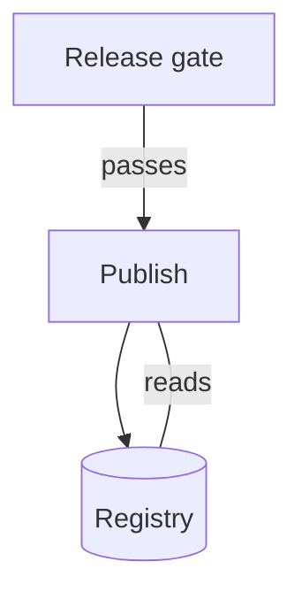
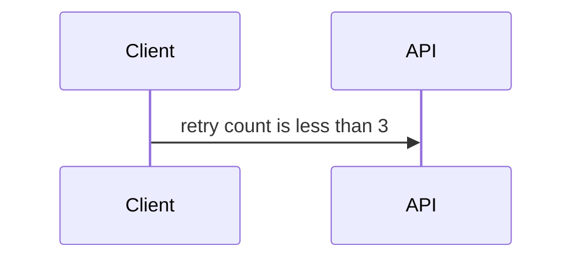

# Safe Mermaid

```mermaid
graph TD
    A["Release gate"] -->|"passes"| B["Publish"]
    B --> C[("Registry")]
    B ---|"reads"| C
```

```mermaid
sequenceDiagram
    participant Client
    participant API
    Client->>API: retry count is less than 3
```
